<p align="center">
  <a href="README.md">English</a> ·
  <a href="README.ru.md">Русский</a> ·
  <a href="README.es.md">Español</a> ·
  <a href="README.pt.md">Português</a> ·
  <b>Deutsch</b> ·
  <a href="README.fr.md">Français</a> ·
  <a href="README.zh.md">中文</a> ·
  <a href="README.ja.md">日本語</a> ·
  <a href="README.ko.md">한국어</a>
</p>

<p align="center">
  
</p>

<h1 align="center">Grimsby Player</h1>

<p align="center">
  <b>Ein Offline-Player für alle, die Musik herunterladen und sammeln.</b><br>
  Deine Bibliothek sieht aus wie ein Streamingdienst — aber alles liegt auf deiner eigenen Festplatte, nicht auf fremden Servern.
</p>

<p align="center">
  <a href="https://github.com/maksimkhatskevich/grimsby-releases/releases/latest"></a>
  
  
  
  <a href="https://github.com/maksimkhatskevich/grimsby-releases/releases"></a>
</p>

<p align="center">
  <a href="https://github.com/maksimkhatskevich/grimsby-releases/releases/latest"><b>⬇ Für Windows herunterladen</b></a>
</p>

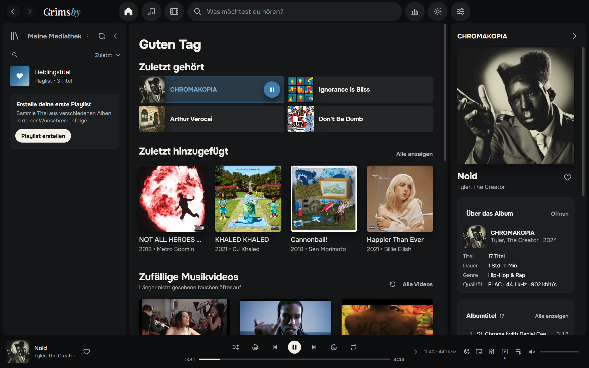

---

## Warum Grimsby

Wer Alben in FLAC lädt, Diskografien sammelt und Musikvideos und Konzerte aufbewahrt, kennt das Problem.
Streamingdienste sehen toll aus, aber deine Musik ist dort nicht: seltene Releases, hochwertige Rips, Videos, die von YouTube verschwunden sind.
Klassische Player kommen mit deinen Dateien gut klar — nur wirkt ihre Oberfläche wie aus dem Jahr 2008.

**Grimsby verbindet beides.** Wähle deinen Musikordner, und eine Minute später wird deine Sammlung zu einer schönen Bibliothek:
Alben nach Jahren, Interpretenseiten mit Fotos, Musikvideos neben den Alben, Statistiken und ein Jahresrückblick im Stil von Spotify Wrapped.
Ohne Konto, ohne Abo, ohne Werbung, ohne Internet.

| | Streaming | Klassischer Player | **Grimsby** |
|---|:---:|:---:|:---:|
| Deine eigenen Dateien (FLAC, seltene Releases) | ✕ | ✓ | **✓** |
| Moderne, schöne Oberfläche | ✓ | ✕ | **✓** |
| Musikvideos, Konzerte und Filme neben den Alben | teilweise | ✕ | **✓** |
| Statistiken und Jahresrückblick | ✓ | ✕ | **✓** |
| Funktioniert offline, ohne Abo | ✕ | ✓ | **✓** |
| Sendet nichts über dich irgendwohin | ✕ | ✓ | **✓** |

---

## Funktionen

### 💿 Alben stehen im Mittelpunkt

Grimsby ist dafür gemacht, ganze Alben zu hören. Die gesamte Sammlung ist nach Erscheinungsjahr sortiert, wie in MusicBee: oben eine Jahresleiste,
die Überschrift des aktuellen Jahres bleibt am oberen Rand stehen, und ein Klick darauf öffnet einen Kalender zum schnellen Springen.
Dazu kommen die Tabs „Alle Titel“ (nach Spalten sortierbar), „Interpreten“, „Nach Titel“, „Nach Interpret“ und „Zuletzt hinzugefügt“.

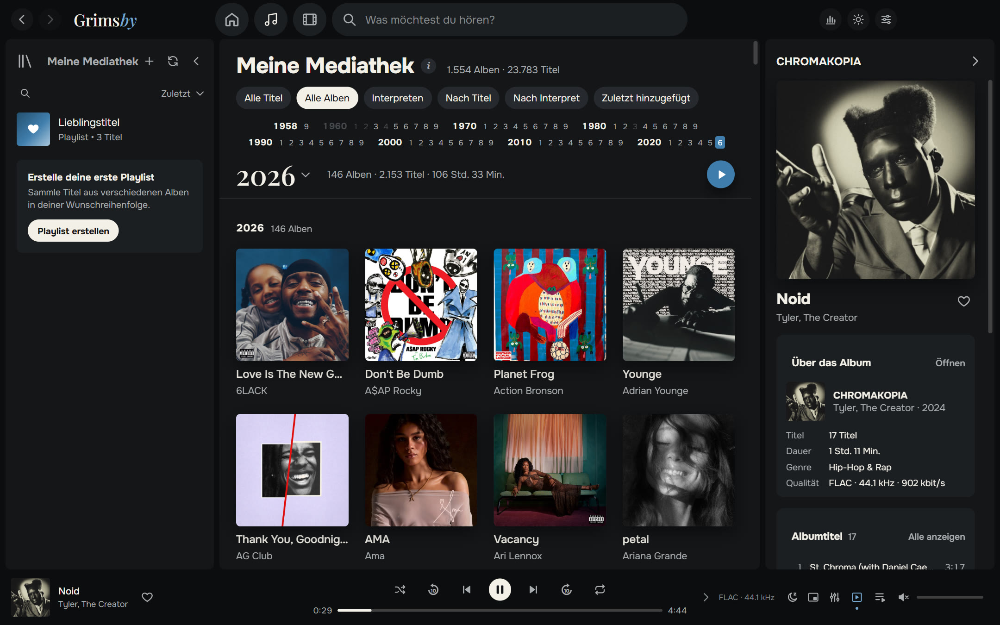

- **Sofort, auch bei riesigen Bibliotheken.** Getestet mit 23.783 Titeln und 1.554 Alben (286 GB): flüssiges Scrollen, sofortige Suche.
- **Scannt nur, wenn du willst:** bei jedem Start, einmal am Tag oder manuell. Bereits bekannte Dateien werden nicht erneut gelesen.
- **MP3, FLAC, ALAC, AAC/M4A, OGG, Opus und WAV.** Apple Lossless, das Browser-Engines nicht abspielen, wandelt Grimsby selbst um.
- **Gastinterpreten** werden in Titeln erkannt — `(feat. …)`, `(ft. …)`, `(with …)` — und erscheinen auch auf ihren Seiten.

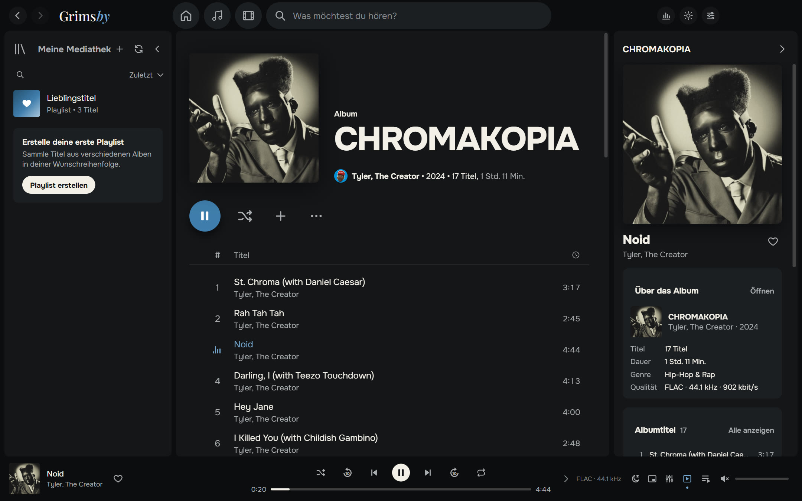

### 🎤 Die ganze Geschichte eines Interpreten auf einer Seite

Alben, Singles, Musikvideos, Filme, Konzerte und Features auf einer Seite. Interpretenfotos lädt Grimsby einmal von Deezer — danach läuft alles offline.
Interpretenradio und „Alle Videos ansehen“ gibt es direkt dort.

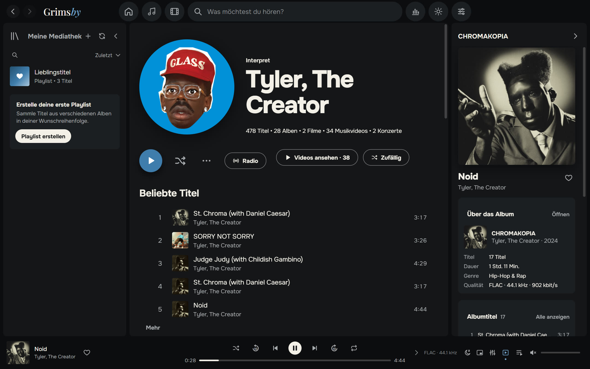

### 🎬 Musikvideos, Konzerte und Albumfilme

Das hat kein Streamingdienst. Grimsby sortiert deinen Videoordner von selbst:

- Videos mit dem Namen `Interpret — Titel` werden nach Interpret und Jahr gruppiert;
- ein Video im Ordner eines Albums wird zum Musikvideo **dieses Albums**;
- Dateien mit `(Film)` werden zu **Albumfilmen**, und Album und Film empfehlen sich gegenseitig;
- ein Ordner `concerts` wird zu einem Konzertbereich mit Reihen (zum Beispiel *Tiny Desk Concert*).

Videos laufen direkt in der App. Verkleinere sie in die Ecke des Players, wie bei Spotify, und stöbere weiter.
Nutzt eine Datei einen seltenen Codec (etwa AV1 in 4K), erstellt Grimsby selbst eine kompatible Kopie.

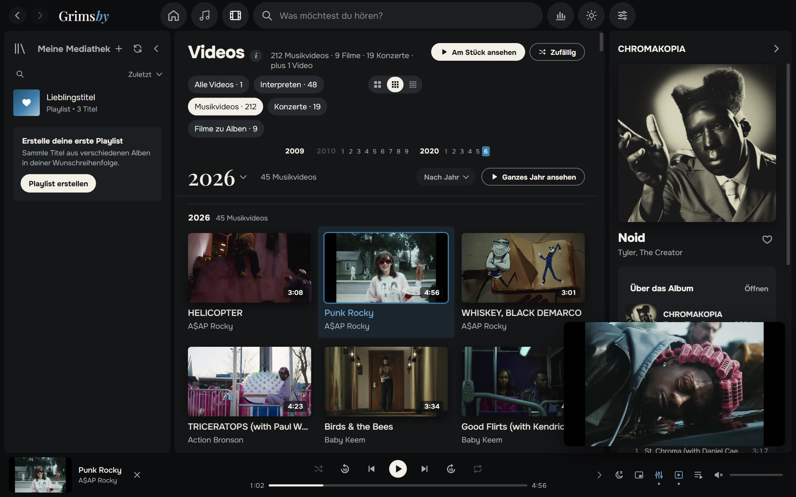

Du schaust keine Musikvideos? Schalte den ganzen Bereich mit einem Schalter in den Einstellungen aus.

### 🔊 Klang wie bei einem richtigen Player

- **Lückenlose Wiedergabe (Gapless)** — Konzeptalben laufen ohne Pausen zwischen den Titeln.
- **Überblendung von 2 bis 12 Sekunden**, innerhalb eines Albums automatisch deaktiviert.
- **Lautstärkeausgleich (ReplayGain / LUFS)**: intelligent, pro Titel oder pro Album.
- **10-Band-Equalizer** mit Presets: Hip-Hop, R&B, Mehr Bass, Gesang, Leise hören und mehr.
- **Sleep-Timer, Mini-Player immer im Vordergrund, Interpretenradio, „Als Nächstes spielen“ und Warteschlange per Drag & Drop.**
- **Lange Titel und Mixe** laufen dort weiter, wo du aufgehört hast.

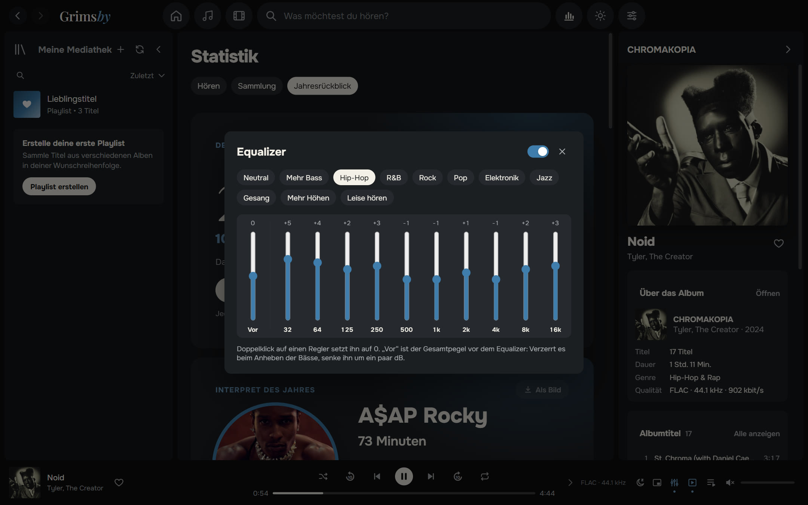

### 📊 Statistiken für Zahlenfans

**Hören** für Woche, Monat, Jahr und insgesamt: Top-Interpreten, -Alben und -Titel nach Minuten oder Wiedergaben, Serien von Tagen mit Musik.
**Sammlung**: wie viele Titel, Alben, Genres, Gigabyte und Stunden Musik du hast, wie viel davon verlustfrei ist — und wie viele Alben du **nie gehört** hast.

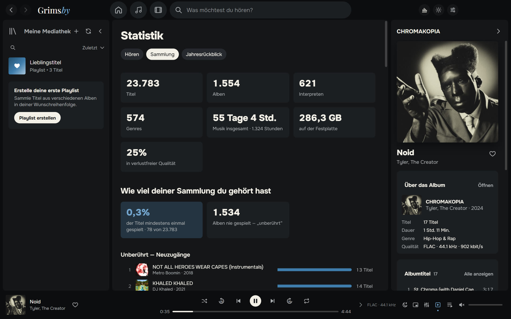

### 🎁 Jahresrückblick

Vom 1. Dezember bis 15. Januar schenkt dir Grimsby einen Jahresrückblick: Interpret des Jahres, Album des Jahres, Lieblingstitel, Rekorde, Entdeckungen und deinen Hörertyp
(„Treuer Fan“, „Entdecker“, „Nachteule“, „Marathonhörer“ …). Jede Karte lässt sich als Bild für Stories speichern — im dunklen oder hellen Design.

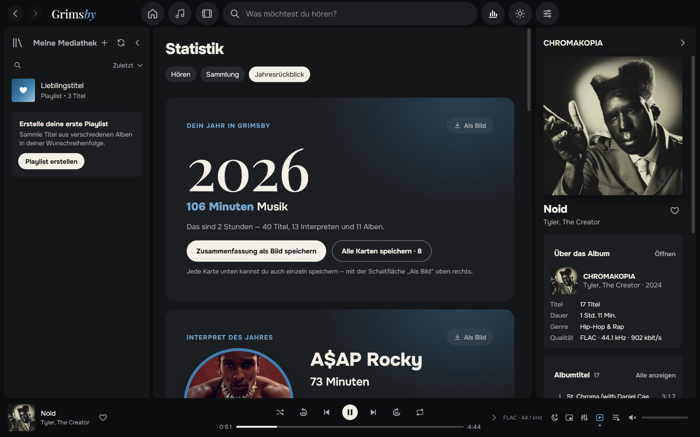

### 🌍 Neun Sprachen

Deutsch, English, Русский, Español, Português, Français, 中文, 日本語 und 한국어. Standardmäßig spricht Grimsby die Sprache deines Windows; ändern kannst du sie unter „Einstellungen → Darstellung“.

### 🎨 Dunkles und helles Design

Grimsbys typisches Blau, Graphit und „Papier“. Wähle ein Design oder folge Windows. Optional nehmen Albumseiten die Farben des Covers an.

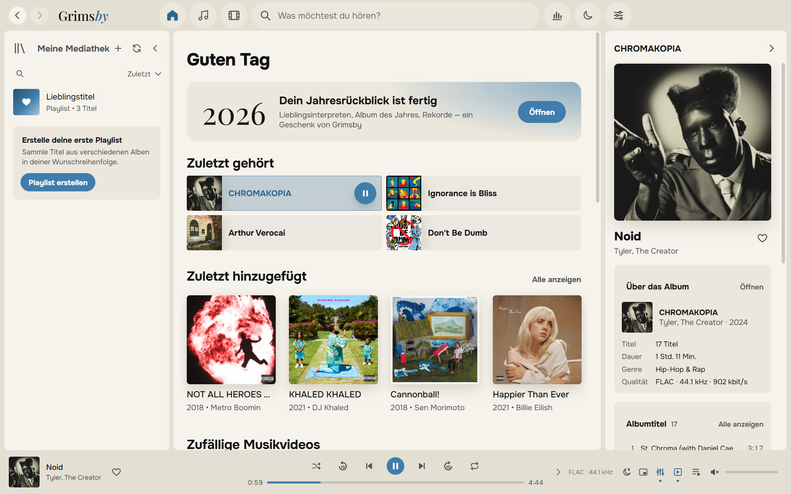

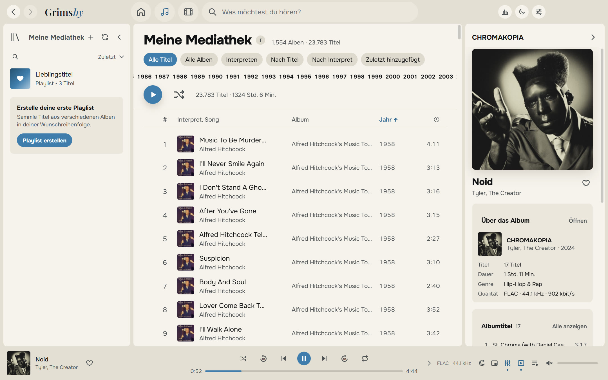

### 🪟 Zu Hause in Windows

- Infobereich-Symbol mit Menü, wie bei Spotify;
- Zurück / Pause / Weiter in der Taskleisten-Miniatur und Unterstützung für Medientasten;
- Mini-Player immer im Vordergrund;
- Tastenkürzel für alles;
- das Fenster öffnet sich so, wie du es geschlossen hast.

### 🛠 Und noch mehr

- **Playlists und Ordner** mit eigenen Covern und Beschreibungen, „Lieblingstitel“, smarte Vorschläge.
- **Tag-Editor** für ein ganzes Album auf einmal, mit Sicherungskopie der Dateien vor jeder Änderung.
- **Bibliotheks-Check**: Alben ohne Cover, Jahr oder Genre, Titel ohne Nummer, Duplikate, unlesbare Dateien.
- **Backup** von Favoriten, Playlists und Verlauf in einer einzigen Datei.
- **Eingebaute Anleitung „Dateien vorbereiten“** in einfacher Sprache.
- **Updates nach deinem Wunsch**: „Nur benachrichtigen“, „Automatisch“ oder „Nicht suchen“.

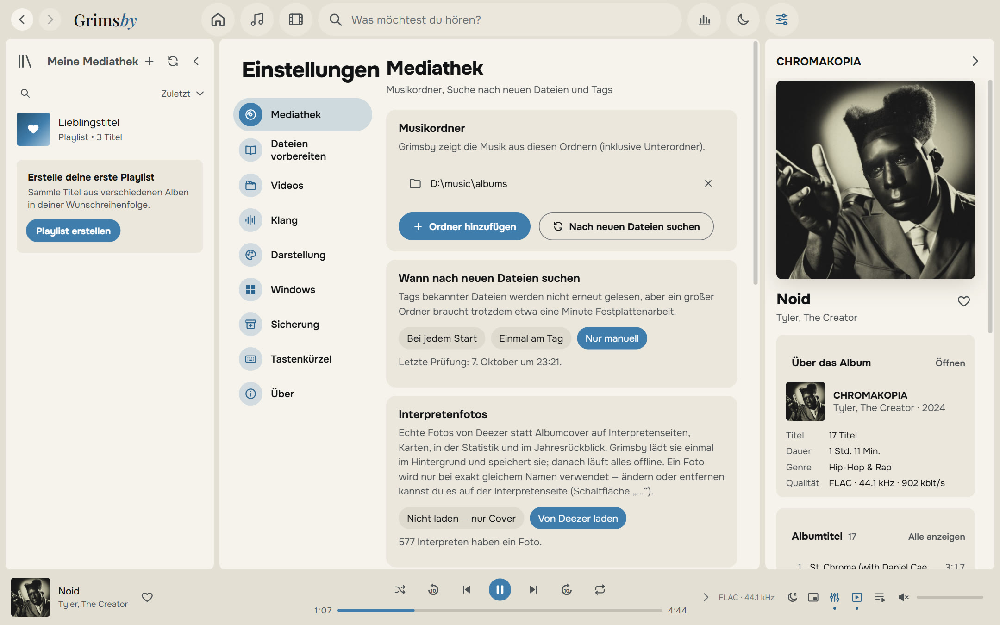

---

## Herunterladen und installieren

1. Öffne die Seite der **[neuesten Version](https://github.com/maksimkhatskevich/grimsby-releases/releases/latest)** und lade `Grimsby-Player-Setup-X.Y.Z.exe` herunter.
2. Starte das Installationsprogramm. Windows zeigt eventuell das blaue Fenster „Der Computer wurde durch Windows geschützt“ — eine übliche Warnung bei Programmen ohne kostenpflichtige Signatur. Klicke auf **Weitere Informationen → Trotzdem ausführen**.
3. Wähle beim ersten Start deinen Musikordner (und auf Wunsch deinen Videoordner). Den Rest erledigt Grimsby.

**Voraussetzungen:** Windows 10 oder 11 (64 Bit). Internet wird nur für Updates und optionale Interpretenfotos benötigt.

Grimsby sucht selbst nach neuen Versionen und zeigt, was sich geändert hat. Favoriten, Playlists, Verlauf und Einstellungen bleiben erhalten.

---

## So organisierst du deine Dateien

Grimsby zwingt dich nicht, deine Sammlung umzuräumen: Es liest Tags und versteht die gängigsten Ablagearten. Aber Ordnung mag es:

```
D:\Music\
├── albums\
│   └── Tyler, The Creator\
│       └── CHROMAKOPIA\
│           ├── 01 - St. Chroma.flac          ← Tags: Interpret, Album, Jahr, eingebettetes Cover
│           └── (2024) Tyler, The Creator — Noid.mp4   ← Musikvideo dieses Albums
└── clips\
    ├── 2024\
    │   └── Kendrick Lamar — Not Like Us.mp4  ← Musikvideo; das Jahr kommt vom Ordner
    └── concerts\
        └── Tiny Desk Concert\
            └── Doechii — Tiny Desk.mp4       ← Konzert in einer Reihe
```

Eine ausführliche Anleitung findest du in der App: „Einstellungen → Dateien vorbereiten“.

---

## Datenschutz

Grimsby läuft **vollständig auf deinem Computer**. Kein Konto, keine Werbung, keine Analyse. Dein Hörverlauf verlässt nie deinen PC.
Die App geht nur für Updates (GitHub) online und — sofern du es nicht abschaltest — für Interpretenfotos (Deezer).

---

## Feedback

Einen Fehler gefunden, eine Idee oder einfach Danke sagen?

- ✉️ E-Mail: **[grimsbyy@gmail.com](mailto:grimsbyy@gmail.com)**
- 🐞 Fehler und Ideen: [Issues](https://github.com/maksimkhatskevich/grimsby-releases/issues)
- 📣 Telegram: [@itsgrimsby](https://t.me/itsgrimsby) (auf Russisch)

Bei Fehlerberichten bitte die Grimsby-Version („Einstellungen → Über“), was du gerade gemacht hast und, wenn möglich, einen Screenshot angeben.

---

## Lizenzen

Grimsby nutzt Open-Source-Komponenten, darunter Electron, React und FFmpeg (GPL v3). Die vollständige Liste mit Lizenztexten und Links zum Quellcode findest du in der App: „Einstellungen → Über“.
Spotify, Apple Music, MusicBee und Deezer werden nur zum Vergleich genannt und gehören ihren Inhabern. Die Cover auf den Screenshots gehören den Rechteinhabern und zeigen beispielhaft eine private Bibliothek.

<p align="center"><sub>Mit Liebe zu Alben gemacht · © 2026 Grimsby</sub></p>
