<p align="center">
  <a href="README.md">English</a> ·
  <a href="README.ru.md">Русский</a> ·
  <b>Español</b> ·
  <a href="README.pt.md">Português</a> ·
  <a href="README.de.md">Deutsch</a> ·
  <a href="README.fr.md">Français</a> ·
  <a href="README.zh.md">中文</a> ·
  <a href="README.ja.md">日本語</a> ·
  <a href="README.ko.md">한국어</a>
</p>

<p align="center">
  
</p>

<h1 align="center">Grimsby Player</h1>

<p align="center">
  <b>Un reproductor offline para quienes descargan y coleccionan música.</b><br>
  Tu biblioteca se ve como un servicio de streaming, pero todo está en tu propio disco, no en el servidor de otro.
</p>

<p align="center">
  <a href="https://github.com/maksimkhatskevich/grimsby-releases/releases/latest"></a>
  
  
  
  <a href="https://github.com/maksimkhatskevich/grimsby-releases/releases"></a>
</p>

<p align="center">
  <a href="https://github.com/maksimkhatskevich/grimsby-releases/releases/latest"><b>⬇ Descargar para Windows</b></a>
</p>

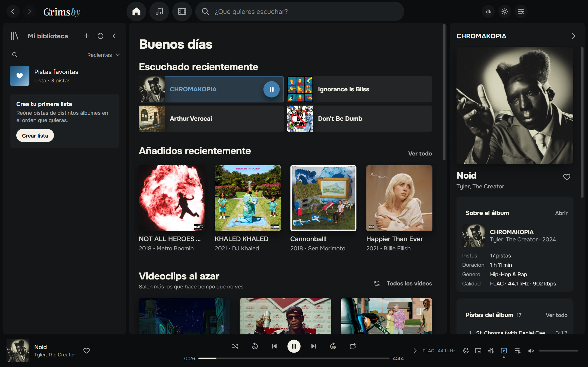

---

## Por qué Grimsby

Si descargas álbumes en FLAC, coleccionas discografías y guardas videoclips y conciertos, conoces el problema.
Los servicios de streaming lucen genial, pero tu música no está ahí: lanzamientos raros, rips de calidad, videos que desaparecieron de YouTube.
Los reproductores clásicos manejan bien tus archivos, pero su interfaz parece de 2008.

**Grimsby une ambos mundos.** Indícale tu carpeta de música y en un minuto tu colección se convierte en una biblioteca preciosa:
álbumes por año, páginas de artistas con fotos, videoclips junto a los álbumes, estadísticas y un resumen del año al estilo de Spotify Wrapped.
Sin cuentas, sin suscripciones, sin anuncios y sin internet.

| | Streaming | Reproductor clásico | **Grimsby** |
|---|:---:|:---:|:---:|
| Tus propios archivos (FLAC, lanzamientos raros) | ✕ | ✓ | **✓** |
| Interfaz moderna y bonita | ✓ | ✕ | **✓** |
| Videoclips, conciertos y películas junto a los álbumes | en parte | ✕ | **✓** |
| Estadísticas y resumen del año | ✓ | ✕ | **✓** |
| Funciona sin internet ni suscripción | ✕ | ✓ | **✓** |
| No envía nada sobre ti a ningún sitio | ✕ | ✓ | **✓** |

---

## Funciones

### 💿 Los álbumes, primero

Grimsby está pensado para escuchar álbumes completos. Toda tu colección se ordena por año de lanzamiento, como en MusicBee: una franja de años arriba,
el encabezado del año actual queda fijo en la parte superior y, al hacer clic, abre un calendario para saltar rápido.
También hay pestañas «Todas las pistas» (ordenables por columna), «Artistas», «Por título», «Por artista» y «Añadidos recientemente».

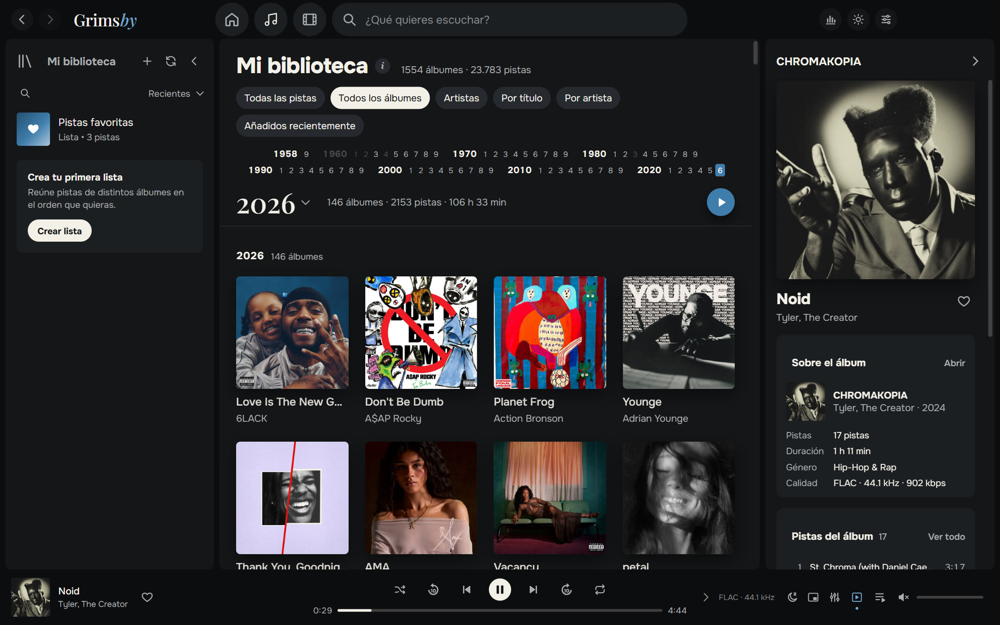

- **Instantáneo incluso con bibliotecas enormes.** Probado con 23 783 pistas y 1554 álbumes (286 GB): desplazamiento fluido y búsqueda inmediata.
- **Escanea solo cuando tú quieras:** en cada inicio, una vez al día o manualmente. Los archivos ya conocidos no se vuelven a leer.
- **MP3, FLAC, ALAC, AAC/M4A, OGG, Opus y WAV.** Grimsby convierte por su cuenta el Apple Lossless que los motores de navegador no reproducen.
- **Artistas invitados** detectados en los títulos — `(feat. …)`, `(ft. …)`, `(with …)` — que también aparecen en sus páginas.

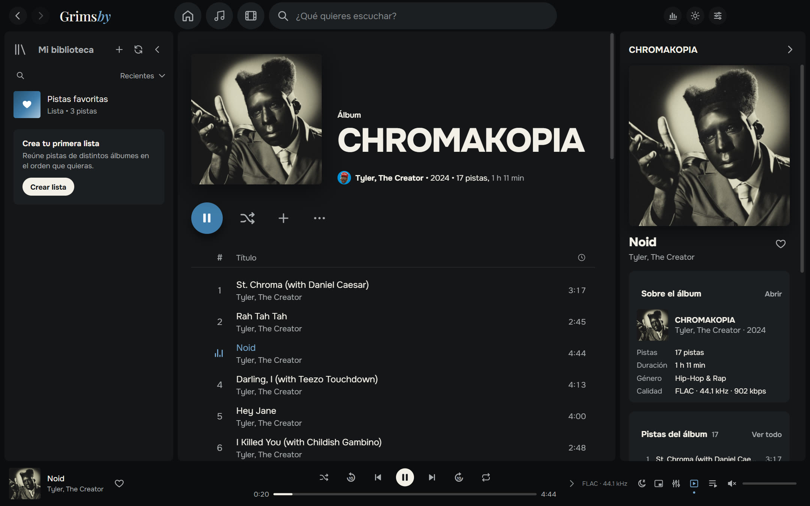

### 🎤 Toda la historia de un artista en una página

Álbumes, sencillos, videoclips, películas, conciertos y colaboraciones en una sola página. Grimsby descarga las fotos de artistas desde Deezer una vez; después todo funciona offline.
Ahí mismo tienes la radio del artista y «Ver todos los videos».

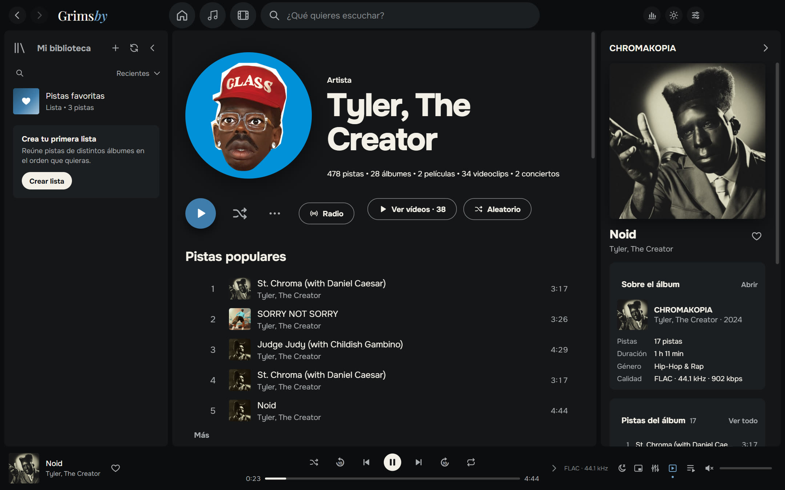

### 🎬 Videoclips, conciertos y películas de álbumes

Algo que no tiene ningún servicio de streaming. Grimsby organiza tu carpeta de videos por sí solo:

- los videos llamados `Artista — Título` se agrupan por artista y año;
- un video dentro de la carpeta de un álbum se convierte en videoclip **de ese álbum**;
- los archivos marcados con `(Film)` se convierten en **películas del álbum**, y el álbum y su película se recomiendan mutuamente;
- la carpeta `concerts` se convierte en una sección de conciertos con series (por ejemplo, *Tiny Desk Concert*).

Los videos se reproducen dentro de la app. Puedes encogerlos a una esquina del reproductor, como en Spotify, y seguir navegando.
Si un archivo usa un códec raro (por ejemplo, AV1 en 4K), Grimsby prepara una copia compatible él solo.

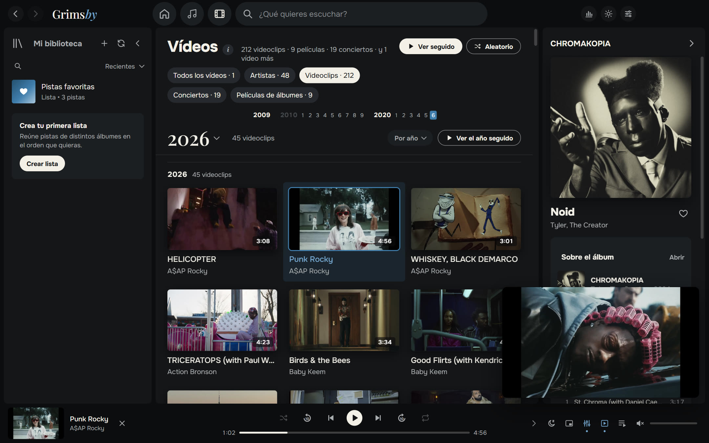

¿No ves videoclips? Desactiva toda la sección con un solo interruptor en los ajustes.

### 🔊 Sonido de reproductor de verdad

- **Reproducción sin pausas (gapless)**: los álbumes conceptuales suenan sin cortes entre pistas.
- **Fundido cruzado de 2 a 12 segundos**, que se desactiva solo dentro de un mismo álbum.
- **Nivelación de volumen (ReplayGain / LUFS)**: inteligente, por pista o por álbum.
- **Ecualizador de 10 bandas** con preajustes: Hip-hop, R&B, Más graves, Voces, Volumen bajo y más.
- **Temporizador de apagado, mini reproductor siempre visible, radio por artista, «Reproducir a continuación» y cola con arrastrar y soltar.**
- **Pistas largas y mezclas** continúan donde las dejaste.

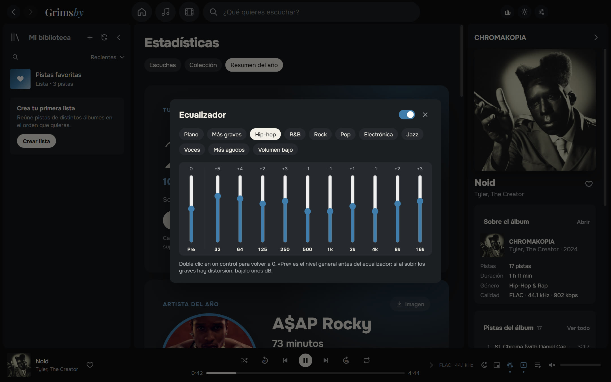

### 📊 Estadísticas para amantes de los números

**Escuchas** de la semana, el mes, el año y de siempre: top de artistas, álbumes y pistas por minutos o reproducciones, rachas de días con música.
**Colección**: cuántas pistas, álbumes, géneros, gigabytes y horas de música tienes, qué parte es lossless y cuántos álbumes **nunca has escuchado**.

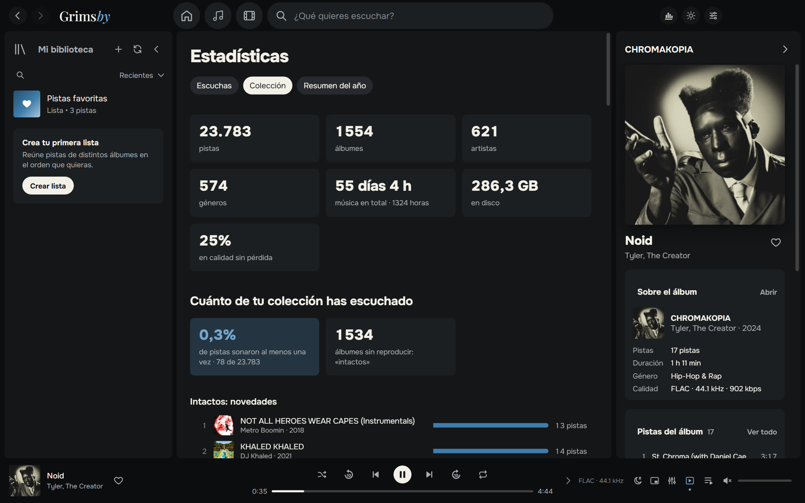

### 🎁 Resumen del año

Del 1 de diciembre al 15 de enero, Grimsby te regala tu resumen del año: artista del año, álbum del año, pistas favoritas, récords, descubrimientos y tu tipo de oyente
(«Fan incondicional», «Explorador», «Noctámbulo», «Maratonista»…). Cada tarjeta se puede guardar como imagen para historias, en tema oscuro o claro.

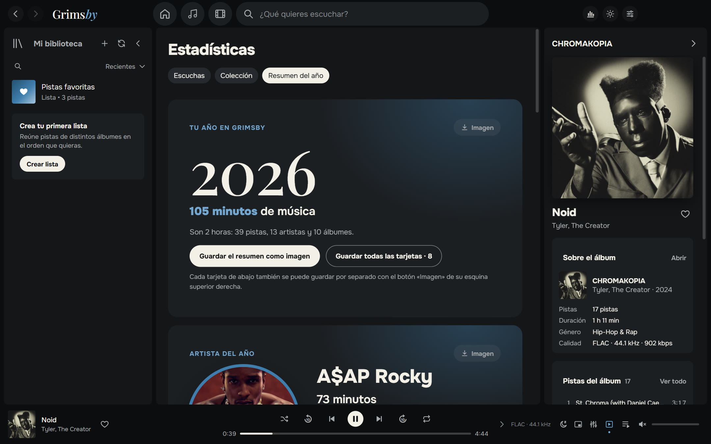

### 🌍 Nueve idiomas

Español, English, Русский, Português, Deutsch, Français, 中文, 日本語 y 한국어. Por defecto Grimsby usa el idioma de tu Windows; puedes cambiarlo en «Ajustes → Apariencia».

### 🎨 Tema oscuro y claro

El azul característico de Grimsby, grafito y «papel». Elige un tema o sigue a Windows. Opcionalmente, las páginas de álbum toman los colores de la portada.

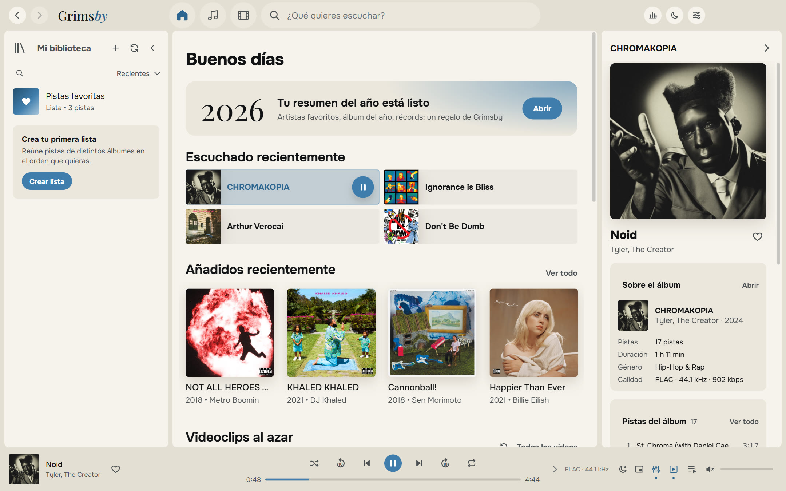

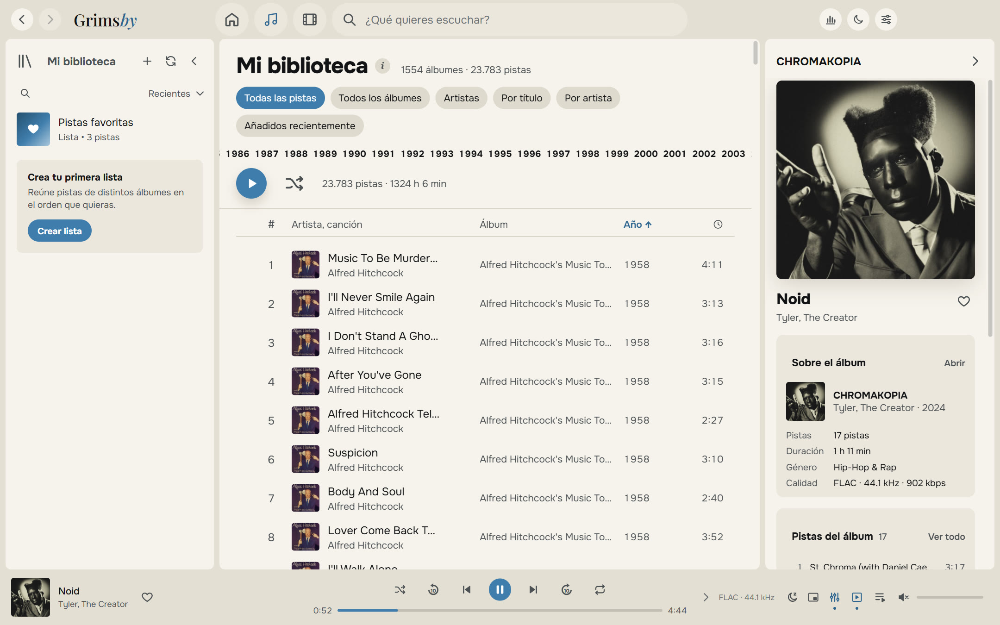

### 🪟 Como en casa en Windows

- icono en la bandeja del sistema con menú, como Spotify;
- botones anterior / pausa / siguiente en la miniatura de la barra de tareas y teclas multimedia;
- mini reproductor siempre visible;
- atajos de teclado para todo;
- la ventana se abre tal como la cerraste.

### 🛠 Y más

- **Listas y carpetas** con portadas y descripciones propias, «Pistas favoritas», sugerencias inteligentes.
- **Editor de etiquetas** para un álbum entero a la vez, con copia de seguridad de los archivos antes de cambiarlos.
- **Salud de la biblioteca**: álbumes sin portada, año o género, pistas sin número, duplicados, archivos ilegibles.
- **Copia de seguridad** de favoritos, listas e historial en un solo archivo.
- **Guía integrada «Cómo preparar los archivos»** en lenguaje sencillo.
- **Actualizaciones a tu manera**: «Solo avisar», «Automáticamente» o «No buscar».

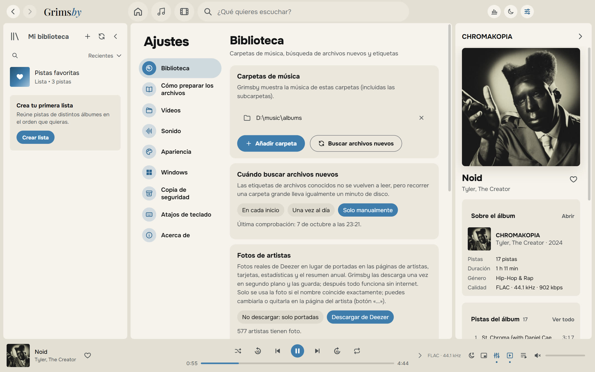

---

## Descargar e instalar

1. Abre la página de la **[última versión](https://github.com/maksimkhatskevich/grimsby-releases/releases/latest)** y descarga `Grimsby-Player-Setup-X.Y.Z.exe`.
2. Ejecuta el instalador. Windows puede mostrar la ventana azul «Windows protegió su PC»: es un aviso normal para programas sin firma digital de pago. Pulsa **Más información → Ejecutar de todas formas**.
3. En el primer inicio, elige tu carpeta de música (y, si quieres, la de videos). Grimsby hace el resto.

**Requisitos:** Windows 10 u 11 (64 bits). Internet solo hace falta para actualizaciones y fotos de artistas opcionales.

Grimsby busca nuevas versiones por sí solo y te muestra qué ha cambiado. Tus favoritos, listas, historial y ajustes se conservan.

---

## Cómo organizar tus archivos

Grimsby no te obliga a reorganizar tu colección: lee las etiquetas y entiende las formas más comunes de guardar música. Pero le gusta el orden:

```
D:\Music\
├── albums\
│   └── Tyler, The Creator\
│       └── CHROMAKOPIA\
│           ├── 01 - St. Chroma.flac          ← etiquetas: artista, álbum, año, portada incrustada
│           └── (2024) Tyler, The Creator — Noid.mp4   ← videoclip de este álbum
└── clips\
    ├── 2024\
    │   └── Kendrick Lamar — Not Like Us.mp4  ← videoclip; el año sale de la carpeta
    └── concerts\
        └── Tiny Desk Concert\
            └── Doechii — Tiny Desk.mp4       ← concierto dentro de una serie
```

Hay una guía detallada en la app: «Ajustes → Cómo preparar los archivos».

---

## Privacidad

Grimsby funciona **por completo en tu ordenador**. Sin cuentas, sin anuncios, sin analítica. Tu historial de escucha nunca sale de tu PC.
La app solo se conecta para buscar actualizaciones (GitHub) y, si no lo desactivas, para las fotos de artistas (Deezer).

---

## Contacto

¿Encontraste un error, tienes una idea o solo quieres dar las gracias?

- ✉️ correo: **[grimsbyy@gmail.com](mailto:grimsbyy@gmail.com)**
- 🐞 errores e ideas: [Issues](https://github.com/maksimkhatskevich/grimsby-releases/issues)
- 📣 Telegram: [@itsgrimsby](https://t.me/itsgrimsby) (en ruso)

Al reportar un error, indica tu versión de Grimsby («Ajustes → Acerca de»), qué estabas haciendo y, si puedes, una captura.

---

## Licencias

Grimsby usa componentes de código abierto, entre ellos Electron, React y FFmpeg (GPL v3). La lista completa con licencias y enlaces al código fuente está en la app: «Ajustes → Acerca de».
Spotify, Apple Music, MusicBee y Deezer se mencionan solo como comparación y pertenecen a sus dueños. Las portadas de las capturas pertenecen a sus titulares y se muestran como ejemplo de una biblioteca personal.

<p align="center"><sub>Hecho con amor por los álbumes · © 2026 Grimsby</sub></p>
