<p align="center">
  <a href="README.md">English</a> ·
  <a href="README.ru.md">Русский</a> ·
  <a href="README.es.md">Español</a> ·
  <a href="README.pt.md">Português</a> ·
  <a href="README.de.md">Deutsch</a> ·
  <b>Français</b> ·
  <a href="README.zh.md">中文</a> ·
  <a href="README.ja.md">日本語</a> ·
  <a href="README.ko.md">한국어</a>
</p>

<p align="center">
  
</p>

<h1 align="center">Grimsby Player</h1>

<p align="center">
  <b>Un lecteur hors ligne pour ceux qui téléchargent et collectionnent la musique.</b><br>
  Votre bibliothèque ressemble à un service de streaming — mais tout reste sur votre propre disque, pas sur le serveur de quelqu’un d’autre.
</p>

<p align="center">
  <a href="https://github.com/maksimkhatskevich/grimsby-releases/releases/latest"></a>
  
  
  
  <a href="https://www.virustotal.com/gui/file/5c565d77d2b34a541cc38c9464028a9a490483999d84340947974058d25d8179"></a>
  <a href="https://github.com/maksimkhatskevich/grimsby-releases/releases"></a>
</p>

<p align="center">
  <a href="https://github.com/maksimkhatskevich/grimsby-releases/releases/latest"><b>⬇ Télécharger pour Windows</b></a>
</p>

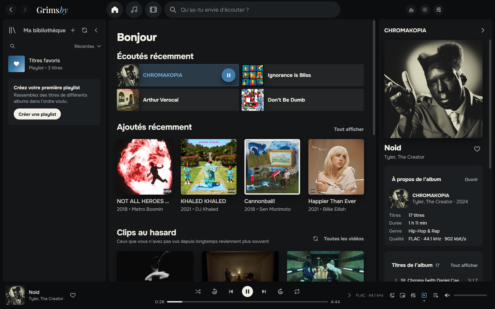

---

## Pourquoi Grimsby

Si vous téléchargez des albums en FLAC, collectionnez des discographies et gardez des clips et des concerts, vous connaissez le problème.
Les services de streaming sont beaux, mais votre musique n’y est pas : sorties rares, rips de qualité, clips disparus de YouTube.
Les lecteurs classiques gèrent très bien vos fichiers — mais leur interface semble dater de 2008.

**Grimsby réunit les deux.** Indiquez votre dossier de musique et, une minute plus tard, votre collection devient une superbe bibliothèque :
albums par année, pages d’artistes avec photos, clips à côté des albums, statistiques et une rétrospective de l’année.
Sans compte, sans abonnement, sans pub et sans Internet.

| | Streaming | Lecteur classique | **Grimsby** |
|---|:---:|:---:|:---:|
| Vos propres fichiers (FLAC, sorties rares) | ✕ | ✓ | **✓** |
| Interface moderne et belle | ✓ | ✕ | **✓** |
| Clips, concerts et films à côté des albums | en partie | ✕ | **✓** |
| Statistiques et rétrospective de l’année | ✓ | ✕ | **✓** |
| Convertisseur, recherche de doublons, éditeur de tags | ✕ | en partie | **✓** |
| Fonctionne hors ligne, sans abonnement | ✕ | ✓ | **✓** |
| N’envoie rien sur vous nulle part | ✕ | ✓ | **✓** |

---

## Fonctionnalités

### 💿 Les albums d’abord

Grimsby est conçu pour écouter des albums entiers. Toute votre collection est classée par année de sortie : une frise des années en haut,
l’en-tête de l’année en cours reste collé en haut de la page, et un clic dessus ouvre un calendrier pour sauter rapidement.
On trouve aussi les onglets « Tous les titres » (triables par colonne), « Artistes », « Par titre », « Par artiste » et « Ajoutés récemment », ainsi qu’une barre alphabétique.

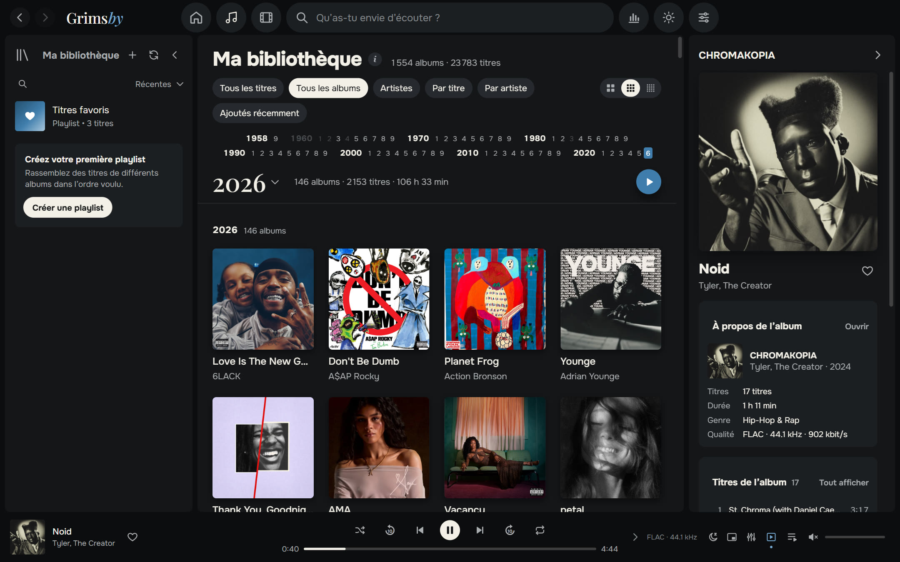

- **Instantané même avec une énorme bibliothèque.** Testé sur 23 783 titres et 1 554 albums (286 Go) : défilement fluide, recherche immédiate.
- **Analyse uniquement quand vous le souhaitez :** à chaque lancement, une fois par jour ou manuellement. Les fichiers déjà connus ne sont pas relus.
- **MP3, FLAC, ALAC, AAC/M4A, OGG, Opus et WAV.** Grimsby convertit lui-même l’Apple Lossless que les moteurs de navigateur ne lisent pas.
- **Albums multi-disques** découpés en « Disque 1 », « Disque 2 »… avec une numérotation propre à chaque disque.
- **Les artistes invités** sont détectés dans les titres — `(feat. …)`, `(ft. …)`, `(with …)` — et apparaissent aussi sur leurs pages.
- **Taille des pochettes** : grandes, normales ou petites, séparément pour la musique et les vidéos.

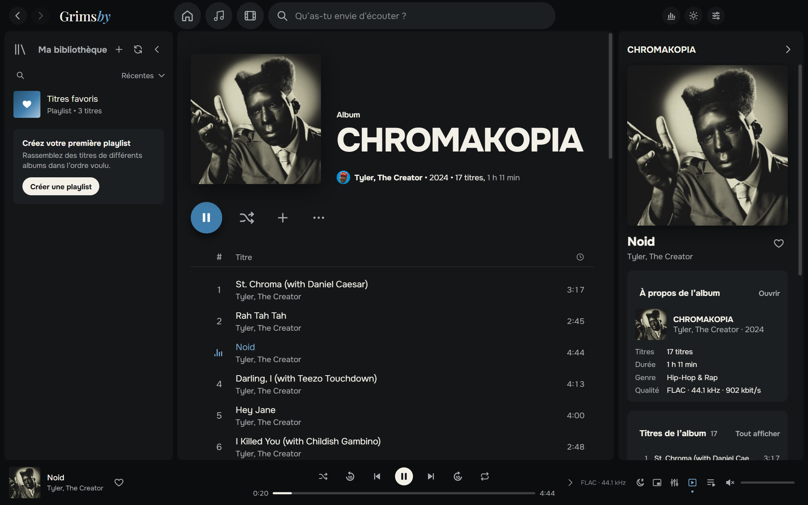

### 🎤 Toute l’histoire d’un artiste sur une page

Albums, singles, clips, films, concerts et featurings sur une seule page. Grimsby récupère les photos des artistes sur Deezer une seule fois — ensuite tout fonctionne hors ligne.
La radio de l’artiste et « Regarder toutes les vidéos » sont juste là.

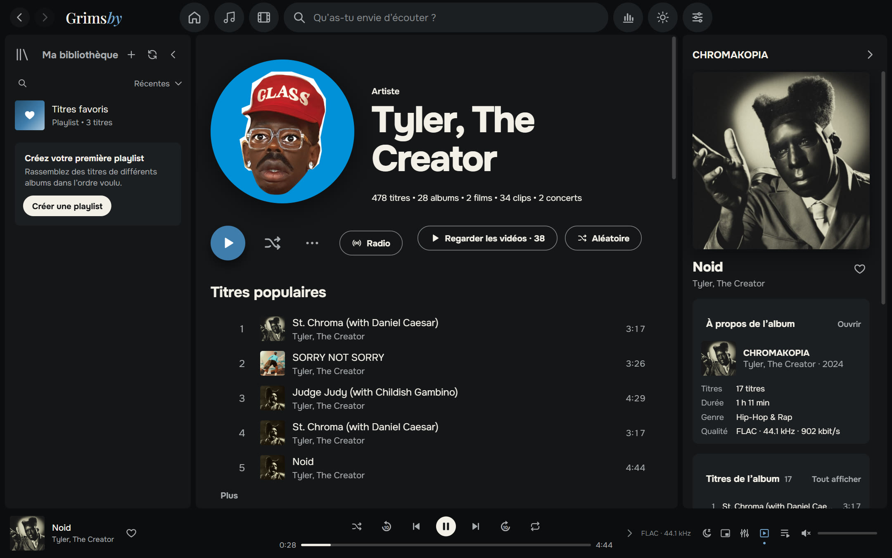

### 🎬 Clips, concerts et films d’albums

C’est ce qu’aucun service de streaming ne propose. Grimsby range votre dossier vidéo tout seul :

- les vidéos nommées `Artiste — Titre` sont regroupées par artiste et par année ;
- une vidéo placée dans le dossier d’un album devient un clip **de cet album** ;
- les fichiers marqués `(Film)` deviennent des **films d’album**, et l’album et son film se recommandent mutuellement ;
- un dossier `concerts` devient une section concerts avec des séries (par exemple *Tiny Desk Concert*).

Les vidéos se lisent directement dans l’application. Réduisez-les dans le coin du lecteur et continuez à naviguer.
Si un fichier utilise un codec rare (par exemple AV1 en 4K), Grimsby prépare lui-même une copie compatible.

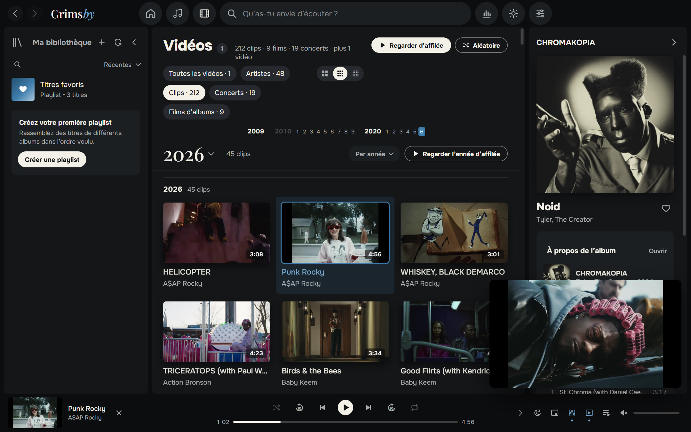

Vous ne regardez pas de clips ? Désactivez toute la section d’un seul interrupteur dans les paramètres.

### 🧰 Une bibliothèque bien rangée

- **Convertisseur de fichiers** : MP3, AAC (M4A), Opus, OGG, FLAC, ALAC et WAV. Tags et pochettes sont conservés. Enregistrez des copies dans un autre dossier ou remplacez les originaux : les anciens fichiers vont à la Corbeille, et vos favoris et playlists passent aux nouveaux. Choisissez les titres par cases à cocher.
- **Recherche de doublons** : le même titre dans plusieurs fichiers et des copies de dossiers d’albums, avec le dossier, le format et le débit de chaque copie. Pas un doublon ? Cliquez sur « Tout est en ordre » et Grimsby s’en souviendra.
- **Santé de la bibliothèque** avec un smiley d’humeur 😊 😐 😟 : albums sans pochette, année ou genre, titres sans numéro, fichiers illisibles — et comment corriger.
- **Modifier les infos** : tags et pochette d’un album entier d’un coup, y compris le découpage en disques. Grimsby sauvegarde les fichiers avant toute modification.

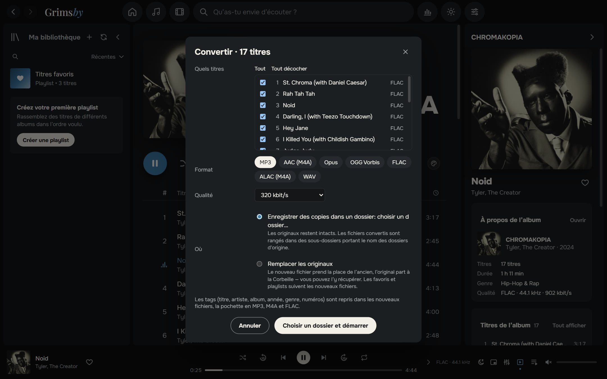

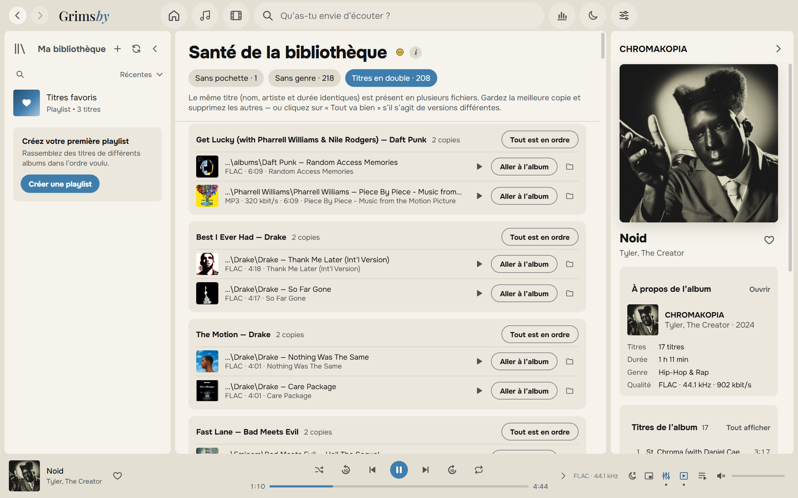

### 🔊 Un son de vrai lecteur

- **Lecture sans blanc (gapless)** — les albums concept s’enchaînent sans coupure entre les titres.
- **Fondu enchaîné de 2 à 12 secondes**, désactivé automatiquement au sein d’un même album.
- **Normalisation du volume (ReplayGain / LUFS)** : intelligente, par titre ou par album.
- **Égaliseur 10 bandes** avec préréglages : Hip-hop, R&B, Plus de basses, Voix, Écoute à faible volume, et plus encore.
- **Minuterie de mise en veille, mini-lecteur toujours au premier plan, « Lire ensuite » et file d’attente en glisser-déposer.**
- **Les titres longs et les mixes** reprennent là où vous vous étiez arrêté.

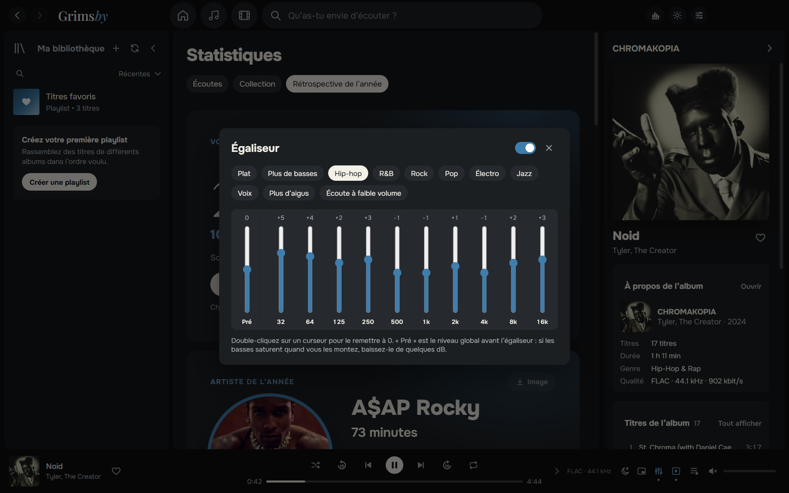

### 📻 Des playlists qui se font toutes seules

- **Playlists intelligentes**, dont **« Radio : mon mix »** — vos titres les plus écoutés mêlés à des morceaux proches par genre et par année — et la **radio de l’artiste**, un mix autour d’un artiste ou d’un genre.
- **Votre propre ordre** pour les playlists et dossiers du panneau latéral, conservé même si vous changez de tri puis revenez.
- Triez « Titres favoris » et les playlists par numéro, artiste, titre, album ou durée — depuis un menu ou en cliquant sur les en-têtes de colonnes.
- Pochettes et descriptions personnalisées pour les playlists.

### 📊 Des statistiques pour les amoureux des chiffres

**Écoutes** de la semaine, du mois, de l’année et depuis toujours : top artistes, albums et titres en minutes ou en lectures, séries de jours en musique. Les chiffres se mettent à jour en direct pendant l’écoute.
**Collection** : combien de titres, d’albums, de genres, de gigaoctets et d’heures de musique vous avez, quelle part est en lossless — et combien d’albums vous n’avez **jamais écoutés**.

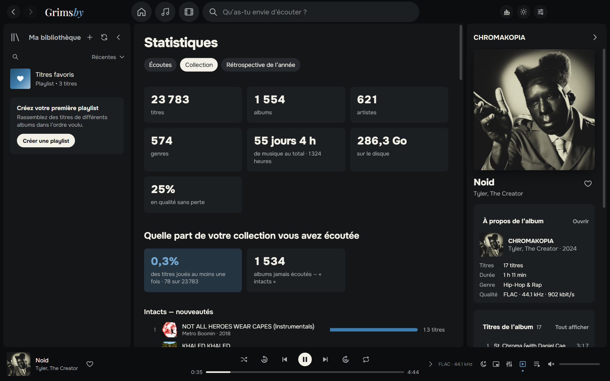

### 🎁 Rétrospective de l’année

Du 1er décembre au 15 janvier, Grimsby vous offre votre rétrospective : artiste de l’année, album de l’année, titres préférés, records, découvertes et votre profil d’auditeur
(« Fan fidèle », « Explorateur », « Oiseau de nuit », « Marathonien »…). Chaque carte peut être enregistrée en image pour vos stories, en thème sombre ou clair.

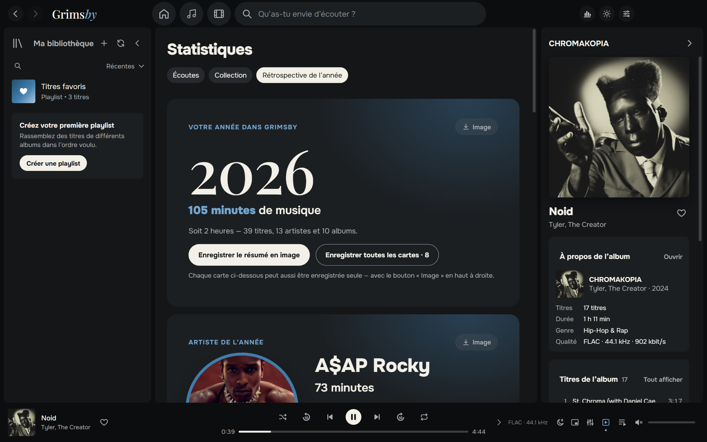

### 🌍 Neuf langues

Français, English, Русский, Español, Português, Deutsch, 中文, 日本語 et 한국어. Par défaut, Grimsby utilise la langue de votre Windows ; vous pouvez la changer dans « Paramètres → Apparence ».

### 🎨 Thèmes sombre et clair, couleurs de la pochette

Le bleu signature de Grimsby, le graphite et le « papier ». Choisissez un thème ou suivez Windows. La page d’un album ou d’une playlist peut prendre les couleurs de sa pochette — d’une lueur douce à un remplissage complet — via un bouton palette sur la page même.

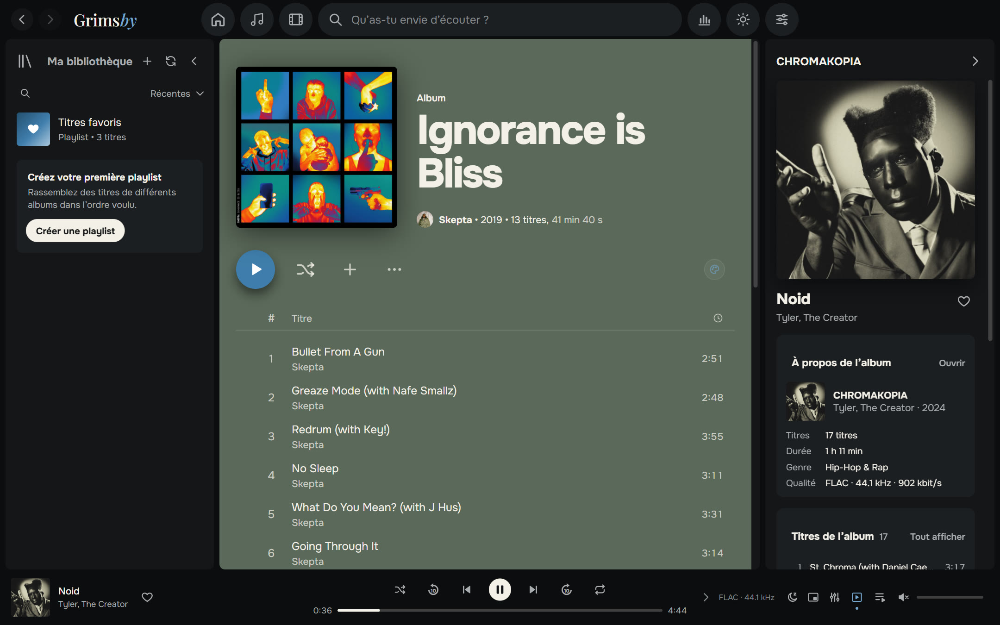

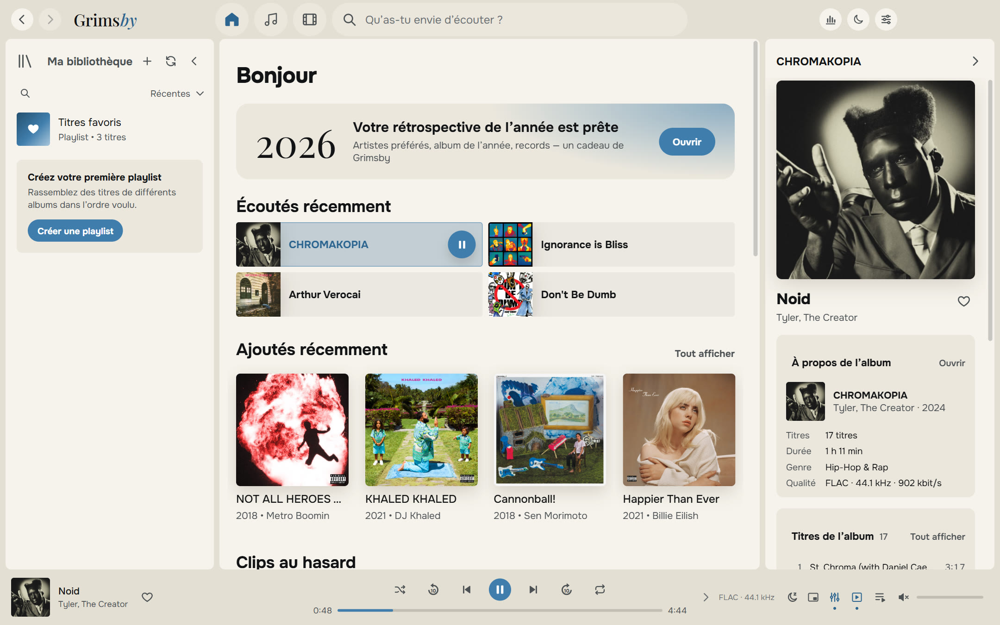

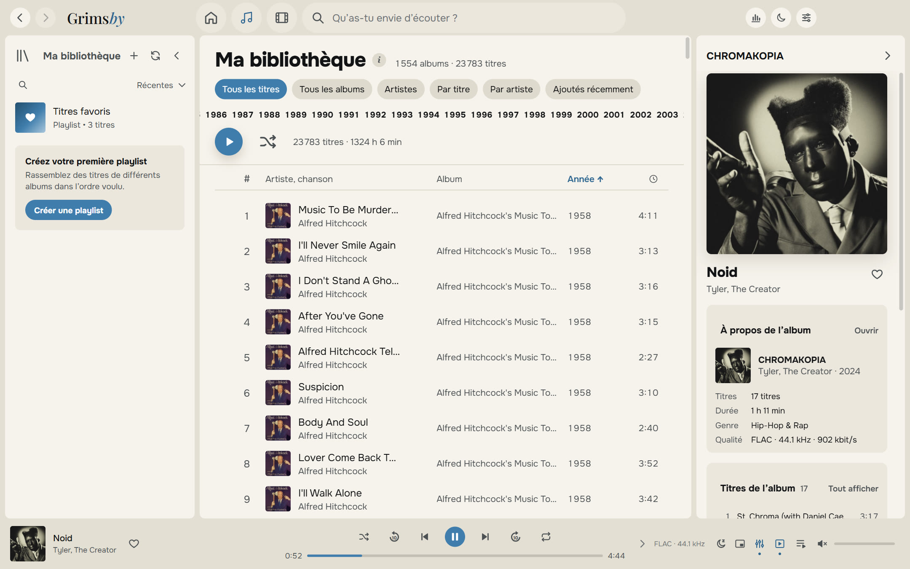

### 🪟 Chez lui dans Windows

- icône dans la zone de notification avec menu de lecture ;
- boutons précédent / pause / suivant dans la miniature de la barre des tâches et touches multimédia ;
- mini-lecteur toujours au premier plan ;
- raccourcis clavier pour tout ;
- la fenêtre se rouvre exactement comme vous l’avez laissée.

### 🛠 Et encore

- **Sauvegarde** des favoris, playlists et historique dans un seul fichier.
- **Guide intégré « Préparer les fichiers »** en langage simple.
- **Mises à jour à votre façon** : « Prévenir seulement », « Automatiquement » ou « Ne pas vérifier ».

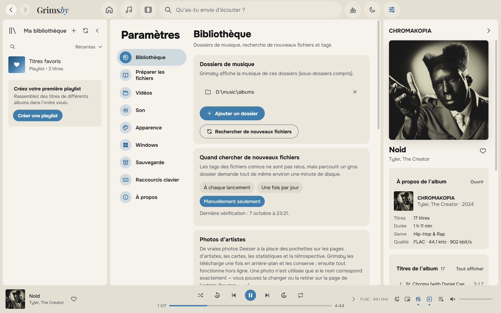

---

## Télécharger et installer

1. Ouvrez la page de la **[dernière version](https://github.com/maksimkhatskevich/grimsby-releases/releases/latest)** et téléchargez `Grimsby-Player-Setup-X.Y.Z.exe`.
2. Lancez l’installeur. Windows peut afficher la fenêtre bleue « Windows a protégé votre ordinateur » — un avertissement habituel pour les logiciels sans signature payante. Cliquez sur **Informations complémentaires → Exécuter quand même**.
   L’installeur a été vérifié sur VirusTotal : [aucun des 68 antivirus ne détecte quoi que ce soit](https://www.virustotal.com/gui/file/5c565d77d2b34a541cc38c9464028a9a490483999d84340947974058d25d8179) (version 1.4.0).
3. Au premier lancement, choisissez votre dossier de musique (et, si vous voulez, celui des vidéos). Grimsby s’occupe du reste.

**Configuration requise :** Windows 10 ou 11 (64 bits). Internet n’est nécessaire que pour les mises à jour et les photos d’artistes facultatives.

Grimsby recherche lui-même les nouvelles versions et montre ce qui a changé. Favoris, playlists, historique et paramètres sont conservés.

---

## Comment organiser vos fichiers

Grimsby ne vous oblige pas à réorganiser votre collection : il lit les tags et comprend les façons les plus courantes de ranger sa musique. Mais il aime l’ordre :

```
D:\Music\
├── albums\
│   └── Tyler, The Creator\
│       └── CHROMAKOPIA\
│           ├── 01 - St. Chroma.flac          ← tags : artiste, album, année, pochette intégrée
│           └── (2024) Tyler, The Creator — Noid.mp4   ← clip de cet album
└── clips\
    ├── 2024\
    │   └── Kendrick Lamar — Not Like Us.mp4  ← clip ; l’année vient du dossier
    └── concerts\
        └── Tiny Desk Concert\
            └── Doechii — Tiny Desk.mp4       ← concert dans une série
```

Un guide détaillé se trouve dans l’application : « Paramètres → Préparer les fichiers ».

---

## Confidentialité

Grimsby fonctionne **entièrement sur votre ordinateur**. Pas de compte, pas de pub, pas d’analytique. Votre historique d’écoute ne quitte jamais votre PC.
L’application ne se connecte que pour les mises à jour (GitHub) et — sauf si vous le désactivez — pour les photos d’artistes (Deezer).

---

## Contact

Un bug, une idée, ou juste envie de dire merci ?

- ✉️ e-mail : **[grimsbyy@gmail.com](mailto:grimsbyy@gmail.com)**
- 🐞 bugs et idées : [Issues](https://github.com/maksimkhatskevich/grimsby-releases/issues)
- 📣 Telegram : [@itsgrimsby](https://t.me/itsgrimsby) (en russe)

Pour signaler un bug, indiquez votre version de Grimsby (« Paramètres → À propos »), ce que vous faisiez et, si possible, une capture d’écran.

---

## Licences

Grimsby utilise des composants open source, dont Electron, React et FFmpeg (GPL v3). La liste complète avec les textes de licence et les liens vers le code source est dans l’application : « Paramètres → À propos ».
Deezer est une marque de son propriétaire. Les pochettes des captures appartiennent à leurs ayants droit et illustrent une bibliothèque personnelle.

<p align="center"><sub>Fait avec amour pour les albums · © 2026 Grimsby</sub></p>
