<p align="center">
  <a href="README.md">English</a> ·
  <a href="README.ru.md">Русский</a> ·
  <a href="README.es.md">Español</a> ·
  <a href="README.pt.md">Português</a> ·
  <a href="README.de.md">Deutsch</a> ·
  <a href="README.fr.md">Français</a> ·
  <a href="README.zh.md">中文</a> ·
  <b>日本語</b> ·
  <a href="README.ko.md">한국어</a>
</p>

<p align="center">
  
</p>

<h1 align="center">Grimsby Player</h1>

<p align="center">
  <b>音楽をダウンロードして集める人のためのオフラインプレーヤー。</b><br>
  ライブラリはストリーミングサービスのような見た目。でも、すべては他人のサーバーではなく、あなた自身のドライブにあります。
</p>

<p align="center">
  <a href="https://github.com/maksimkhatskevich/grimsby-releases/releases/latest"></a>
  
  
  
  <a href="https://github.com/maksimkhatskevich/grimsby-releases/releases"></a>
</p>

<p align="center">
  <a href="https://github.com/maksimkhatskevich/grimsby-releases/releases/latest"><b>⬇ Windows 版をダウンロード</b></a>
</p>

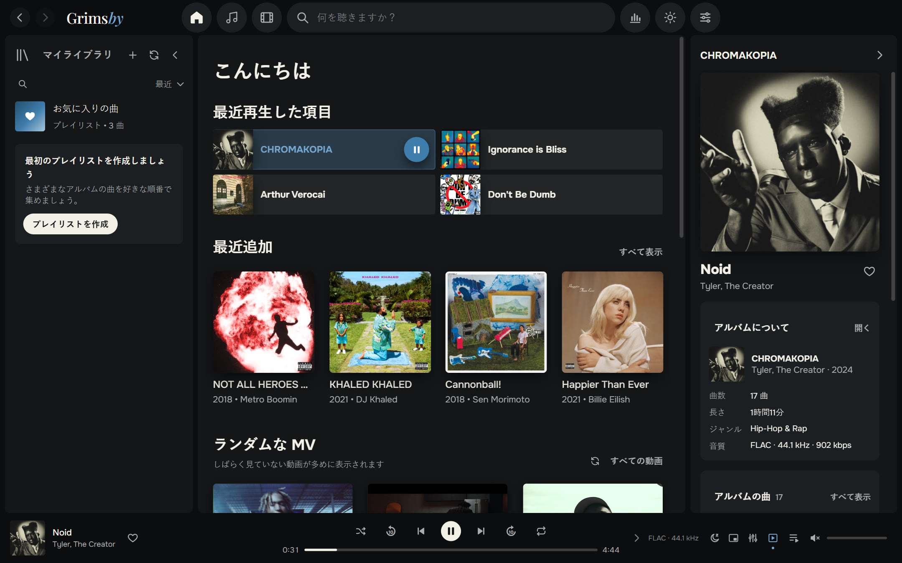

---

## なぜ Grimsby なのか

FLAC でアルバムをダウンロードし、ディスコグラフィーを集め、MV やライブ映像を保存している人なら、この悩みを知っているはずです。
ストリーミングアプリは見た目は素敵ですが、あなたの音楽はそこにありません。レアな作品、高音質のリッピング、YouTube から消えた映像。
従来のプレーヤーはファイルを問題なく扱えますが、画面はまるで 2008 年のままです。

**Grimsby はその両方をつなぎます。** 音楽フォルダーを指定すれば、1 分後にはコレクションが美しいライブラリに変わります。
年ごとのアルバム、写真付きのアーティストページ、アルバムの隣に並ぶ MV、統計、そして Spotify Wrapped のような年間の振り返り。
アカウントも、サブスクリプションも、広告も、インターネットも不要です。

| | ストリーミング | 従来のプレーヤー | **Grimsby** |
|---|:---:|:---:|:---:|
| 自分のファイル（FLAC、レアな作品） | ✕ | ✓ | **✓** |
| モダンで美しい画面 | ✓ | ✕ | **✓** |
| アルバムの隣に MV・ライブ・映画 | 一部 | ✕ | **✓** |
| 統計と年間の振り返り | ✓ | ✕ | **✓** |
| オフライン・サブスク不要 | ✕ | ✓ | **✓** |
| あなたの情報をどこにも送らない | ✕ | ✓ | **✓** |

---

## 機能

### 💿 主役はアルバム

Grimsby はアルバムを通して聴くために作られています。コレクション全体がリリース年ごとに並び、MusicBee のように上部に年のバーが表示されます。
現在の年の見出しはページ上部に固定され、クリックするとカレンダーが開いてすばやく移動できます。
「すべての曲」（列ごとに並べ替え可能）、「アーティスト」、「タイトル順」、「アーティスト別」、「最近追加」のタブもあります。

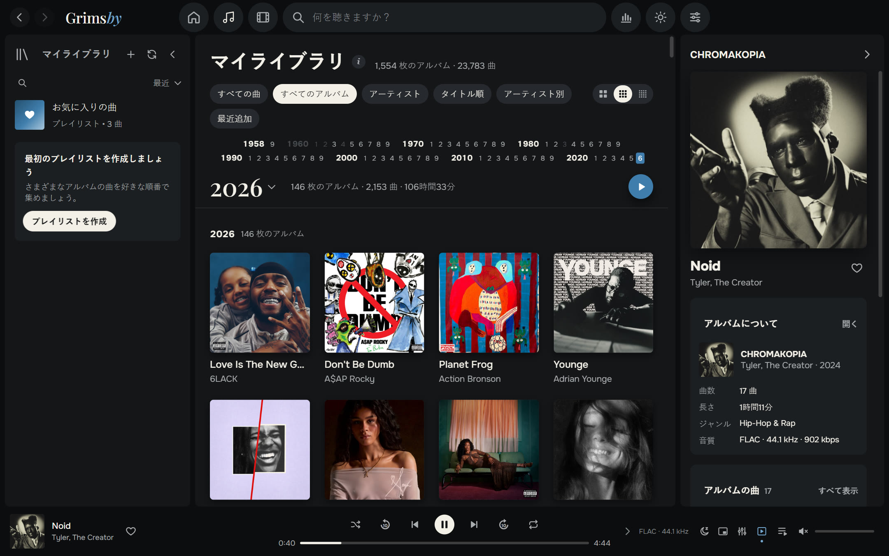

- **巨大なライブラリでも一瞬。** 23,783 曲・1,554 アルバム（286 GB）のコレクションでテスト済み。スクロールは滑らか、検索は即座です。
- **スキャンはあなたの指示どおりに：** 起動のたび、1 日 1 回、または手動のみ。既知のファイルは読み直しません。
- **MP3、FLAC、ALAC、AAC/M4A、OGG、Opus、WAV に対応。** ブラウザーエンジンで再生できない Apple Lossless は Grimsby が自動で変換します。
- **客演アーティスト** を曲名から検出——`(feat. …)`、`(ft. …)`、`(with …)`——その曲は客演アーティストのページにも表示されます。

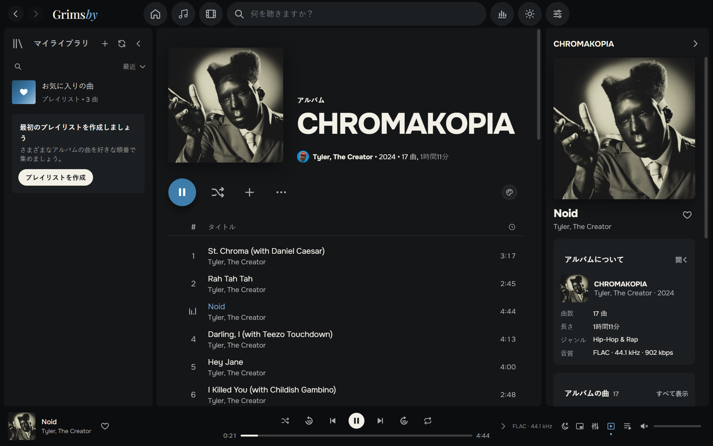

### 🎤 アーティストのすべてを 1 ページに

アルバム、シングル、MV、映画、ライブ、客演曲をひとつのページに。アーティスト写真は Deezer から一度だけ取得し、その後はすべてオフラインで動きます。
アーティストラジオや「すべての動画を見る」もここから。

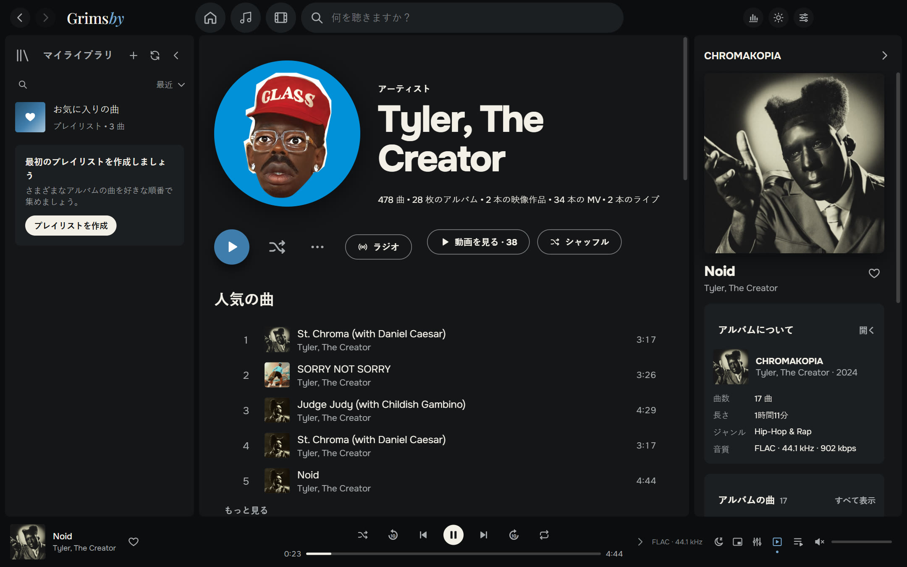

### 🎬 MV、ライブ、アルバム映画

どのストリーミングサービスにもない機能です。Grimsby は動画フォルダーを自動で整理します。

- `アーティスト — タイトル` という名前の動画は、アーティストと年ごとにまとめられます。
- アルバムフォルダー内の動画は**そのアルバムの** MV になります。
- `(Film)` が付いたファイルは**アルバム映画**になり、アルバムと映画が互いにおすすめし合います。
- `concerts` フォルダーはシリーズ別のライブセクションになります（例：*Tiny Desk Concert*）。

動画はアプリ内で再生されます。Spotify のようにプレーヤーの隅に小さくして、ライブラリを見続けられます。
珍しいコーデック（例：4K の AV1）のファイルでも、Grimsby が互換性のあるコピーを自動で用意します。

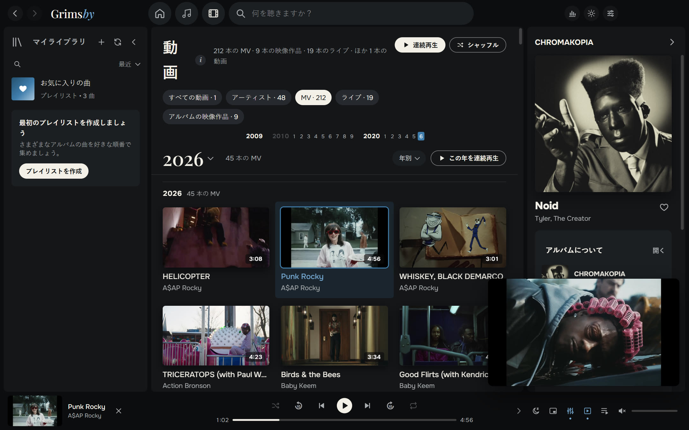

MV は見ない？ 設定のスイッチひとつで動画セクションごと非表示にできます。

### 🔊 本格的なプレーヤーの音

- **ギャップレス再生**——コンセプトアルバムも曲間の途切れなしで再生。
- **2〜12 秒のクロスフェード**。同じアルバム内では自動でオフになります。
- **音量の自動調整（ReplayGain / LUFS）**：スマート、曲ごと、アルバムごと。
- **10 バンドイコライザー**とプリセット：ヒップホップ、R&B、低音強調、ボーカル、小音量など。
- **スリープタイマー、常に最前面のミニプレーヤー、アーティストラジオ、「次に再生」、ドラッグ＆ドロップできる再生キュー。**
- **長い曲やミックス** は止めたところから再開します。

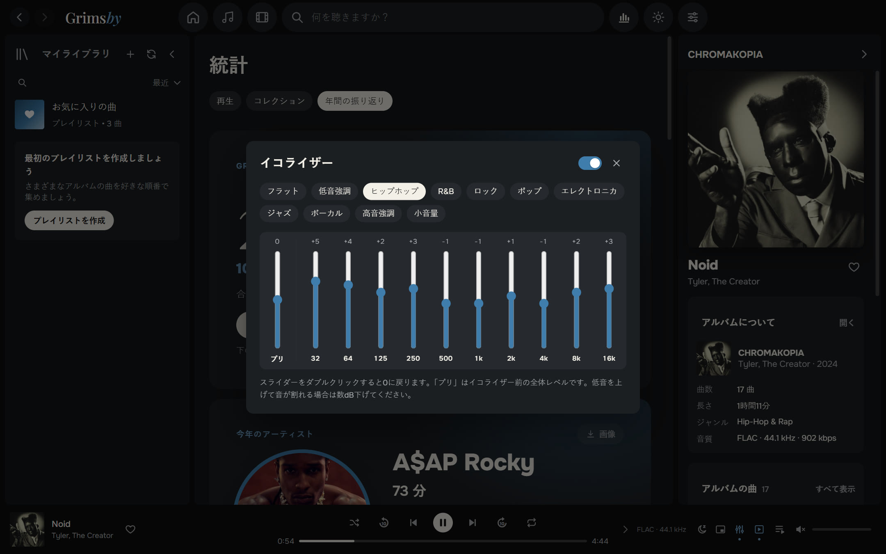

### 📊 数字好きのための統計

**再生**：週・月・年・全期間。分数や再生回数によるアーティスト・アルバム・曲のランキング、音楽を聴いた連続日数。
**コレクション**：曲数、アルバム数、ジャンル数、容量、総再生時間、ロスレスの割合——そして**一度も再生していない**アルバムの数。

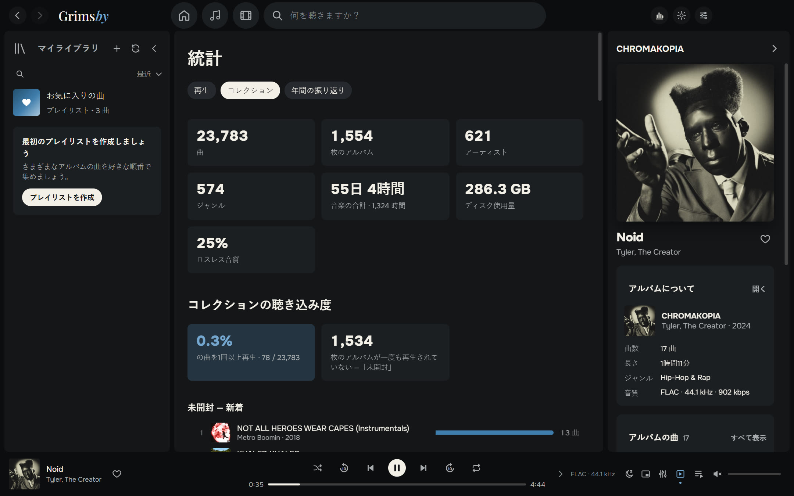

### 🎁 年間の振り返り

12 月 1 日から 1 月 15 日まで、Grimsby が年間の振り返りを贈ります。今年のアーティスト、今年のアルバム、お気に入りの曲、記録、新しい発見、そしてあなたのリスナータイプ
（「一途なファン」「開拓者」「夜型」「マラソン派」…）。各カードはストーリー用の画像として保存でき、ダーク／ライトテーマに対応しています。

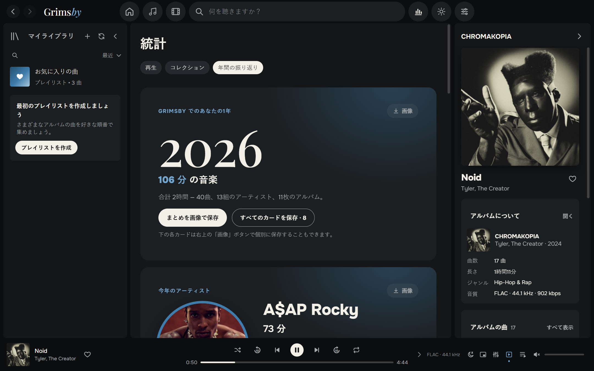

### 🌍 9 つの言語

日本語、English、Русский、Español、Português、Deutsch、Français、中文、한국어。既定では Windows の言語で表示され、「設定 → 表示」で切り替えられます。

### 🎨 ダークテーマとライトテーマ

Grimsby を象徴するブルー、グラファイト、そして「紙」の色。テーマを選ぶか、Windows に合わせることができます。アルバムページをジャケットの色に染めることもできます。

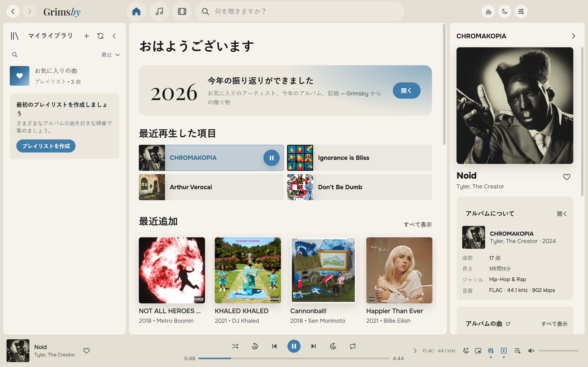

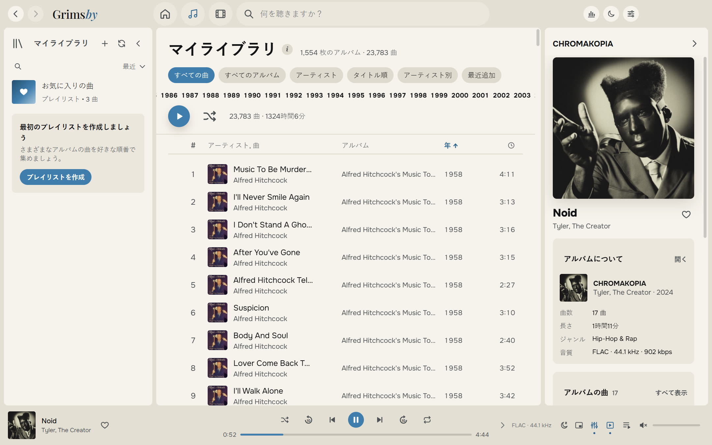

### 🪟 Windows にしっかりなじむ

- Spotify のような、メニュー付きの通知領域アイコン
- タスクバーのサムネイルに前へ／一時停止／次へボタン、メディアキーにも対応
- 常に最前面のミニプレーヤー
- あらゆる操作にキーボードショートカット
- 閉じたときと同じ状態でウィンドウが開く

### 🛠 そのほか

- **プレイリストとフォルダー**：カバーや説明を自由に設定、「お気に入りの曲」、スマートな提案。
- **タグエディター**：アルバム全体をまとめて編集。変更前にファイルをバックアップします。
- **ライブラリの健康チェック**：ジャケット・年・ジャンルのないアルバム、番号のない曲、重複、読み込めないファイル。
- **バックアップ**：お気に入り、プレイリスト、履歴をひとつのファイルに。
- **組み込みガイド「ファイルの準備方法」**：わかりやすい言葉で。
- **アップデートは好みで**：「通知のみ」「自動」「確認しない」。

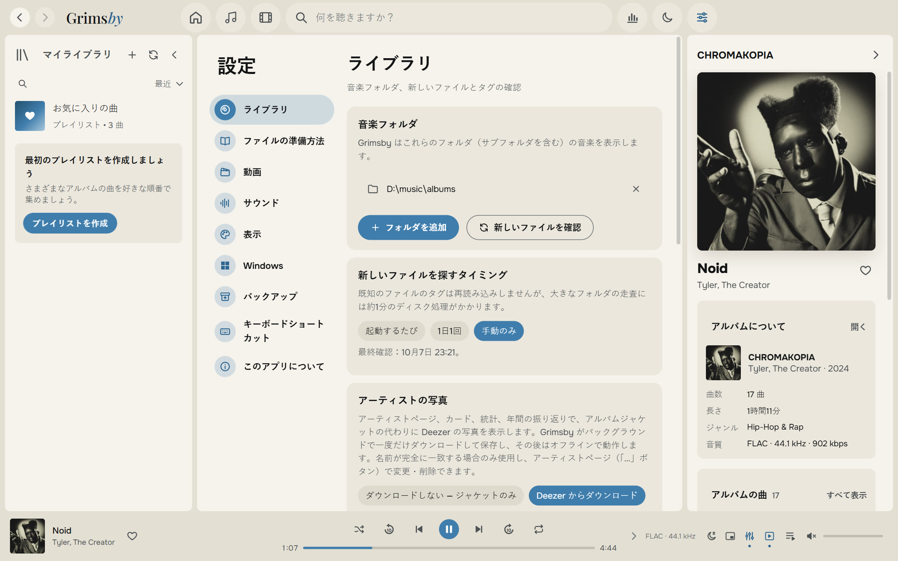

---

## ダウンロードとインストール

1. **[最新バージョン](https://github.com/maksimkhatskevich/grimsby-releases/releases/latest)**のページを開き、`Grimsby-Player-Setup-X.Y.Z.exe` をダウンロードします。
2. インストーラーを実行します。Windows に青い「Windows によって PC が保護されました」画面が表示されることがあります。これは有料のコード署名がないアプリでよく出る警告です。**詳細情報 → 実行** をクリックしてください。
3. 初回起動時に音楽フォルダー（必要なら動画フォルダーも）を選べば、あとは Grimsby におまかせです。

**動作環境：** Windows 10 または 11（64 ビット）。インターネットはアップデートと任意のアーティスト写真にのみ使います。

Grimsby は新しいバージョンを自動で確認し、変更点を表示します。お気に入り、プレイリスト、履歴、設定はそのまま残ります。

---

## ファイルの整理のしかた

Grimsby はコレクションの並べ替えを強制しません。タグを読み取り、よくある保存方法を理解します。ただ、整理されているのが好きです。

```
D:\Music\
├── albums\
│   └── Tyler, The Creator\
│       └── CHROMAKOPIA\
│           ├── 01 - St. Chroma.flac          ← タグ：アーティスト、アルバム、年、埋め込みジャケット
│           └── (2024) Tyler, The Creator — Noid.mp4   ← このアルバムの MV
└── clips\
    ├── 2024\
    │   └── Kendrick Lamar — Not Like Us.mp4  ← MV。年はフォルダー名から
    └── concerts\
        └── Tiny Desk Concert\
            └── Doechii — Tiny Desk.mp4       ← シリーズ内のライブ
```

詳しいガイドはアプリ内にあります：「設定 → ファイルの準備方法」。

---

## プライバシー

Grimsby は**すべてあなたのパソコン上で動作します**。アカウントも広告も解析もありません。再生履歴が PC の外に出ることはありません。
インターネットに接続するのは、アップデートの確認（GitHub）と、オフにしていなければアーティスト写真の取得（Deezer）のときだけです。

---

## フィードバック

不具合を見つけた、アイデアがある、ひとことお礼を言いたい——どれでも歓迎です。

- ✉️ メール：**[grimsbyy@gmail.com](mailto:grimsbyy@gmail.com)**
- 🐞 不具合とアイデア：[Issues](https://github.com/maksimkhatskevich/grimsby-releases/issues)
- 📣 Telegram：[@itsgrimsby](https://t.me/itsgrimsby)（ロシア語）

不具合を報告するときは、Grimsby のバージョン（「設定 → このアプリについて」）、そのとき何をしていたか、可能ならスクリーンショットを添えてください。

---

## ライセンス

Grimsby は Electron、React、FFmpeg（GPL v3）などのオープンソースコンポーネントを使用しています。ライセンス本文とソースコードへのリンクを含む一覧はアプリ内にあります：「設定 → このアプリについて」。
Spotify、Apple Music、MusicBee、Deezer は比較のためにのみ言及しており、各社に帰属します。スクリーンショットのジャケットは各権利者に帰属し、個人ライブラリの例として表示しています。

<p align="center"><sub>アルバムへの愛を込めて · © 2026 Grimsby</sub></p>
