<p align="center">
  <a href="README.md">English</a> ·
  <a href="README.ru.md">Русский</a> ·
  <a href="README.es.md">Español</a> ·
  <a href="README.pt.md">Português</a> ·
  <a href="README.de.md">Deutsch</a> ·
  <a href="README.fr.md">Français</a> ·
  <a href="README.zh.md">中文</a> ·
  <a href="README.ja.md">日本語</a> ·
  <b>한국어</b>
</p>

<p align="center">
  
</p>

<h1 align="center">Grimsby Player</h1>

<p align="center">
  <b>음악을 내려받고 모으는 사람들을 위한 오프라인 플레이어.</b><br>
  라이브러리는 스트리밍 서비스처럼 보이지만, 모든 파일은 남의 서버가 아닌 내 드라이브에 있습니다.
</p>

<p align="center">
  <a href="https://github.com/maksimkhatskevich/grimsby-releases/releases/latest"></a>
  
  
  
  <a href="https://www.virustotal.com/gui/file/5c565d77d2b34a541cc38c9464028a9a490483999d84340947974058d25d8179"></a>
  <a href="https://github.com/maksimkhatskevich/grimsby-releases/releases"></a>
</p>

<p align="center">
  <a href="https://github.com/maksimkhatskevich/grimsby-releases/releases/latest"><b>⬇ Windows용 다운로드</b></a>
</p>

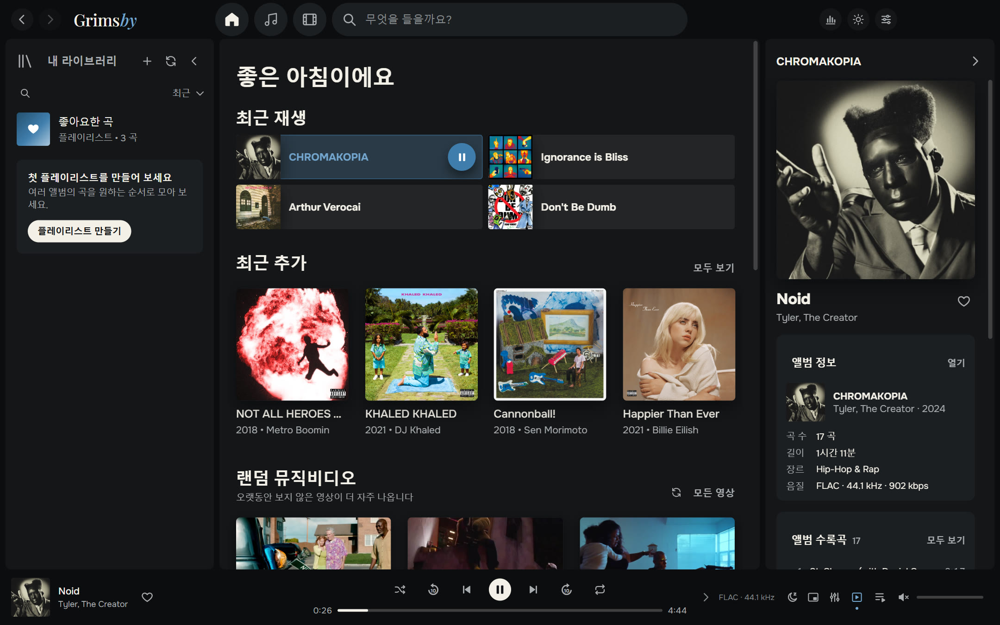

---

## 왜 Grimsby인가

FLAC 앨범을 내려받고, 디스코그래피를 모으고, 뮤직비디오와 공연 영상을 보관한다면 이 고민을 알고 있을 겁니다.
스트리밍 앱은 보기 좋지만 내 음악은 거기에 없습니다. 희귀 음반, 고음질 립, YouTube에서 사라진 영상들.
기존 플레이어는 파일을 잘 다루지만, 화면은 2008년에 멈춰 있는 것 같죠.

**Grimsby는 둘을 하나로 합칩니다.** 음악 폴더를 지정하면 1분 뒤 컬렉션이 멋진 라이브러리로 바뀝니다.
연도별 앨범, 사진이 있는 아티스트 페이지, 앨범 옆의 뮤직비디오, 통계, 그리고 연말 결산까지.
계정도, 구독도, 광고도, 인터넷도 필요 없습니다.

| | 스트리밍 | 기존 플레이어 | **Grimsby** |
|---|:---:|:---:|:---:|
| 내 파일 (FLAC, 희귀 음반) | ✕ | ✓ | **✓** |
| 현대적이고 아름다운 화면 | ✓ | ✕ | **✓** |
| 앨범 옆의 뮤직비디오·공연·영화 | 일부 | ✕ | **✓** |
| 통계와 연말 결산 | ✓ | ✕ | **✓** |
| 변환기·중복 찾기·태그 편집 | ✕ | 일부 | **✓** |
| 인터넷·구독 없이 작동 | ✕ | ✓ | **✓** |
| 내 정보를 어디에도 보내지 않음 | ✕ | ✓ | **✓** |

---

## 기능

### 💿 앨범이 주인공

Grimsby는 앨범을 처음부터 끝까지 듣기 위해 만들어졌습니다. 컬렉션 전체가 발매 연도별로 정리되고, 위쪽에는 연도 막대가 있습니다.
현재 연도 제목은 페이지 상단에 고정되며, 클릭하면 빠르게 이동할 수 있는 달력이 열립니다.
「모든 곡」(열별 정렬 가능), 「아티스트」, 「제목순」, 「아티스트별」, 「최근 추가」 탭과 알파벳 막대도 있습니다.

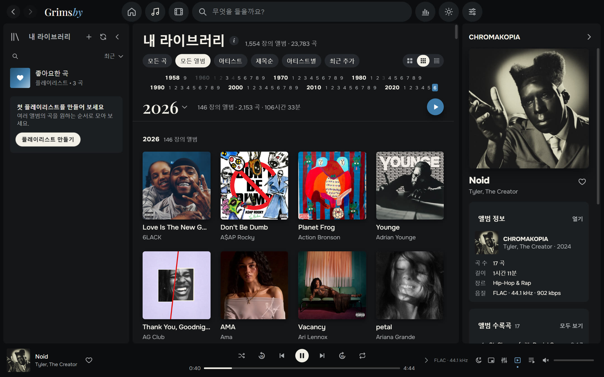

- **거대한 라이브러리에서도 즉시.** 23,783곡, 1,554개 앨범(286 GB) 컬렉션으로 테스트했습니다. 스크롤은 부드럽고 검색은 바로 됩니다.
- **원할 때만 스캔:** 실행할 때마다, 하루 한 번, 또는 수동으로. 이미 알고 있는 파일은 다시 읽지 않습니다.
- **MP3, FLAC, ALAC, AAC/M4A, OGG, Opus, WAV 지원.** 브라우저 엔진이 재생하지 못하는 Apple Lossless는 Grimsby가 알아서 변환합니다.
- **여러 디스크로 된 앨범** 은 「디스크 1」, 「디스크 2」…로 나뉘고 디스크마다 번호가 매겨집니다.
- **피처링 아티스트** 를 곡 제목에서 찾아냅니다 — `(feat. …)`, `(ft. …)`, `(with …)` — 해당 곡은 피처링 아티스트 페이지에도 표시됩니다.
- **커버 크기**: 크게, 보통, 작게 — 음악과 영상에 따로 설정할 수 있습니다.

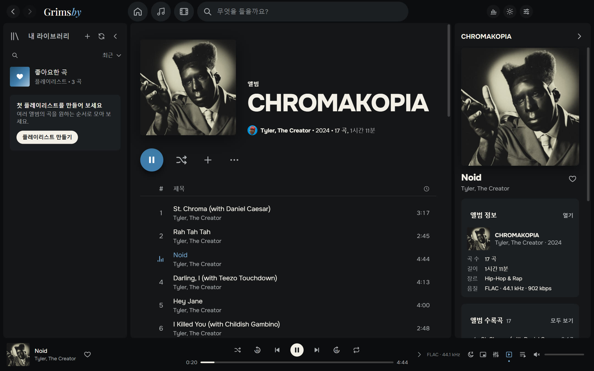

### 🎤 아티스트의 모든 것을 한 페이지에

앨범, 싱글, 뮤직비디오, 영화, 공연, 피처링 곡을 한 페이지에서. 아티스트 사진은 Deezer에서 한 번만 받아오고, 그다음부터는 모두 오프라인으로 작동합니다.
아티스트 라디오와 「모든 영상 보기」도 바로 여기 있습니다.

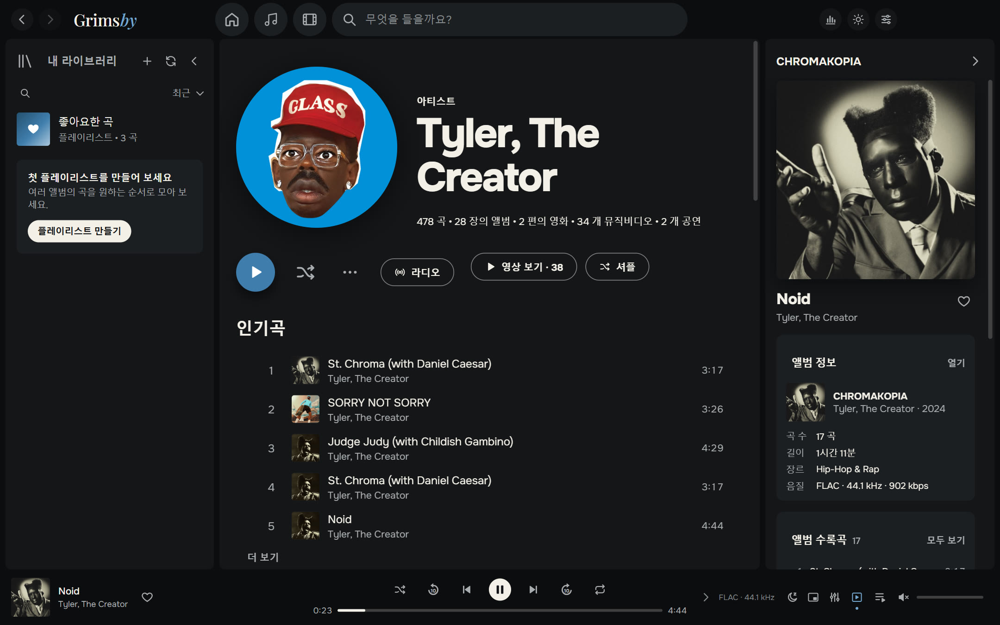

### 🎬 뮤직비디오, 공연, 앨범 영화

어떤 스트리밍 서비스에도 없는 기능입니다. Grimsby가 영상 폴더를 알아서 정리합니다.

- `아티스트 — 제목` 형식의 영상은 아티스트와 연도별로 묶입니다.
- 앨범 폴더 안의 영상은 **그 앨범의** 뮤직비디오가 됩니다.
- `(Film)` 표시가 있는 파일은 **앨범 영화**가 되고, 앨범과 영화가 서로를 추천합니다.
- `concerts` 폴더는 시리즈별 공연 섹션이 됩니다 (예: *Tiny Desk Concert*).

영상은 앱 안에서 재생됩니다. 플레이어 구석으로 작게 줄이고 라이브러리를 계속 둘러볼 수 있습니다.
흔치 않은 코덱(예: 4K AV1)을 쓰는 파일도 Grimsby가 호환되는 사본을 알아서 준비합니다.

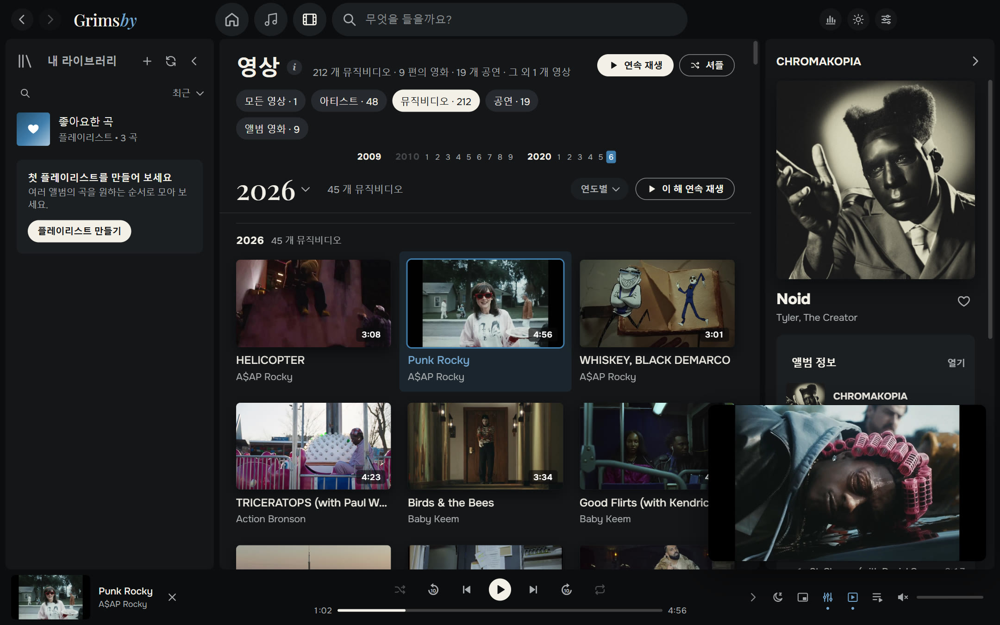

뮤직비디오를 보지 않나요? 설정에서 스위치 하나로 영상 섹션 전체를 숨길 수 있습니다.

### 🧰 깔끔하게 정리되는 라이브러리

- **파일 변환기**: MP3, AAC(M4A), Opus, OGG, FLAC, ALAC, WAV. 태그와 커버도 함께 옮겨집니다. 사본을 별도 폴더에 저장하거나 원본을 바꿀 수 있으며, 이전 파일은 휴지통으로 가고 좋아요와 플레이리스트는 새 파일로 옮겨집니다. 변환할 곡은 체크박스로 고릅니다.
- **중복 찾기**: 서로 다른 파일에 있는 같은 곡과 앨범 폴더 사본을 찾아, 사본마다 폴더·포맷·비트레이트를 보여 줍니다. 중복이 아니라면 「문제 없음」을 누르세요. Grimsby가 기억합니다.
- **보관함 상태** 를 기분 이모티콘 😊 😐 😟 으로 표시: 커버·연도·장르가 없는 앨범, 번호 없는 곡, 읽을 수 없는 파일 — 그리고 고치는 방법까지.
- **정보 편집**: 앨범 전체의 태그와 커버를 한 번에, 디스크 나누기도 가능. 변경 전에 파일을 백업합니다.

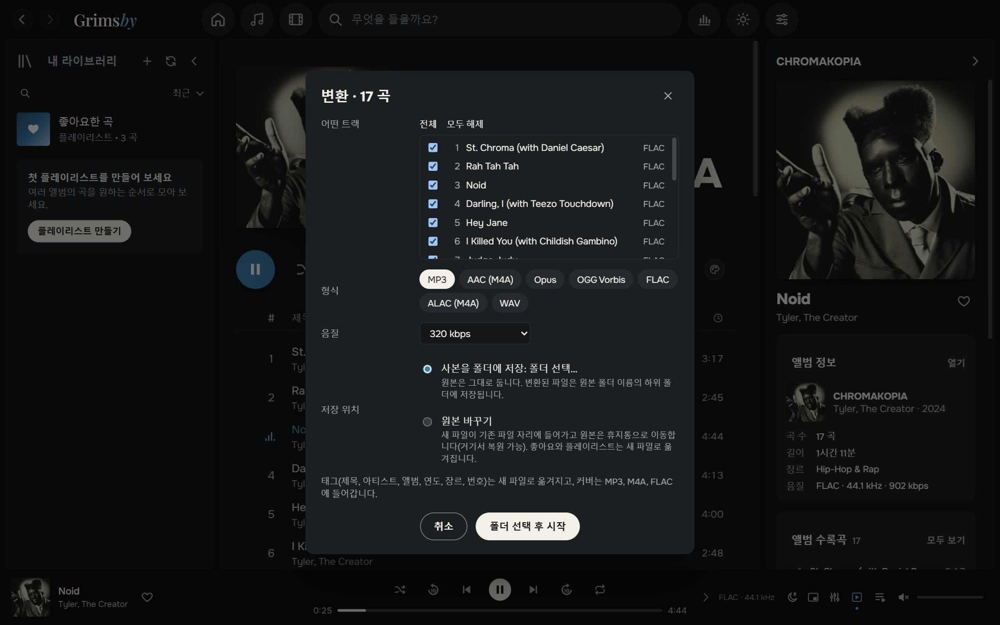

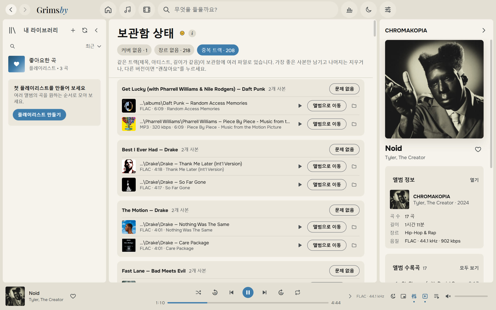

### 🔊 제대로 된 플레이어의 소리

- **갭리스 재생** — 콘셉트 앨범도 곡 사이 끊김 없이 재생됩니다.
- **2~12초 크로스페이드**, 같은 앨범 안에서는 자동으로 꺼집니다.
- **볼륨 평준화 (ReplayGain / LUFS)**: 스마트, 곡별, 앨범별.
- **10밴드 이퀄라이저**와 프리셋: 힙합, R&B, 저음 강조, 보컬, 작은 음량 등.
- **수면 타이머, 항상 위에 표시되는 미니 플레이어, 「다음에 재생」, 끌어다 놓는 재생 대기열.**
- **긴 곡과 믹스** 는 멈춘 곳에서 이어서 재생됩니다.

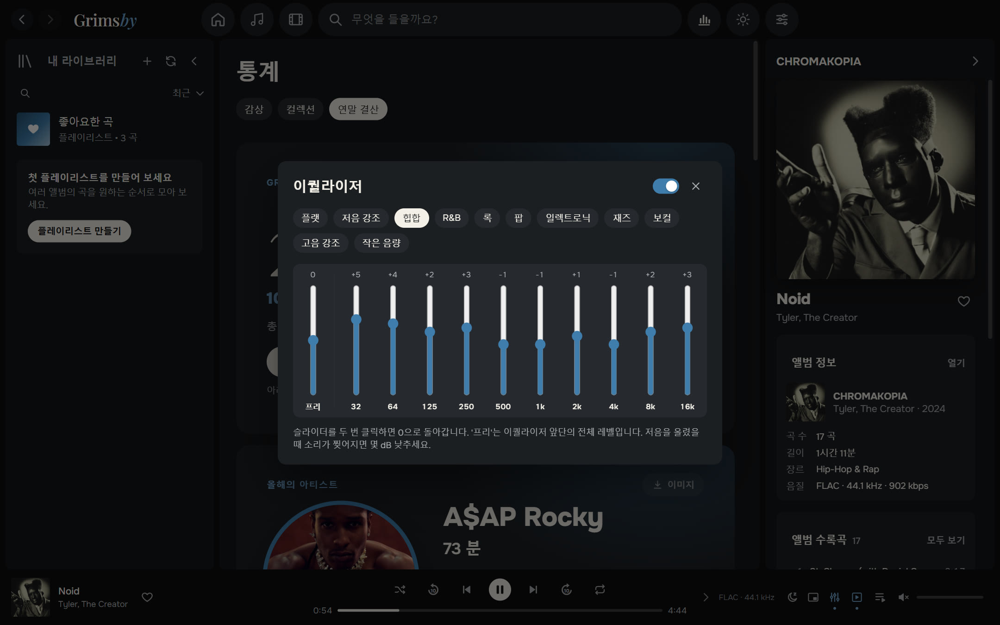

### 📻 스스로 채워지는 플레이리스트

- **스마트 플레이리스트**: 자주 듣는 곡에 장르와 연도가 비슷한 곡을 섞은 **「라디오: 내 믹스」**, 한 아티스트나 장르를 중심으로 한 **아티스트 라디오** 도 있습니다.
- 사이드 패널의 플레이리스트와 폴더를 **원하는 순서** 로 배치할 수 있고, 정렬을 바꿨다가 돌아와도 유지됩니다.
- 「좋아요한 곡」과 플레이리스트를 번호, 아티스트, 제목, 앨범, 길이로 정렬 — 메뉴에서 또는 열 제목을 클릭해서.
- 플레이리스트마다 커버와 설명을 지정할 수 있습니다.

### 📊 숫자를 좋아하는 사람을 위한 통계

**감상**: 이번 주, 이번 달, 올해, 전체 기간. 분 또는 재생 횟수 기준 인기 아티스트·앨범·곡, 음악과 함께한 연속 일수. 숫자는 음악이 재생되는 동안 실시간으로 바뀝니다.
**컬렉션**: 곡, 앨범, 장르, 용량, 총 재생 시간, 무손실 비율 — 그리고 **한 번도 재생하지 않은** 앨범 수까지.

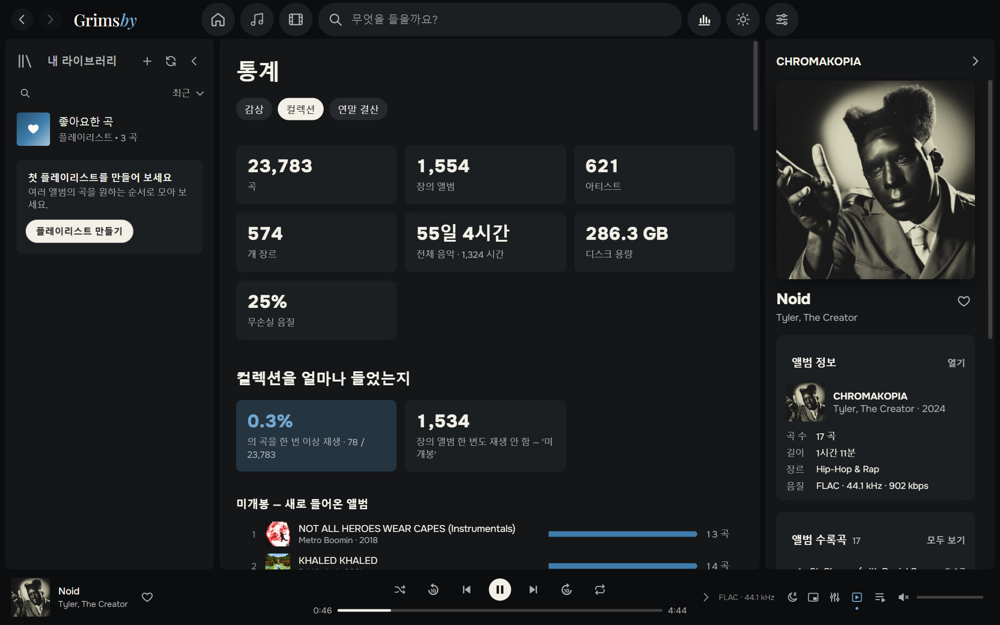

### 🎁 연말 결산

12월 1일부터 1월 15일까지 Grimsby가 연말 결산을 선물합니다. 올해의 아티스트, 올해의 앨범, 좋아하는 곡, 기록, 새로운 발견, 그리고 나의 리스너 유형
(「열혈 팬」, 「탐험가」, 「올빼미」, 「마라토너」…). 카드마다 스토리용 이미지로 저장할 수 있고, 다크·라이트 테마를 지원합니다.

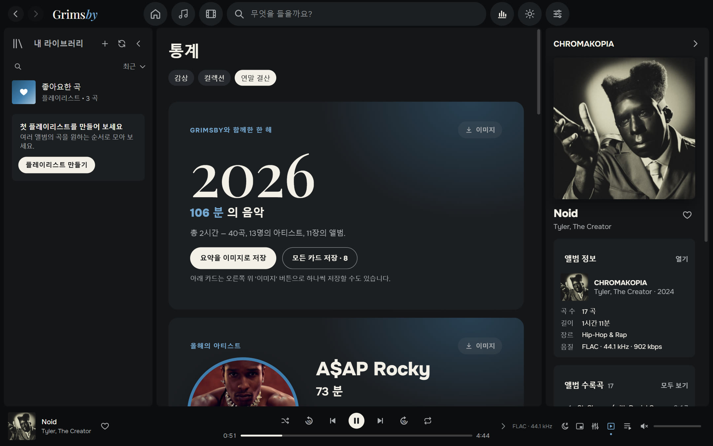

### 🌍 9개 언어

한국어, English, Русский, Español, Português, Deutsch, Français, 中文, 日本語. 기본적으로 Windows 언어를 따르며, 「설정 → 모양」에서 바꿀 수 있습니다.

### 🎨 다크·라이트 테마와 커버의 색

Grimsby의 상징인 블루, 그래파이트, 그리고 「종이」 색. 테마를 고르거나 Windows 설정을 따를 수 있습니다. 앨범이나 플레이리스트 페이지를 커버 색으로 물들일 수 있습니다 — 은은한 빛부터 전체 채우기까지, 페이지의 팔레트 버튼으로 바로 전환합니다.

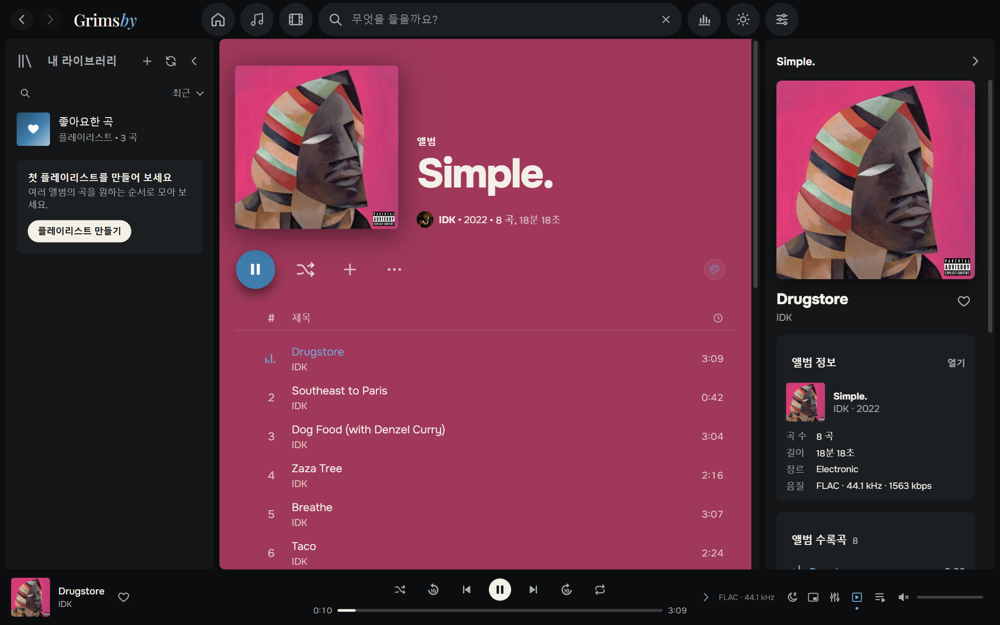

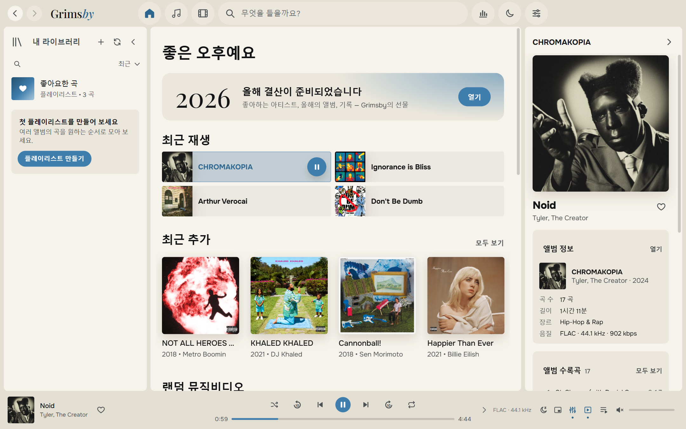

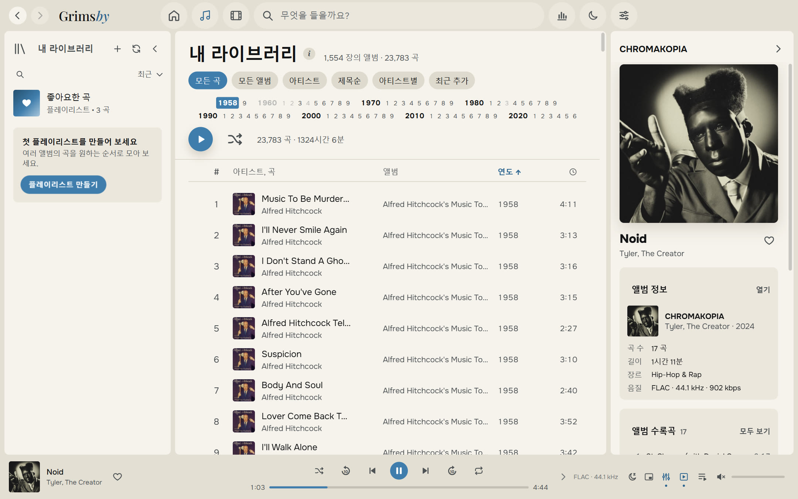

### 🪟 Windows와 잘 어울리는 앱

- 재생 메뉴가 있는 알림 영역 아이콘
- 작업 표시줄 미리 보기의 이전 / 일시 정지 / 다음 버튼, 미디어 키 지원
- 항상 위에 표시되는 미니 플레이어
- 모든 기능에 단축키
- 닫았을 때 모습 그대로 다시 열리는 창

### 🛠 그 밖에도

- **백업**: 좋아요, 플레이리스트, 기록을 파일 하나로.
- **내장 가이드 「파일 준비 방법」**: 쉬운 말로 설명합니다.
- **업데이트는 원하는 방식으로**: 「알림만」, 「자동」, 「확인 안 함」.

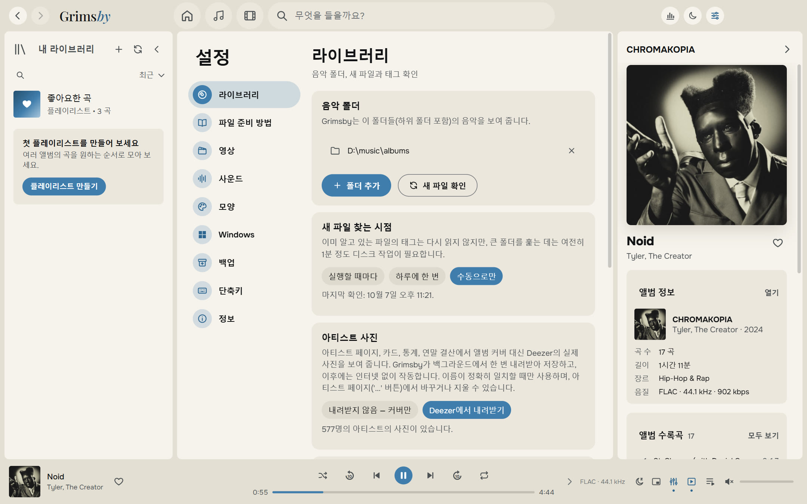

---

## 다운로드 및 설치

1. **[최신 버전](https://github.com/maksimkhatskevich/grimsby-releases/releases/latest)** 페이지를 열고 `Grimsby-Player-Setup-X.Y.Z.exe`를 내려받습니다.
2. 설치 프로그램을 실행합니다. Windows가 파란색 「Windows의 PC 보호」 창을 띄울 수 있는데, 유료 코드 서명이 없는 프로그램에서 흔히 나오는 경고입니다. **추가 정보 → 실행** 을 누르세요.
   설치 프로그램은 VirusTotal에서 검사했습니다: [백신 엔진 68개 모두 이상 없음](https://www.virustotal.com/gui/file/5c565d77d2b34a541cc38c9464028a9a490483999d84340947974058d25d8179) (버전 1.4.0).
3. 처음 실행할 때 음악 폴더(원하면 영상 폴더도)를 선택하면, 나머지는 Grimsby가 알아서 합니다.

**요구 사항:** Windows 10 또는 11 (64비트). 인터넷은 업데이트와 선택 사항인 아티스트 사진에만 필요합니다.

Grimsby는 새 버전을 스스로 확인하고 무엇이 바뀌었는지 보여 줍니다. 좋아요, 플레이리스트, 기록, 설정은 그대로 유지됩니다.

---

## 파일 정리 방법

Grimsby는 컬렉션을 다시 정리하라고 강요하지 않습니다. 태그를 읽고 가장 흔한 저장 방식을 이해합니다. 그래도 정리된 것을 좋아하죠.

```
D:\Music\
├── albums\
│   └── Tyler, The Creator\
│       └── CHROMAKOPIA\
│           ├── 01 - St. Chroma.flac          ← 태그: 아티스트, 앨범, 연도, 내장 커버
│           └── (2024) Tyler, The Creator — Noid.mp4   ← 이 앨범의 뮤직비디오
└── clips\
    ├── 2024\
    │   └── Kendrick Lamar — Not Like Us.mp4  ← 뮤직비디오, 연도는 폴더에서
    └── concerts\
        └── Tiny Desk Concert\
            └── Doechii — Tiny Desk.mp4       ← 시리즈 안의 공연
```

자세한 가이드는 앱 안에 있습니다: 「설정 → 파일 준비 방법」.

---

## 개인정보

Grimsby는 **전부 내 컴퓨터에서 작동합니다**. 계정, 광고, 분석이 없습니다. 감상 기록은 절대 PC 밖으로 나가지 않습니다.
앱이 인터넷에 연결하는 것은 업데이트 확인(GitHub)과, 끄지 않았다면 아티스트 사진(Deezer)뿐입니다.

---

## 피드백

버그를 찾았거나, 아이디어가 있거나, 그냥 고맙다고 말하고 싶다면 연락 주세요.

- ✉️ 이메일: **[grimsbyy@gmail.com](mailto:grimsbyy@gmail.com)**
- 🐞 버그와 아이디어: [Issues](https://github.com/maksimkhatskevich/grimsby-releases/issues)
- 📣 Telegram: [@itsgrimsby](https://t.me/itsgrimsby) (러시아어)

버그를 알릴 때는 Grimsby 버전(「설정 → 정보」), 당시 하던 작업, 가능하면 스크린샷을 함께 보내 주세요.

---

## 라이선스

Grimsby는 Electron, React, FFmpeg(GPL v3) 등 오픈 소스 구성 요소를 사용합니다. 라이선스 전문과 소스 코드 링크가 포함된 전체 목록은 앱 안에 있습니다: 「설정 → 정보」.
Deezer는 해당 소유자의 상표입니다. 스크린샷의 앨범 커버는 각 권리자에게 속하며 개인 라이브러리의 예시로 표시되었습니다.

<p align="center"><sub>앨범을 사랑하는 마음으로 만들었습니다 · © 2026 Grimsby</sub></p>
