<p align="center">
  <b>English</b> ·
  <a href="README.ru.md">Русский</a> ·
  <a href="README.es.md">Español</a> ·
  <a href="README.pt.md">Português</a> ·
  <a href="README.de.md">Deutsch</a> ·
  <a href="README.fr.md">Français</a> ·
  <a href="README.zh.md">中文</a> ·
  <a href="README.ja.md">日本語</a> ·
  <a href="README.ko.md">한국어</a>
</p>

<p align="center">
  
</p>

<h1 align="center">Grimsby Player</h1>

<p align="center">
  <b>An offline player for people who download and collect music.</b><br>
  Your library looks like a streaming service — but everything lives on your own drive, not on someone else's server.
</p>

<p align="center">
  <a href="https://github.com/maksimkhatskevich/grimsby-releases/releases/latest"></a>
  
  
  
  <a href="https://github.com/maksimkhatskevich/grimsby-releases/releases"></a>
</p>

<p align="center">
  <a href="https://github.com/maksimkhatskevich/grimsby-releases/releases/latest"><b>⬇ Download for Windows</b></a>
  &nbsp;·&nbsp;
  <a href="#features">Features</a>
  &nbsp;·&nbsp;
  <a href="#how-to-organize-your-files">Organizing files</a>
  &nbsp;·&nbsp;
  <a href="#feedback">Feedback</a>
</p>

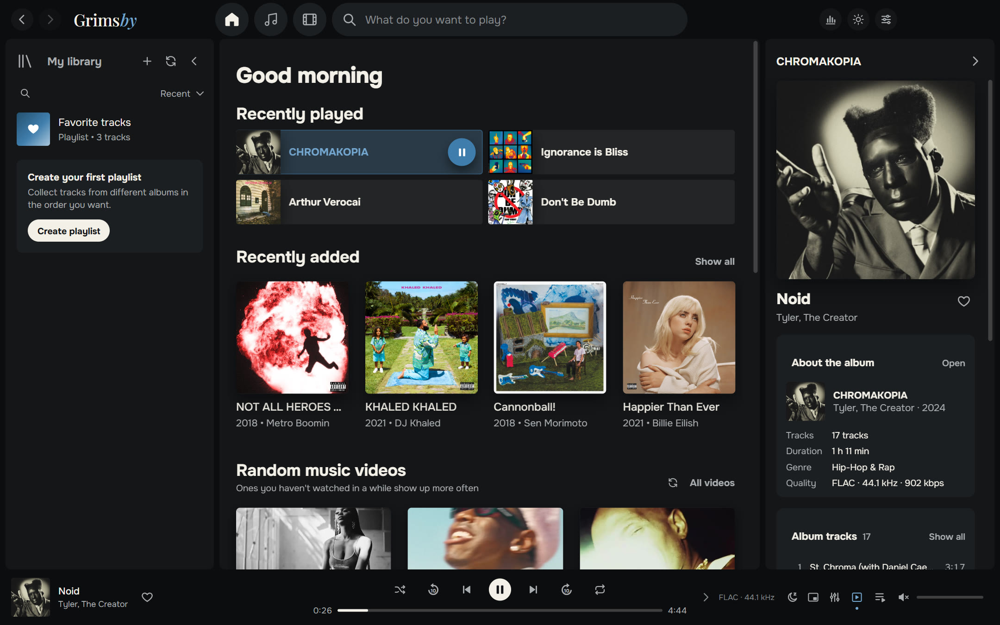

---

## Why Grimsby

If you download albums in FLAC, collect discographies and keep music videos and live sets, you know the problem.
Streaming apps look great, but your music isn't there: rare releases, quality rips, videos that disappeared from YouTube.
Classic players handle your files just fine — but their interface feels stuck in 2008.

**Grimsby brings the two together.** Point it at your music folder, and a minute later your collection becomes a beautiful library:
albums by year, artist pages with photos, music videos next to albums, stats and a yearly recap in the spirit of Spotify Wrapped.
No accounts, no subscriptions, no ads, no internet required.

| | Streaming | Classic player | **Grimsby** |
|---|:---:|:---:|:---:|
| Your own files (FLAC, rare releases) | ✕ | ✓ | **✓** |
| Modern, beautiful interface | ✓ | ✕ | **✓** |
| Music videos, concerts and films next to albums | partly | ✕ | **✓** |
| Stats and a yearly recap | ✓ | ✕ | **✓** |
| Works offline, no subscription | ✕ | ✓ | **✓** |
| Sends nothing about you anywhere | ✕ | ✓ | **✓** |

---

## Features

### 💿 Albums come first

Grimsby is built for listening to whole albums. Your entire collection is laid out by release year, like in MusicBee: a year strip on top,
the current year's header sticks to the top of the page, and clicking it opens a calendar for quick jumps.
There are also tabs for All tracks (sortable by column), Artists, By title, By artist and Recently added.

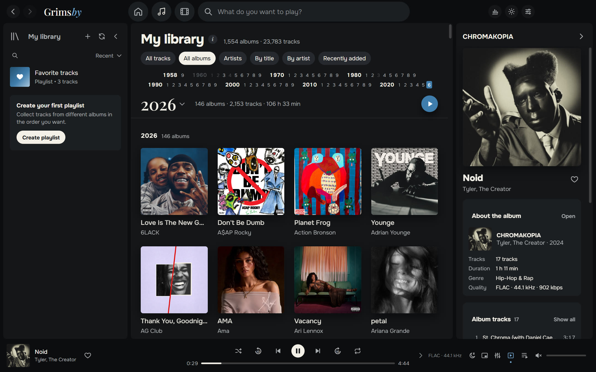

- **Instant even on a huge library.** Tested on a collection of 23,783 tracks and 1,554 albums (286 GB): smooth scrolling, instant search.
- **Scans only when you say so:** on every launch, once a day or manually. Files it already knows aren't read again.
- **MP3, FLAC, ALAC, AAC/M4A, OGG, Opus and WAV.** Grimsby quietly converts Apple Lossless, which browser engines can't play.
- **Featured artists** are found in track titles — `(feat. …)`, `(ft. …)`, `(with …)` — and the tracks show up on their pages too.

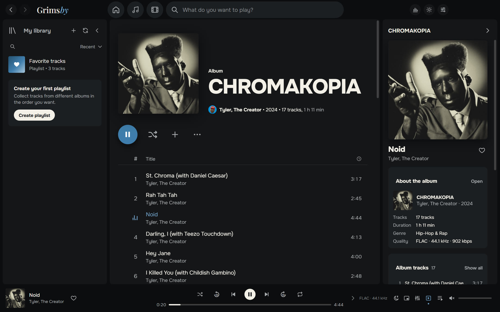

### 🎤 An artist's whole story on one page

Albums, singles, music videos, films, concerts and features on a single page. Grimsby fetches artist photos from Deezer once — after that everything works offline.
Artist radio and "Watch all videos" are right there.

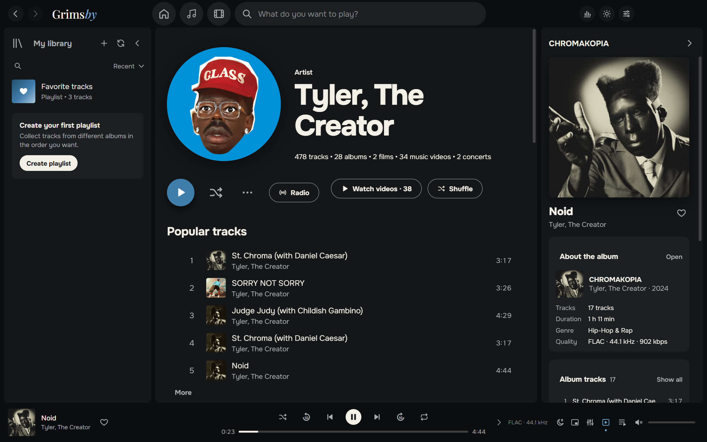

### 🎬 Music videos, concerts and album films

This is something no streaming service has. Grimsby sorts your video folder for you:

- videos named `Artist — Title` are grouped by artist and year;
- a video inside an album folder becomes a music video **of that album**;
- files marked `(Film)` become **album films**, and the album and its film recommend each other;
- a `concerts` folder turns into a concerts section with series (for example, *Tiny Desk Concert*).

Videos play right inside the app. Shrink one into the corner of the player, like in Spotify, and keep browsing your library.
If a file uses a rare codec (say, AV1 in 4K), Grimsby prepares a compatible copy by itself — no need to hunt for another player.

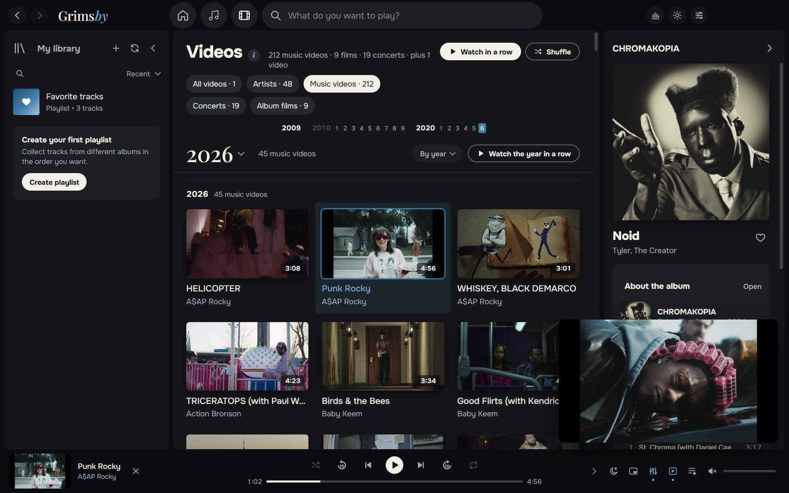

Don't watch videos? Turn the whole section off with a single switch in settings.

### 🔊 Sound like a proper player

- **Gapless playback** — concept albums play without pauses between tracks.
- **Smooth crossfade from 2 to 12 seconds**, automatically skipped within one album so intended transitions stay intact.
- **Volume leveling (ReplayGain / LUFS)** — smart, per track or per album. An old remaster and a new release sound equally loud.
- **10-band equalizer** with presets: Hip-hop, R&B, More bass, Vocal, Quiet listening and more.
- **Sleep timer, an always-on-top mini player, artist radio, Play next and drag-and-drop in the queue.**
- **Long tracks and mixes** resume where you left off.

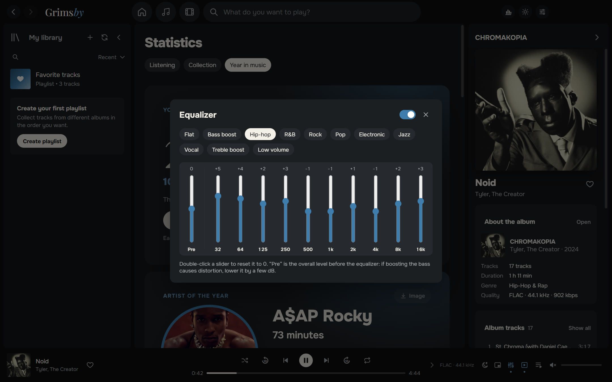

### 📊 Stats for people who love numbers

**Listening** for the week, month, year and all time: top artists, albums and tracks by minutes or plays, listening streaks.
**Collection**: how many tracks, albums, genres, gigabytes and hours of music you have, what share is lossless — and how many albums you've **never played**.

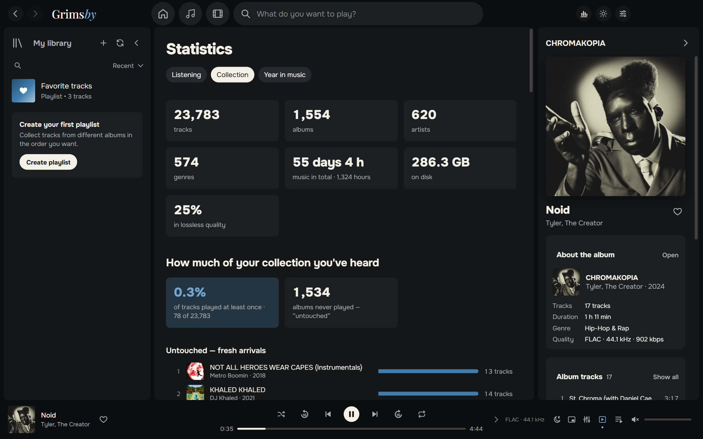

### 🎁 Your year in music

From December 1 to January 15, Grimsby gives you a yearly recap: artist of the year, album of the year, favorite tracks, records, discoveries and your listener type
("Devoted fan", "Explorer", "Night owl", "Marathoner"…). Every card can be saved as an image for stories — in the dark or the light theme.

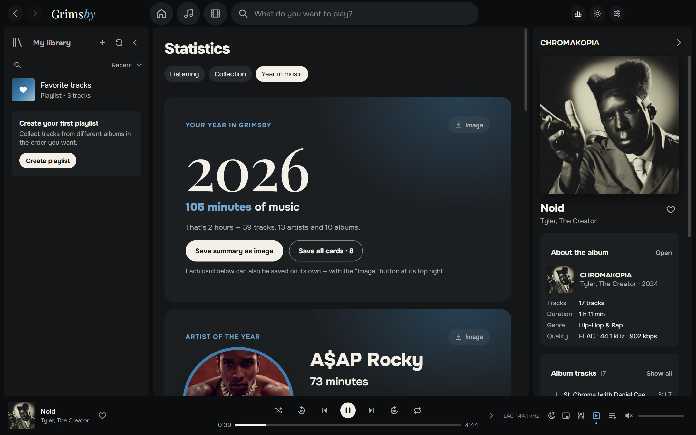

### 🌍 Nine languages

English, Русский, Español, Português, Deutsch, Français, 中文, 日本語 and 한국어. By default Grimsby speaks the language of your Windows; you can switch it in Appearance settings.

### 🎨 Dark and light themes

Grimsby's signature blue, graphite and "paper". Pick a theme or follow Windows. Optionally, album pages take on the colors of the cover.

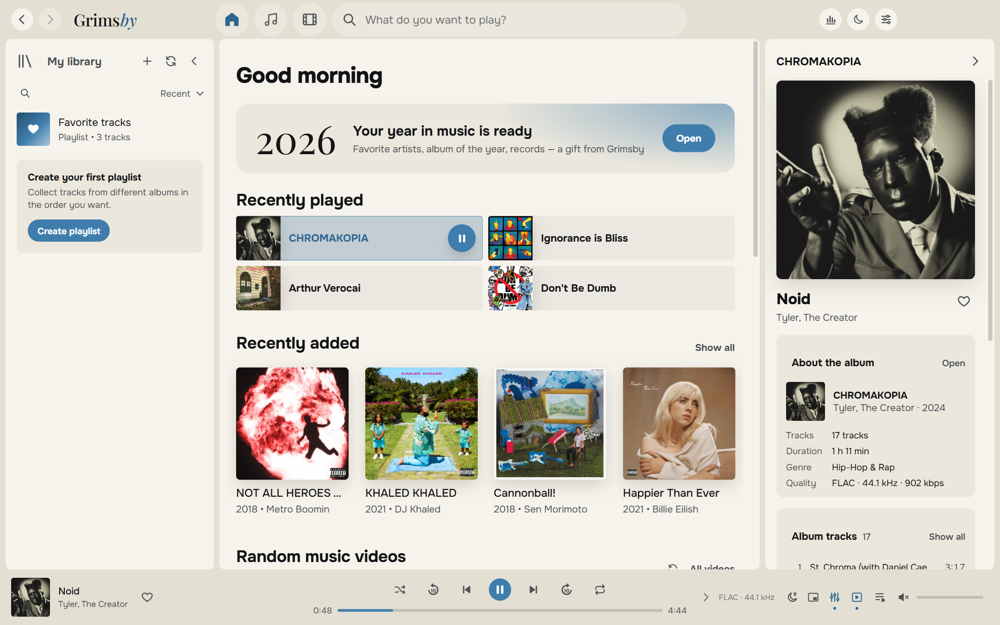

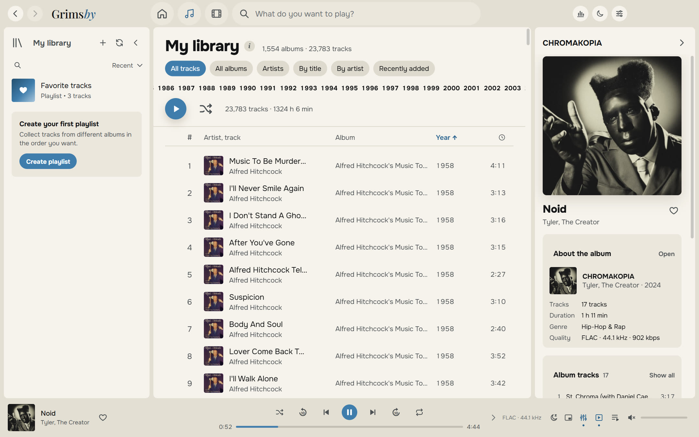

### 🪟 Feels at home in Windows

- a tray icon with a menu, like Spotify;
- previous / pause / next buttons in the taskbar thumbnail and media key support;
- an always-on-top mini player;
- keyboard shortcuts for everything;
- the window reopens exactly the way you left it.

### 🛠 And more

- **Playlists and folders** with custom covers and descriptions, Favorite tracks, smart suggestions.
- **Tag editor** — edit tags and cover art for a whole album at once. Grimsby backs up the files before changing them.
- **Library health**: albums without a cover, year or genre, tracks without numbers, duplicates, one album split across folders, unreadable files.
- **Backup** of likes, playlists and history into a single file.
- **Built-in guide "How to prepare files"** in plain language.
- **Updates your way**: notify only, install automatically, or don't check at all.

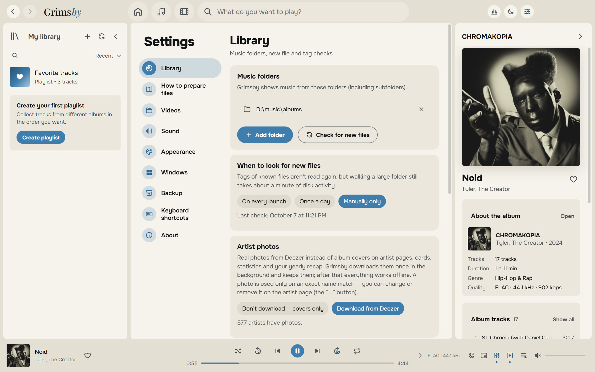

---

## Download and install

1. Open the **[latest release](https://github.com/maksimkhatskevich/grimsby-releases/releases/latest)** page and download `Grimsby-Player-Setup-X.Y.Z.exe`.
2. Run the installer. Windows may show a blue "Windows protected your PC" window — that's a normal warning for apps without a paid code-signing certificate. Click **More info → Run anyway**.
3. On first launch, pick your music folder (and, if you like, your videos folder). Grimsby takes care of the rest.

**Requirements:** Windows 10 or 11 (64-bit). Internet is only needed for updates and optional artist photos.

### Updates

Grimsby checks for new versions itself and shows what's changed. Your likes, playlists, history and settings are kept across updates.
The full changelog is on the [Releases](https://github.com/maksimkhatskevich/grimsby-releases/releases) page and in the app: Settings → About.

---

## How to organize your files

Grimsby doesn't make you reorganize your collection: it reads tags and understands the most common ways people store music. But it does love order:

```
D:\Music\
├── albums\
│   └── Tyler, The Creator\
│       └── CHROMAKOPIA\
│           ├── 01 - St. Chroma.flac          ← tags: artist, album, year, embedded cover
│           ├── ...
│           └── (2024) Tyler, The Creator — Noid.mp4   ← a music video of this album
└── clips\
    ├── 2024\
    │   └── Kendrick Lamar — Not Like Us.mp4  ← a music video; the year comes from the folder
    └── concerts\
        └── Tiny Desk Concert\
            └── Doechii — Tiny Desk.mp4       ← a concert in a series
```

There's a detailed guide in the app: Settings → How to prepare files.

---

## Privacy

Grimsby runs **entirely on your computer**. No accounts, no ads, no analytics. Your listening history never leaves your PC.
The app only goes online for updates (GitHub) and — unless you turn it off — for artist photos (Deezer).

---

## Feedback

Found a bug, have an idea or just want to say thanks? Get in touch:

- ✉️ email: **[grimsbyy@gmail.com](mailto:grimsbyy@gmail.com)**
- 🐞 bugs and ideas: [Issues](https://github.com/maksimkhatskevich/grimsby-releases/issues)
- 📣 Telegram: [@itsgrimsby](https://t.me/itsgrimsby) (in Russian)

When reporting a bug, please include your Grimsby version (Settings → About), what you were doing and, if possible, a screenshot.

---

## Licenses

Grimsby uses open-source components, including Electron, React and FFmpeg (GPL v3). The full list with license texts and links to source code is in the app: Settings → About → Open the license list.
Spotify, Apple Music, MusicBee and Deezer are mentioned only for comparison and belong to their owners. Album covers in the screenshots belong to their rights holders and are shown as an example of a personal library.

<p align="center"><sub>Made with love for albums · © 2026 Grimsby</sub></p>
