<p align="center">
  <a href="README.md">English</a> ·
  <a href="README.ru.md">Русский</a> ·
  <a href="README.es.md">Español</a> ·
  <b>Português</b> ·
  <a href="README.de.md">Deutsch</a> ·
  <a href="README.fr.md">Français</a> ·
  <a href="README.zh.md">中文</a> ·
  <a href="README.ja.md">日本語</a> ·
  <a href="README.ko.md">한국어</a>
</p>

<p align="center">
  
</p>

<h1 align="center">Grimsby Player</h1>

<p align="center">
  <b>Um player offline para quem baixa e coleciona música.</b><br>
  Sua biblioteca parece um serviço de streaming — mas tudo fica no seu próprio disco, e não no servidor de outra pessoa.
</p>

<p align="center">
  <a href="https://github.com/maksimkhatskevich/grimsby-releases/releases/latest"></a>
  
  
  
  <a href="https://github.com/maksimkhatskevich/grimsby-releases/releases"></a>
</p>

<p align="center">
  <a href="https://github.com/maksimkhatskevich/grimsby-releases/releases/latest"><b>⬇ Baixar para Windows</b></a>
</p>

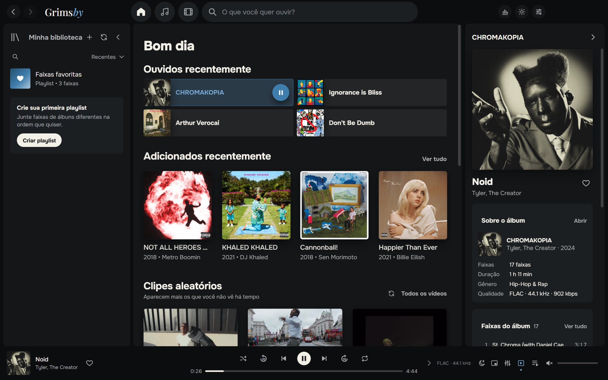

---

## Por que o Grimsby

Se você baixa álbuns em FLAC, coleciona discografias e guarda clipes e shows, conhece o problema.
Os serviços de streaming são bonitos, mas a sua música não está lá: lançamentos raros, rips de qualidade, vídeos que sumiram do YouTube.
Os players clássicos lidam bem com seus arquivos — mas a interface parece de 2008.

**O Grimsby junta os dois mundos.** Aponte a sua pasta de música e, em um minuto, sua coleção vira uma biblioteca linda:
álbuns por ano, páginas de artistas com fotos, clipes ao lado dos álbuns, estatísticas e uma retrospectiva do ano no estilo do Spotify Wrapped.
Sem contas, sem assinaturas, sem anúncios e sem internet.

| | Streaming | Player clássico | **Grimsby** |
|---|:---:|:---:|:---:|
| Seus próprios arquivos (FLAC, lançamentos raros) | ✕ | ✓ | **✓** |
| Interface moderna e bonita | ✓ | ✕ | **✓** |
| Clipes, shows e filmes ao lado dos álbuns | em parte | ✕ | **✓** |
| Estatísticas e retrospectiva do ano | ✓ | ✕ | **✓** |
| Funciona offline, sem assinatura | ✕ | ✓ | **✓** |
| Não envia nada sobre você para lugar nenhum | ✕ | ✓ | **✓** |

---

## Recursos

### 💿 Os álbuns em primeiro lugar

O Grimsby foi feito para ouvir álbuns inteiros. Toda a coleção é organizada por ano de lançamento, como no MusicBee: uma faixa de anos no topo,
o cabeçalho do ano atual fica fixo no alto da página e, ao clicar nele, abre um calendário para pular rapidamente.
Há também as abas «Todas as faixas» (ordenáveis por coluna), «Artistas», «Por título», «Por artista» e «Adicionados recentemente».

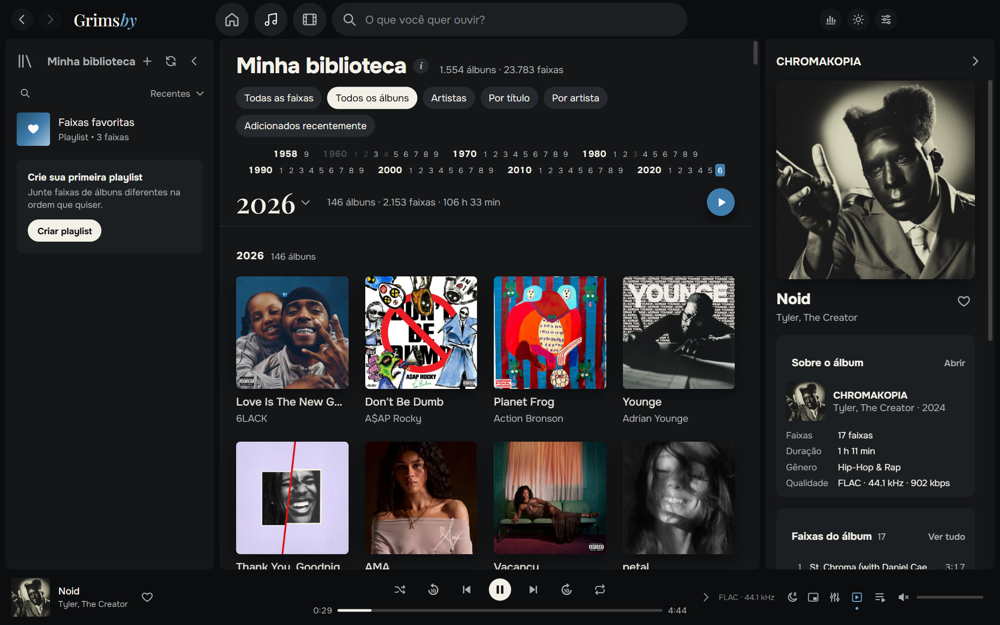

- **Instantâneo mesmo com bibliotecas enormes.** Testado com 23.783 faixas e 1.554 álbuns (286 GB): rolagem suave e busca imediata.
- **Escaneia só quando você quiser:** a cada abertura, uma vez por dia ou manualmente. Arquivos já conhecidos não são lidos de novo.
- **MP3, FLAC, ALAC, AAC/M4A, OGG, Opus e WAV.** O Grimsby converte sozinho o Apple Lossless, que os motores de navegador não tocam.
- **Participações** são encontradas nos títulos — `(feat. …)`, `(ft. …)`, `(with …)` — e aparecem também nas páginas dos artistas convidados.

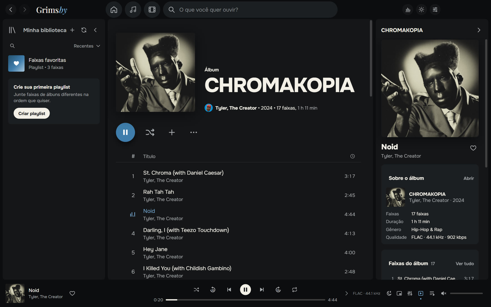

### 🎤 A história inteira de um artista em uma página

Álbuns, singles, clipes, filmes, shows e participações em uma só página. O Grimsby baixa as fotos dos artistas do Deezer uma vez — depois tudo funciona offline.
Ali mesmo estão a rádio do artista e «Assistir a todos os vídeos».

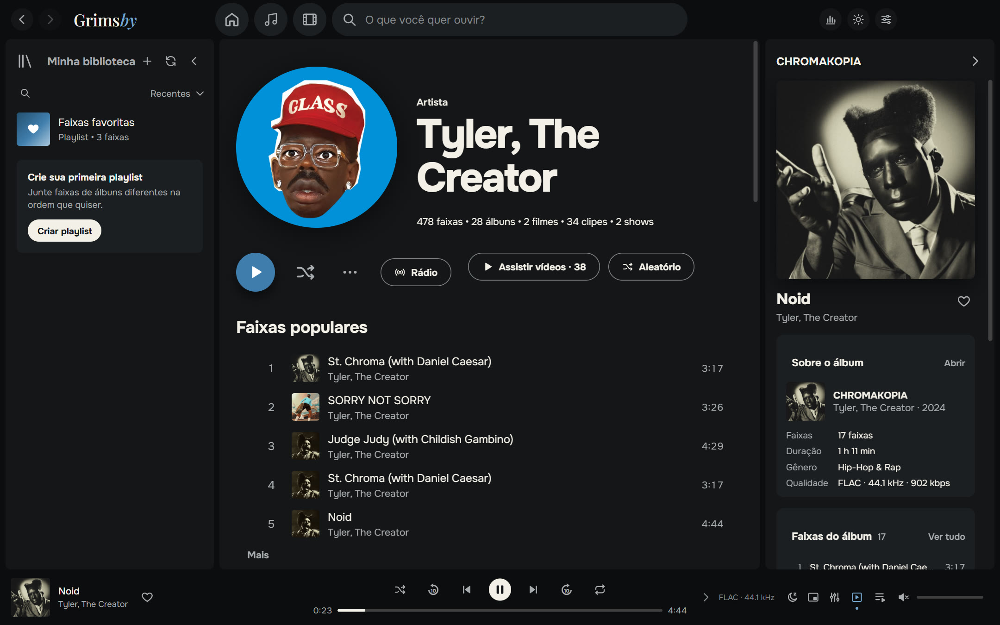

### 🎬 Clipes, shows e filmes de álbuns

Algo que nenhum streaming tem. O Grimsby organiza sua pasta de vídeos sozinho:

- vídeos com nome `Artista — Título` são agrupados por artista e ano;
- um vídeo dentro da pasta de um álbum vira clipe **daquele álbum**;
- arquivos marcados com `(Film)` viram **filmes do álbum**, e o álbum e o filme recomendam um ao outro;
- a pasta `concerts` vira uma seção de shows com séries (por exemplo, *Tiny Desk Concert*).

Os vídeos tocam dentro do app. Você pode encolher o vídeo para o canto do player, como no Spotify, e continuar navegando.
Se o arquivo usar um codec raro (por exemplo, AV1 em 4K), o Grimsby prepara uma cópia compatível sozinho.

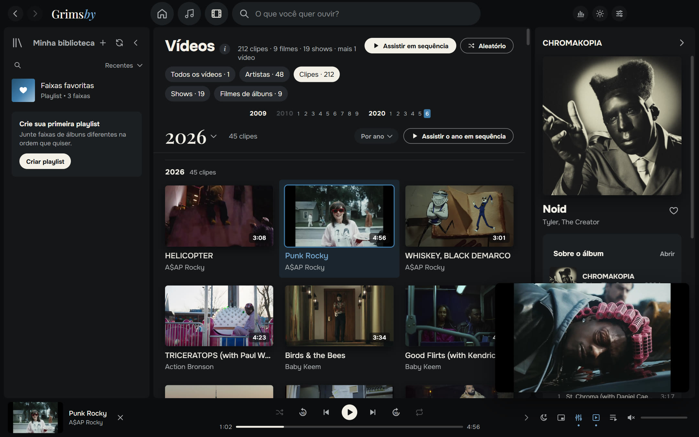

Não assiste a clipes? Desligue a seção inteira com um único botão nas configurações.

### 🔊 Som de player de verdade

- **Reprodução sem pausas (gapless)** — álbuns conceituais tocam sem cortes entre as faixas.
- **Crossfade de 2 a 12 segundos**, desligado automaticamente dentro de um mesmo álbum.
- **Nivelamento de volume (ReplayGain / LUFS)**: inteligente, por faixa ou por álbum.
- **Equalizador de 10 bandas** com predefinições: Hip-hop, R&B, Mais graves, Vocal, Volume baixo e outras.
- **Timer para dormir, mini player sempre visível, rádio por artista, «Tocar a seguir» e fila com arrastar e soltar.**
- **Faixas longas e mixes** continuam de onde você parou.

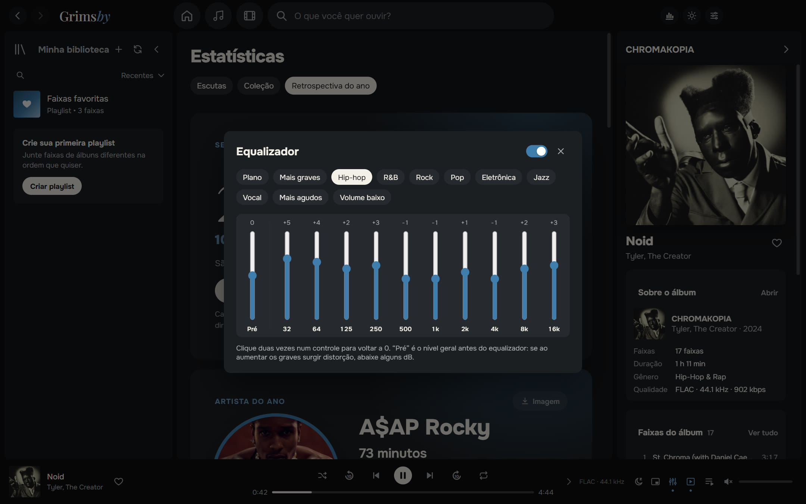

### 📊 Estatísticas para quem ama números

**Escutas** da semana, do mês, do ano e de sempre: top de artistas, álbuns e faixas por minutos ou reproduções, sequências de dias com música.
**Coleção**: quantas faixas, álbuns, gêneros, gigabytes e horas de música você tem, quanto é lossless — e quantos álbuns você **nunca ouviu**.

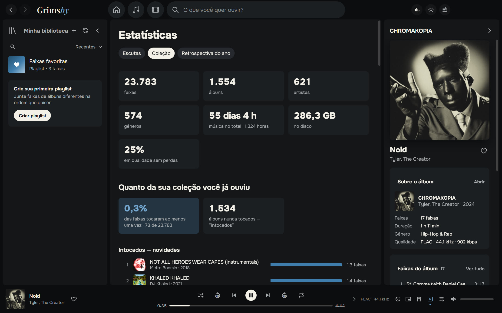

### 🎁 Retrospectiva do ano

De 1º de dezembro a 15 de janeiro, o Grimsby te dá uma retrospectiva do ano: artista do ano, álbum do ano, faixas favoritas, recordes, descobertas e o seu tipo de ouvinte
(«Fã fiel», «Explorador», «Coruja», «Maratonista»…). Cada card pode ser salvo como imagem para os stories, no tema escuro ou claro.

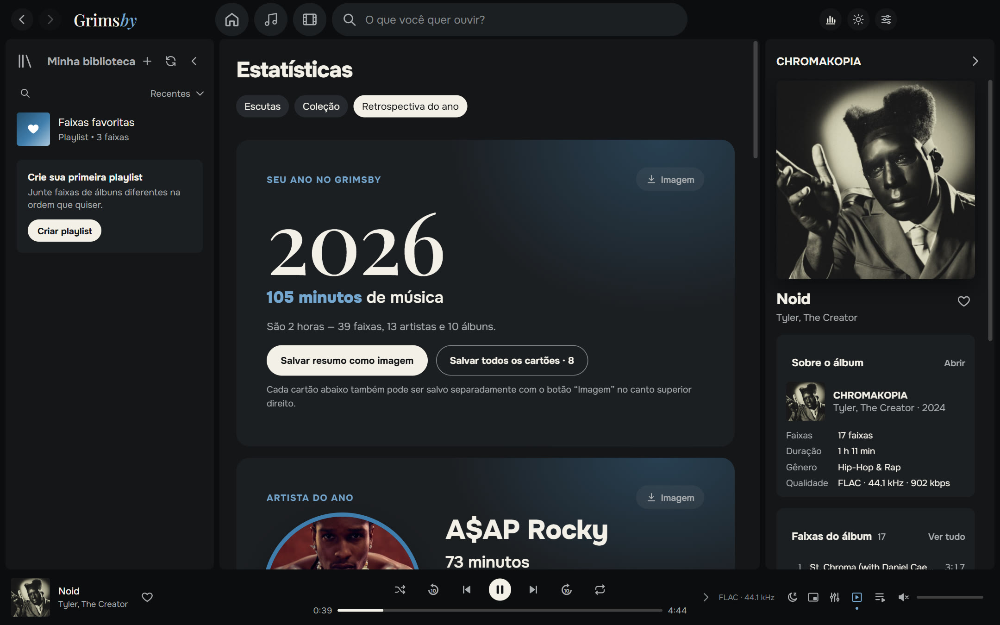

### 🌍 Nove idiomas

Português, English, Русский, Español, Deutsch, Français, 中文, 日本語 e 한국어. Por padrão o Grimsby usa o idioma do seu Windows; dá para trocar em «Configurações → Aparência».

### 🎨 Temas escuro e claro

O azul característico do Grimsby, grafite e «papel». Escolha um tema ou siga o Windows. Opcionalmente, as páginas de álbum ganham as cores da capa.

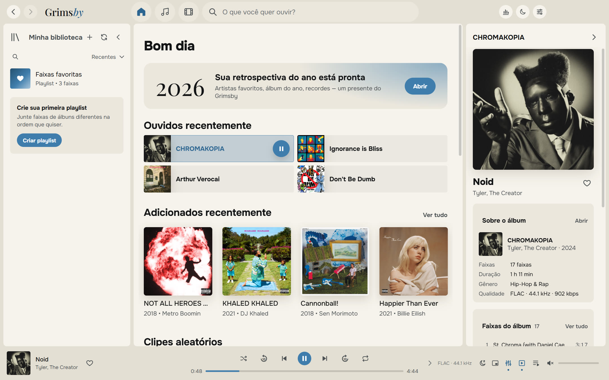

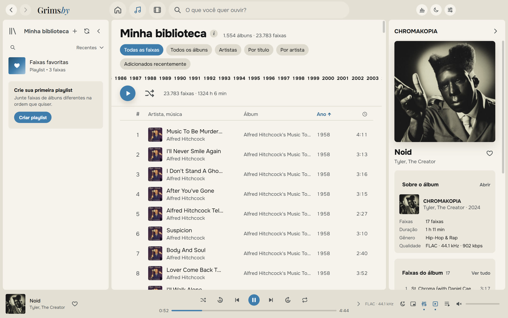

### 🪟 Em casa no Windows

- ícone na bandeja do sistema com menu, como o Spotify;
- botões anterior / pausa / próxima na miniatura da barra de tarefas e teclas de mídia;
- mini player sempre visível;
- atalhos de teclado para tudo;
- a janela abre exatamente como você a fechou.

### 🛠 E mais

- **Playlists e pastas** com capas e descrições próprias, «Faixas favoritas», sugestões inteligentes.
- **Editor de tags** para um álbum inteiro de uma vez, com backup dos arquivos antes de alterar.
- **Saúde da biblioteca**: álbuns sem capa, ano ou gênero, faixas sem número, duplicatas, arquivos ilegíveis.
- **Backup** de curtidas, playlists e histórico em um único arquivo.
- **Guia integrado «Como preparar os arquivos»** em linguagem simples.
- **Atualizações do seu jeito**: «Só avisar», «Automaticamente» ou «Não verificar».

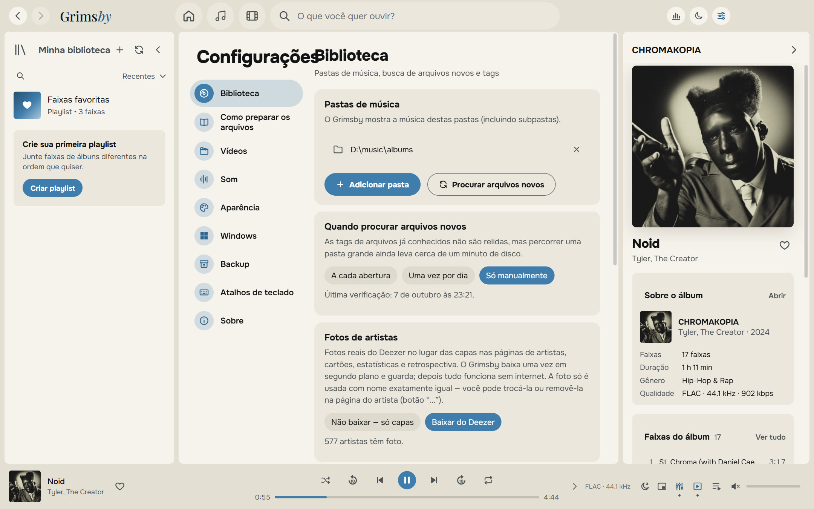

---

## Baixar e instalar

1. Abra a página da **[versão mais recente](https://github.com/maksimkhatskevich/grimsby-releases/releases/latest)** e baixe `Grimsby-Player-Setup-X.Y.Z.exe`.
2. Execute o instalador. O Windows pode mostrar a janela azul «O Windows protegeu o computador» — é um aviso normal para programas sem assinatura digital paga. Clique em **Mais informações → Executar assim mesmo**.
3. Na primeira abertura, escolha sua pasta de música (e, se quiser, a de vídeos). O Grimsby faz o resto.

**Requisitos:** Windows 10 ou 11 (64 bits). A internet só é necessária para atualizações e fotos de artistas opcionais.

O Grimsby procura novas versões sozinho e mostra o que mudou. Suas curtidas, playlists, histórico e configurações são mantidos.

---

## Como organizar seus arquivos

O Grimsby não obriga você a reorganizar a coleção: ele lê as tags e entende as formas mais comuns de guardar música. Mas ele gosta de ordem:

```
D:\Music\
├── albums\
│   └── Tyler, The Creator\
│       └── CHROMAKOPIA\
│           ├── 01 - St. Chroma.flac          ← tags: artista, álbum, ano, capa embutida
│           └── (2024) Tyler, The Creator — Noid.mp4   ← clipe deste álbum
└── clips\
    ├── 2024\
    │   └── Kendrick Lamar — Not Like Us.mp4  ← clipe; o ano vem da pasta
    └── concerts\
        └── Tiny Desk Concert\
            └── Doechii — Tiny Desk.mp4       ← show dentro de uma série
```

Há um guia detalhado no app: «Configurações → Como preparar os arquivos».

---

## Privacidade

O Grimsby funciona **inteiramente no seu computador**. Sem contas, sem anúncios, sem analytics. Seu histórico de escuta nunca sai do seu PC.
O app só se conecta para buscar atualizações (GitHub) e — se você não desligar — fotos de artistas (Deezer).

---

## Contato

Achou um bug, tem uma ideia ou só quer agradecer?

- ✉️ e-mail: **[grimsbyy@gmail.com](mailto:grimsbyy@gmail.com)**
- 🐞 bugs e ideias: [Issues](https://github.com/maksimkhatskevich/grimsby-releases/issues)
- 📣 Telegram: [@itsgrimsby](https://t.me/itsgrimsby) (em russo)

Ao relatar um bug, informe a versão do Grimsby («Configurações → Sobre»), o que você estava fazendo e, se possível, uma captura de tela.

---

## Licenças

O Grimsby usa componentes de código aberto, incluindo Electron, React e FFmpeg (GPL v3). A lista completa com licenças e links para o código-fonte está no app: «Configurações → Sobre».
Spotify, Apple Music, MusicBee e Deezer são citados apenas para comparação e pertencem aos seus donos. As capas nas capturas pertencem aos detentores dos direitos e aparecem como exemplo de uma biblioteca pessoal.

<p align="center"><sub>Feito com amor pelos álbuns · © 2026 Grimsby</sub></p>
