<p align="center">
  <a href="README.md">English</a> ·
  <b>Русский</b> ·
  <a href="README.es.md">Español</a> ·
  <a href="README.pt.md">Português</a> ·
  <a href="README.de.md">Deutsch</a> ·
  <a href="README.fr.md">Français</a> ·
  <a href="README.zh.md">中文</a> ·
  <a href="README.ja.md">日本語</a> ·
  <a href="README.ko.md">한국어</a>
</p>

<p align="center">
  
</p>

<h1 align="center">Grimsby Player</h1>

<p align="center">
  <b>Офлайн-плеер для тех, кто скачивает и собирает музыку.</b><br>
  Ваша медиатека выглядит как стриминг — только всё лежит на вашем диске, а не на чужом сервере.
</p>

<p align="center">
  <a href="https://github.com/maksimkhatskevich/grimsby-releases/releases/latest"></a>
  
  
  
  <a href="https://www.virustotal.com/gui/file/5c565d77d2b34a541cc38c9464028a9a490483999d84340947974058d25d8179"></a>
  <a href="https://github.com/maksimkhatskevich/grimsby-releases/releases"></a>
</p>

<p align="center">
  <a href="https://github.com/maksimkhatskevich/grimsby-releases/releases/latest"><b>⬇ Скачать для Windows</b></a>
  &nbsp;·&nbsp;
  <a href="#возможности">Возможности</a>
  &nbsp;·&nbsp;
  <a href="#как-подготовить-файлы">Как подготовить файлы</a>
  &nbsp;·&nbsp;
  <a href="#обратная-связь">Обратная связь</a>
</p>

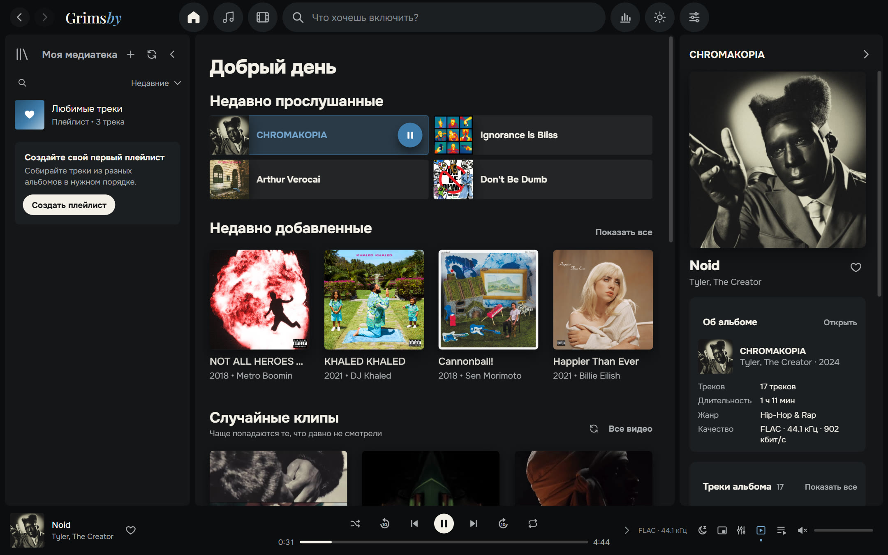

---

## Зачем он нужен

Если вы качаете альбомы во FLAC, собираете дискографии, храните клипы и концерты, то знаете, как это обычно бывает.
У стримингов удобный интерфейс, но там нет вашей музыки: редких релизов, качественных рипов, клипов, которые удалили с YouTube.
У классических плееров с музыкой всё в порядке, а вот интерфейс будто из 2008 года.

**Grimsby соединяет одно с другим.** Укажите папку с музыкой, и через минуту ваша коллекция превратится в красивую медиатеку:
альбомы по годам, страницы исполнителей с фото, клипы рядом с альбомами, статистика и итоги года.
Без аккаунтов, подписок, рекламы и интернета.

| | Стриминг | Классический плеер | **Grimsby** |
|---|:---:|:---:|:---:|
| Ваши собственные файлы (FLAC, редкие релизы) | ✕ | ✓ | **✓** |
| Современный красивый интерфейс | ✓ | ✕ | **✓** |
| Клипы, концерты и фильмы рядом с альбомами | частично | ✕ | **✓** |
| Статистика и итоги года | ✓ | ✕ | **✓** |
| Конвертер, поиск дубликатов, редактор тегов | ✕ | частично | **✓** |
| Работает без интернета и подписки | ✕ | ✓ | **✓** |
| Ничего о вас никуда не отправляет | ✕ | ✓ | **✓** |

---

## Возможности

### 💿 Альбомы — главные герои

Grimsby рассчитан на прослушивание альбомами. Вся коллекция разложена по годам выхода: шкала годов сверху, заголовок текущего года «прилипает» к верху страницы,
а клик по нему открывает календарь для быстрого перехода. Ещё есть вкладки «Все треки» с сортировкой по столбцам, «Исполнители», «По названию», «По исполнителю» и «Недавно добавленные», а также полоска с алфавитом.

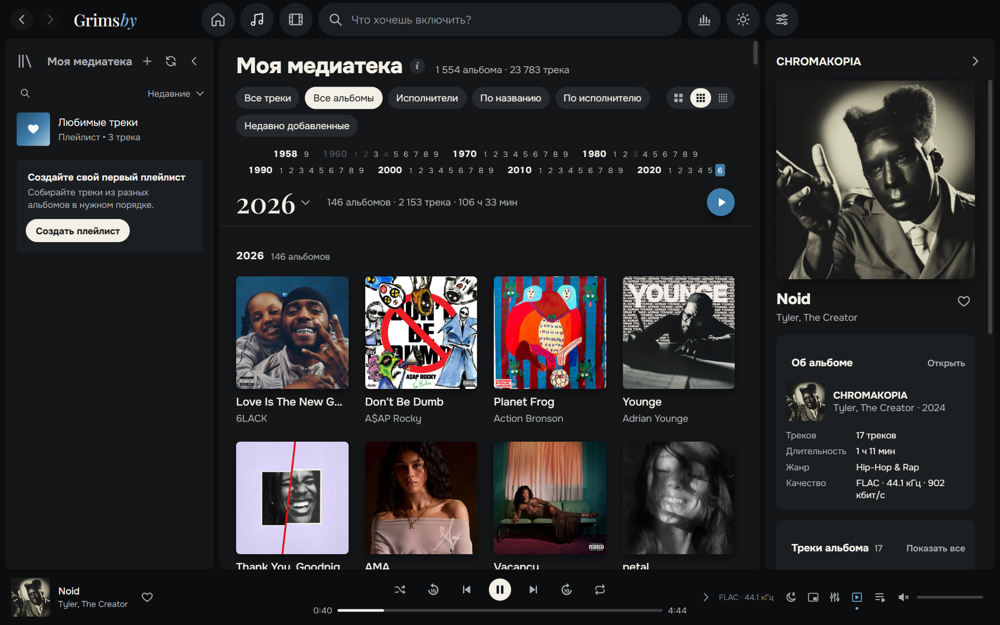

- **Мгновенно даже на огромной медиатеке.** Проверено на коллекции из 23 783 треков и 1 554 альбомов (286 ГБ): прокрутка плавная, поиск отвечает сразу.
- **Сканирование только по вашей команде.** Можно выбрать «при каждом запуске», «раз в день» или «только вручную». Уже известные файлы повторно не читаются.
- **Поддерживаются MP3, FLAC, ALAC, AAC/M4A, OGG, Opus и WAV.** Apple Lossless, который не играют обычные браузерные движки, Grimsby тихо перекодирует сам.
- **Многодисковые альбомы** делятся на «Диск 1», «Диск 2»… с нумерацией внутри каждого диска.
- **Исполнители «при участии»** находятся по названиям треков: `(feat. …)`, `(ft. …)`, `(with …)`. Такие треки попадают и на страницы соавторов.
- **Размер обложек** — крупные, обычные или мелкие, отдельно для музыки и для видео.

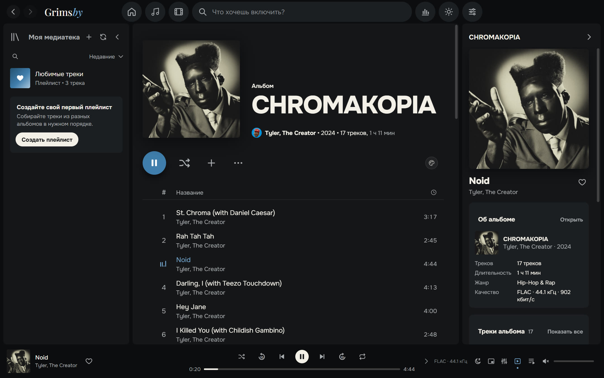

### 🎤 Страница исполнителя — вся его жизнь в одном месте

Альбомы, синглы, клипы, фильмы, концерты и совместные треки на одной странице. Фото исполнителей Grimsby один раз подтягивает из Deezer, дальше всё работает офлайн.
Здесь же «Радио исполнителя» и кнопка «Смотреть все видео подряд».

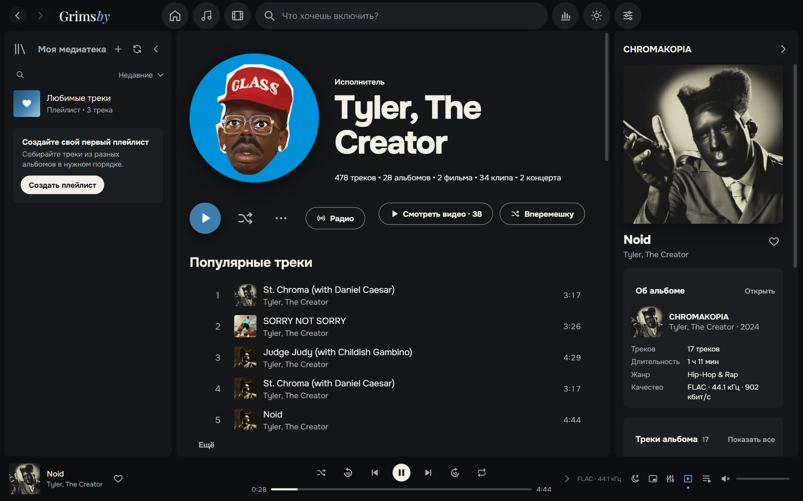

### 🎬 Клипы, концерты и фильмы к альбомам

Это то, чего нет ни в одном стриминге. Grimsby сам разбирает вашу папку с видео:

- клипы в формате `Исполнитель — Название` раскладываются по исполнителям и годам;
- видео из папки альбома становятся клипами **этого альбома**;
- файлы с пометкой `(Film)` становятся **фильмами к альбомам**, и альбом с фильмом рекомендуют друг друга;
- папка `concerts` превращается в раздел концертов с рубриками (например, *Tiny Desk Concert*).

Видео играет прямо в приложении. Его можно свернуть в угол плеера и спокойно листать медиатеку дальше.
Если в файле редкий кодек (например, AV1 в 4K), Grimsby подготовит совместимую копию сам, и вам не придётся искать другой плеер.

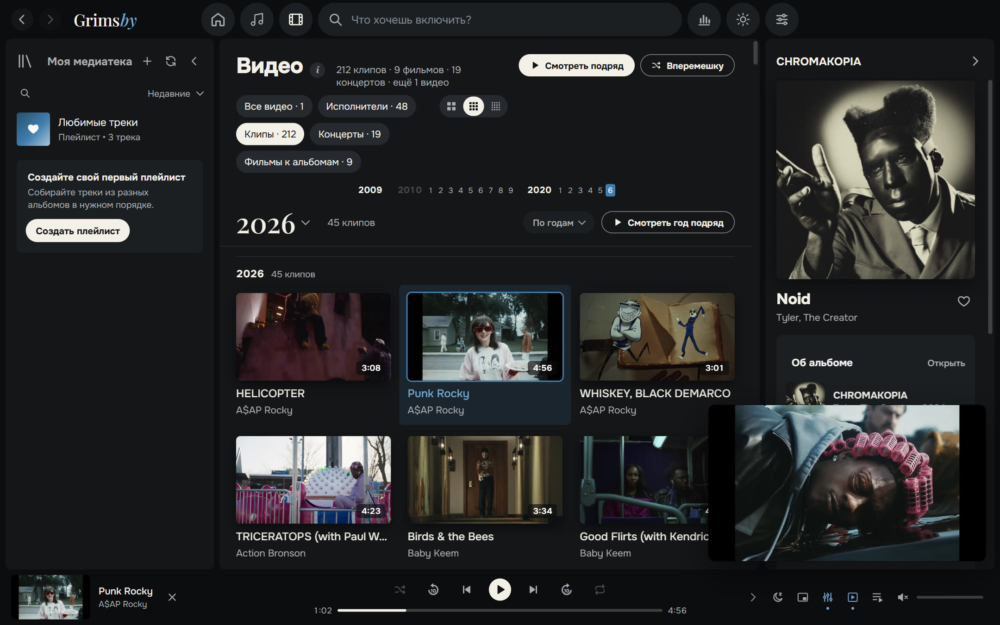

Не смотрите клипы? Раздел видео выключается в настройках одним переключателем.

### 🧰 Порядок в медиатеке

- **Конвертер файлов** — MP3, AAC (M4A), Opus, OGG, FLAC, ALAC и WAV. Теги и обложки переносятся. Можно сохранить копии в отдельную папку или заменить оригиналы: старые файлы уходят в Корзину, а лайки и плейлисты переезжают на новые. Нужные треки выбираются галочками.
- **Поиск дубликатов** — одинаковые треки в разных файлах и копии папок с альбомами. У каждой копии видно папку, формат и битрейт. Не дубликат — нажмите «Всё в порядке», и Grimsby это запомнит.
- **«Здоровье медиатеки»** со смайликом-настроением 😊 😐 😟: альбомы без обложки, года или жанра, треки без номеров, нечитаемые файлы — и как это исправить.
- **«Изменить сведения»** — теги и обложка сразу у целого альбома, в том числе разбивка на диски. Перед изменением Grimsby сохраняет резервную копию файлов.

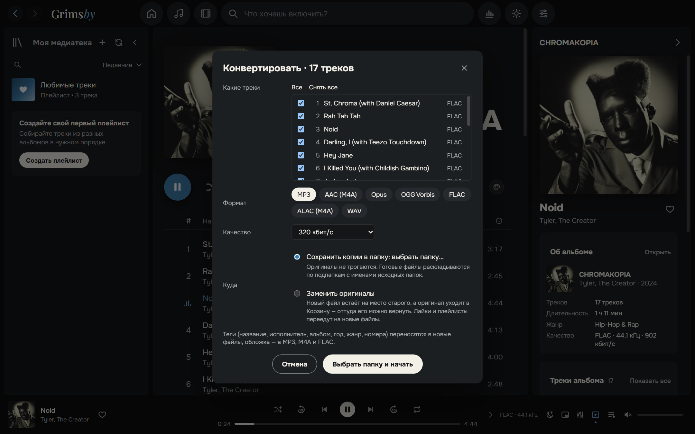

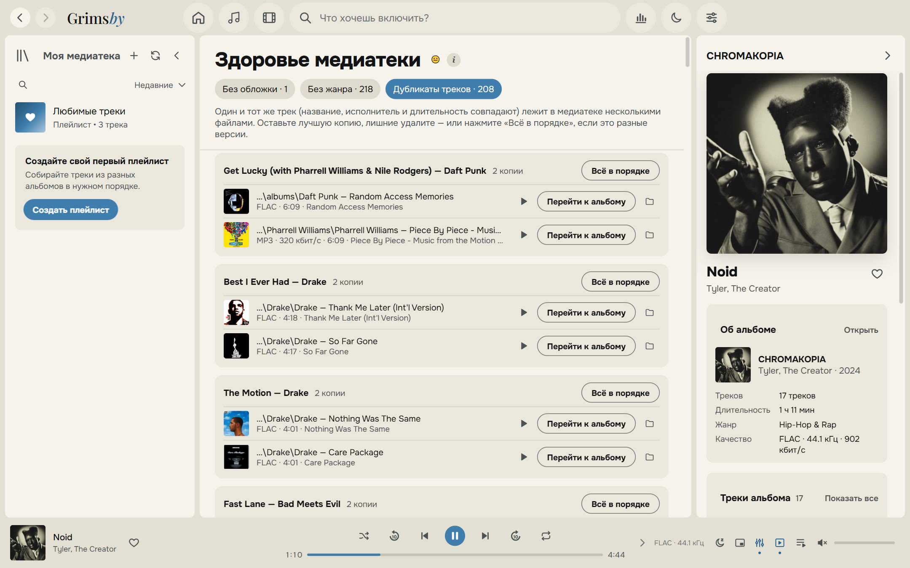

### 🔊 Звук, как в хорошем плеере

- **Бесшовные переходы (gapless).** Концептуальные альбомы играют без пауз между треками.
- **Плавный кроссфейд от 2 до 12 секунд.** Внутри одного альбома он сам отключается, чтобы не портить задуманные переходы.
- **Выравнивание громкости (ReplayGain / LUFS)** в режимах «умное», «по трекам» и «по альбомам». Старый ремастер и новый релиз звучат одинаково громко.
- **10-полосный эквалайзер** с пресетами «Хип-хоп», «R&B», «Больше баса», «Вокал», «Тихое прослушивание» и другими.
- **Таймер сна, мини-плеер поверх всех окон, «Играть следующим», перетаскивание треков в очереди.**
- **Длинные треки и миксы** продолжаются с того места, где вы остановились.

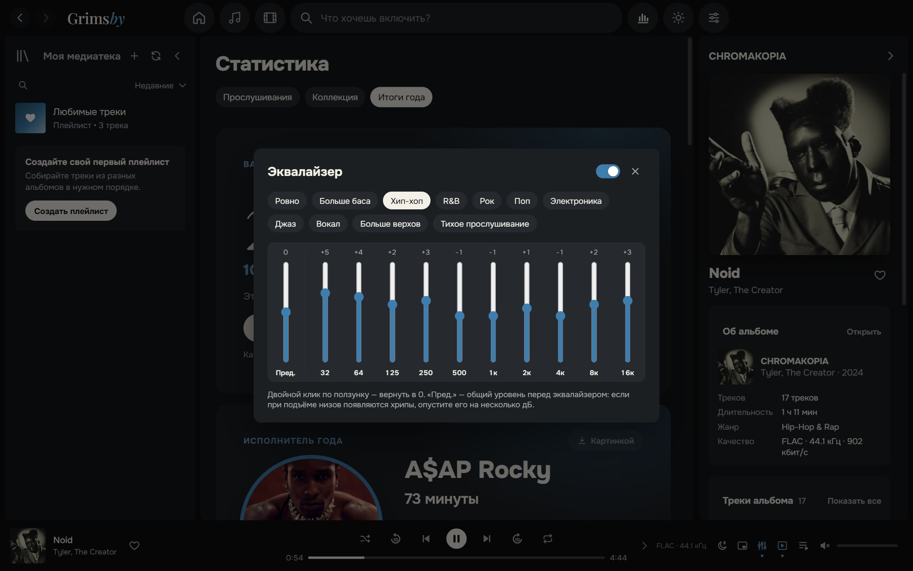

### 📻 Плейлисты, которые собираются сами

- **Умные плейлисты**, в том числе **«Радио: мой микс»** — самое заслушанное вперемешку с похожим по жанру и годам — и **«Радио исполнителя»** — микс вокруг одного артиста или жанра.
- **Свой порядок** плейлистов и папок в левой панели — сохраняется, даже если переключить сортировку и вернуться.
- Сортировка «Любимых треков» и плейлистов по номеру, исполнителю, названию, альбому или длительности — из списка или кликом по заголовкам столбцов.
- Свои обложки и описания у плейлистов.

### 📊 Статистика для тех, кто любит цифры

**Прослушивания** за неделю, месяц, год и всё время. Топ исполнителей, альбомов и треков в минутах или запусках, серии дней с музыкой. Цифры обновляются прямо во время прослушивания.
**Коллекция:** сколько у вас треков, альбомов, жанров, гигабайт и часов музыки, какая доля в lossless и сколько альбомов вы **ни разу не включали**.

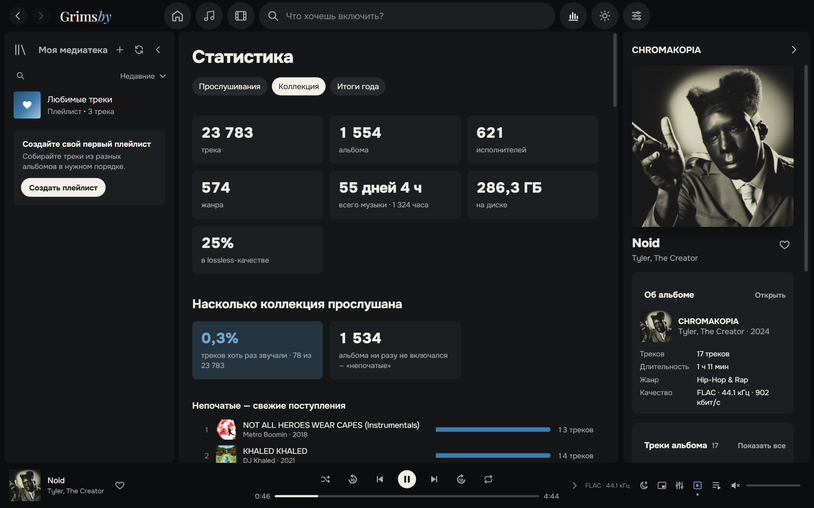

### 🎁 Итоги года

С 1 декабря по 15 января Grimsby дарит итоги года: исполнитель года, альбом года, любимые треки, рекорды, открытия и ваш тип слушателя
(«Преданный фанат», «Открыватель», «Ночной слушатель», «Марафонец»…). Каждую карточку можно сохранить картинкой для сторис, в тёмной или светлой теме.

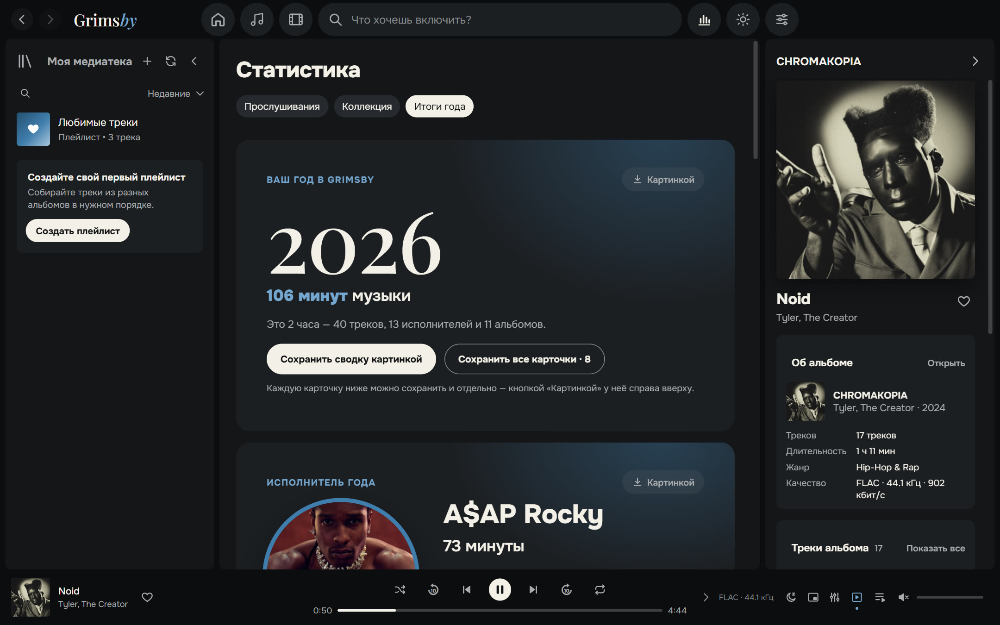

### 🌍 Девять языков

Русский, English, Español, Português, Deutsch, Français, 中文, 日本語 и 한국어. По умолчанию Grimsby говорит на языке Windows, а сменить язык можно в настройках «Оформления».

### 🎨 Тёмная и светлая темы, цвета обложки

Фирменный синий Grimsby, графит и «бумага». Тему можно выбрать или поставить «как в Windows». Страница альбома или плейлиста может окрашиваться в цвета обложки — от лёгкого свечения до полной заливки; переключается кнопкой-палитрой прямо на странице.

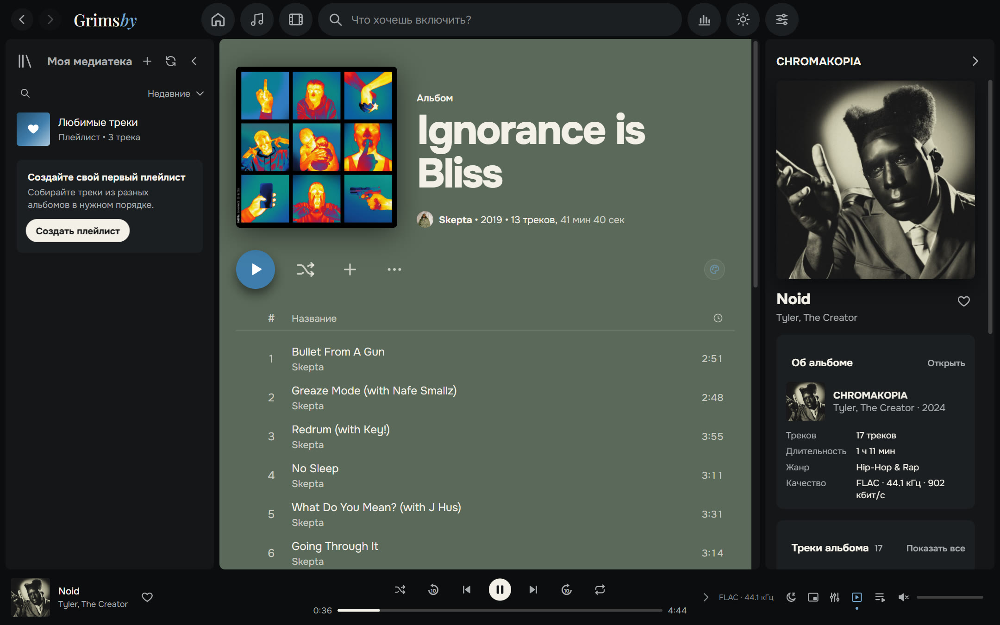

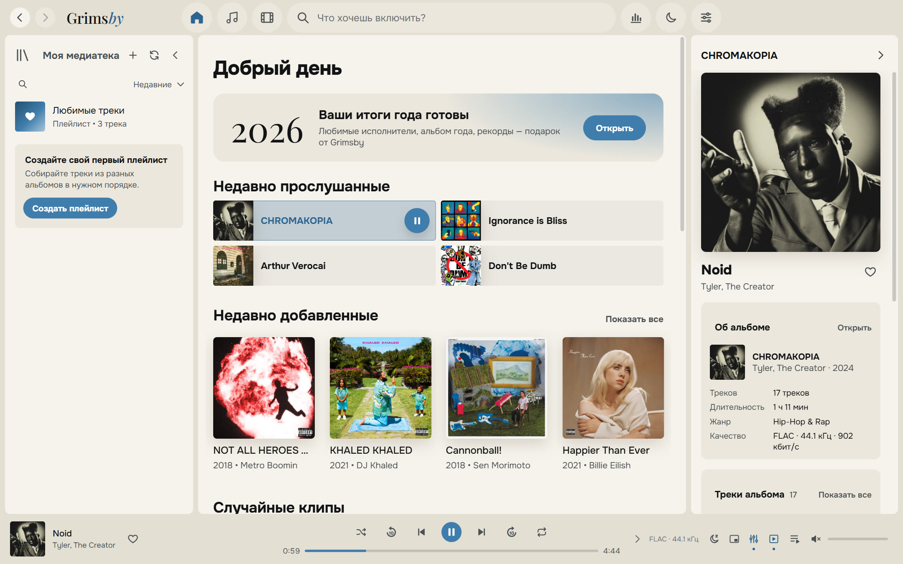

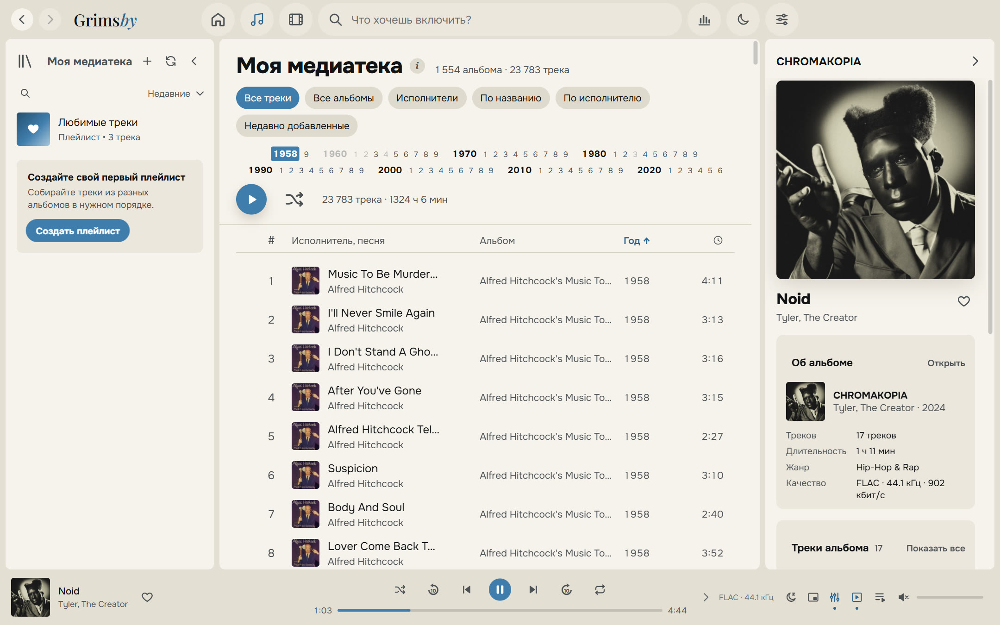

### 🪟 Свой человек в Windows

- значок в области уведомлений с меню управления;
- кнопки «назад / пауза / вперёд» на миниатюре в панели задач и поддержка медиаклавиш;
- мини-плеер поверх всех окон;
- горячие клавиши для всего;
- окно открывается таким, каким вы его закрыли.

### 🛠 И ещё

- **Резервная копия** лайков, плейлистов и истории в один файл.
- **Встроенная памятка «Как подготовить файлы»** простым языком.
- **Обновления на ваш выбор:** «только сообщать», «автоматически» или «не проверять».

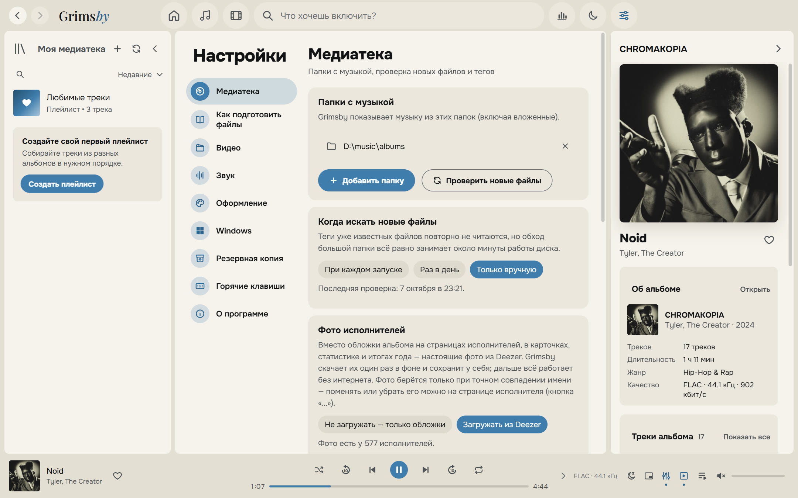

---

## Скачать и установить

1. Откройте страницу **[последней версии](https://github.com/maksimkhatskevich/grimsby-releases/releases/latest)** и скачайте файл `Grimsby-Player-Setup-X.Y.Z.exe`.
2. Запустите установщик. Windows может показать синее окно «Windows защитила ваш компьютер». Это обычное предупреждение для программ без платной цифровой подписи. Нажмите **«Подробнее» → «Выполнить в любом случае»**.
   Установщик проверен на VirusTotal: [ни один из 68 антивирусов ничего не нашёл](https://www.virustotal.com/gui/file/5c565d77d2b34a541cc38c9464028a9a490483999d84340947974058d25d8179) (версия 1.4.0).
3. При первом запуске укажите папку с музыкой (и, если хотите, с клипами). Остальное Grimsby сделает сам.

**Требования:** Windows 10 или 11 (64 бит). Интернет нужен только для обновлений и необязательных фото исполнителей.

### Обновления

Установленный Grimsby сам проверяет новые версии и показывает, что в них изменилось. Лайки, плейлисты, история и настройки при обновлении сохраняются.
Полный список изменений есть на странице [Releases](https://github.com/maksimkhatskevich/grimsby-releases/releases) и в самой программе: «Настройки → О программе».

---

## Как подготовить файлы

Grimsby не заставляет перекладывать коллекцию: он читает теги и понимает самые распространённые способы хранения. Но порядок он любит:

```
D:\Music\
├── albums\
│   └── Tyler, The Creator\
│       └── CHROMAKOPIA\
│           ├── 01 - St. Chroma.flac          ← теги: исполнитель, альбом, год, обложка внутри файла
│           ├── ...
│           └── (2024) Tyler, The Creator — Noid.mp4   ← клип этого альбома
└── clips\
    ├── 2024\
    │   └── Kendrick Lamar — Not Like Us.mp4  ← клип, год берётся из папки
    └── concerts\
        └── Tiny Desk Concert\
            └── Doechii — Tiny Desk.mp4       ← концерт в рубрике
```

Подробная памятка есть в программе: «Настройки → Как подготовить файлы».

---

## Приватность

Grimsby работает **полностью на вашем компьютере**. В нём нет аккаунтов, рекламы и аналитики. Ваша история прослушиваний никуда не отправляется.
В интернет программа выходит только за обновлениями (GitHub) и, если вы не отключили эту функцию, за фото исполнителей (Deezer).

---

## Обратная связь

Нашли ошибку, есть идея или просто хочется сказать спасибо? Пишите:

- ✉️ почта: **[grimsbyy@gmail.com](mailto:grimsbyy@gmail.com)**
- 🐞 ошибки и предложения: [Issues](https://github.com/maksimkhatskevich/grimsby-releases/issues)
- 📣 Telegram: [@itsgrimsby](https://t.me/itsgrimsby)

Если пишете об ошибке, укажите версию Grimsby («Настройки → О программе»), опишите, что вы делали, и, если можно, приложите скриншот.

---

## Лицензии

Grimsby использует свободные компоненты, в том числе Electron, React и FFmpeg (GPL v3). Полный список с текстами лицензий и ссылками на исходный код находится в программе: «Настройки → О программе → Открыть список лицензий».
Deezer — товарный знак его владельца. Обложки на скриншотах принадлежат правообладателям и показаны как пример личной медиатеки.

<p align="center"><sub>Сделано с любовью к альбомам · © 2026 Grimsby</sub></p>
