<p align="center">
  <a href="README.md">English</a> ·
  <a href="README.ru.md">Русский</a> ·
  <a href="README.es.md">Español</a> ·
  <a href="README.pt.md">Português</a> ·
  <a href="README.de.md">Deutsch</a> ·
  <a href="README.fr.md">Français</a> ·
  <b>中文</b> ·
  <a href="README.ja.md">日本語</a> ·
  <a href="README.ko.md">한국어</a>
</p>

<p align="center">
  
</p>

<h1 align="center">Grimsby Player</h1>

<p align="center">
  <b>为下载和收藏音乐的人打造的离线播放器。</b><br>
  你的音乐库看起来像流媒体服务——但所有内容都保存在你自己的硬盘上，而不是别人的服务器上。
</p>

<p align="center">
  <a href="https://github.com/maksimkhatskevich/grimsby-releases/releases/latest"></a>
  
  
  
  <a href="https://www.virustotal.com/gui/file/5c565d77d2b34a541cc38c9464028a9a490483999d84340947974058d25d8179"></a>
  <a href="https://github.com/maksimkhatskevich/grimsby-releases/releases"></a>
</p>

<p align="center">
  <a href="https://github.com/maksimkhatskevich/grimsby-releases/releases/latest"><b>⬇ 下载 Windows 版</b></a>
</p>

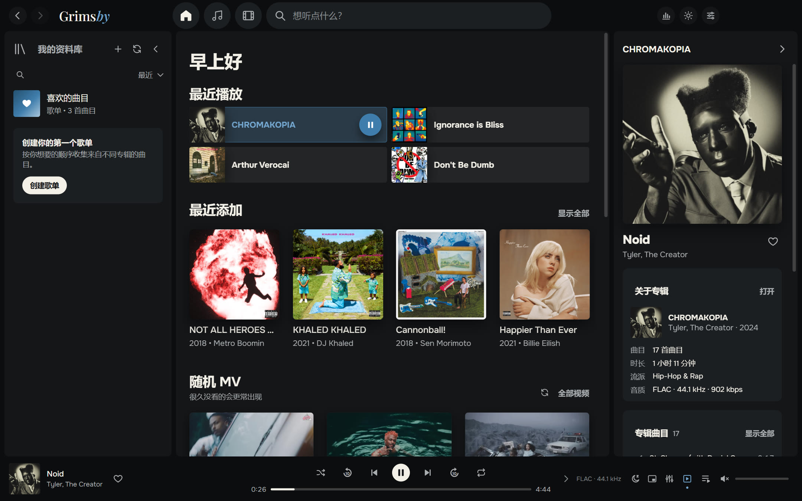

---

## 为什么选择 Grimsby

如果你下载 FLAC 专辑、收集完整唱片目录、保存 MV 和演唱会视频，你一定懂这个烦恼：
流媒体应用很好看，但里面没有你的音乐——稀有版本、高品质抓轨、已经从 YouTube 消失的视频。
经典播放器能很好地处理你的文件，可界面却像停留在 2008 年。

**Grimsby 把两者结合在一起。** 选择你的音乐文件夹，一分钟后你的收藏就变成一个漂亮的音乐库：
按年份排列的专辑、带照片的艺人页面、专辑旁边的 MV、统计数据和年度回顾。
无需账号、无需订阅、没有广告，也不需要联网。

| | 流媒体 | 经典播放器 | **Grimsby** |
|---|:---:|:---:|:---:|
| 你自己的文件（FLAC、稀有版本） | ✕ | ✓ | **✓** |
| 现代、美观的界面 | ✓ | ✕ | **✓** |
| 专辑旁边的 MV、演唱会和电影 | 部分 | ✕ | **✓** |
| 统计和年度回顾 | ✓ | ✕ | **✓** |
| 格式转换、查找重复、标签编辑 | ✕ | 部分 | **✓** |
| 离线可用，无需订阅 | ✕ | ✓ | **✓** |
| 不向任何地方发送你的信息 | ✕ | ✓ | **✓** |

---

## 功能

### 💿 专辑优先

Grimsby 专为完整聆听专辑而设计。整个收藏按发行年份排列：顶部是年份条，
当前年份的标题会固定在页面顶部，点击它会打开日历，方便快速跳转。
另外还有「全部曲目」（可按列排序）、「艺人」、「按标题」、「按艺人」和「最近添加」等标签页，以及字母条。

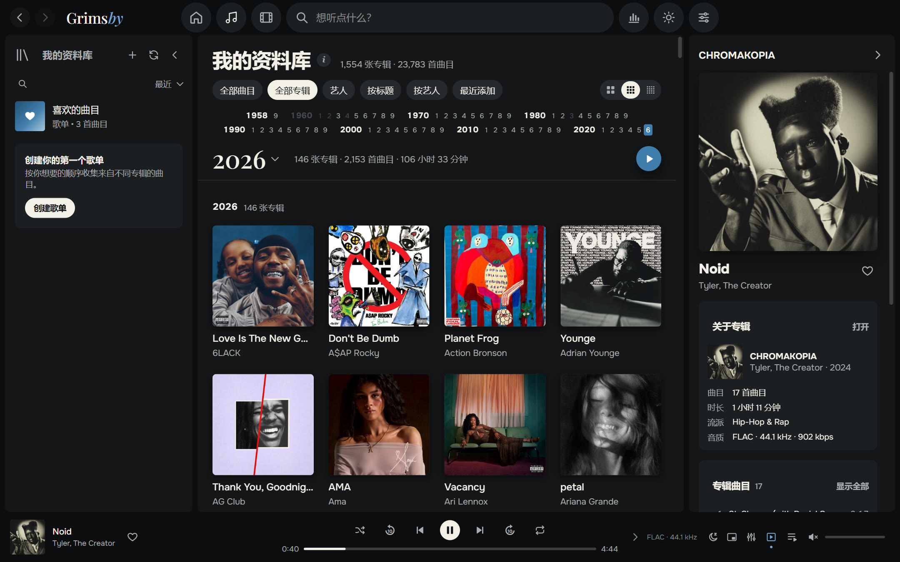

- **即使音乐库很大也能瞬间响应。** 在 23,783 首曲目、1,554 张专辑（286 GB）的收藏上测试：滚动流畅，搜索即时。
- **只在你需要时扫描：** 每次启动、每天一次或手动。已识别的文件不会重复读取。
- **支持 MP3、FLAC、ALAC、AAC/M4A、OGG、Opus 和 WAV。** 浏览器引擎无法播放的 Apple Lossless，Grimsby 会自动转换。
- **多碟专辑** 会分成「碟 1」「碟 2」……每张碟内单独编号。
- **合作艺人** 会从曲目标题中识别——`(feat. …)`、`(ft. …)`、`(with …)`——这些曲目也会出现在合作艺人的页面上。
- **封面大小**：大、普通或小，音乐和视频可分别设置。

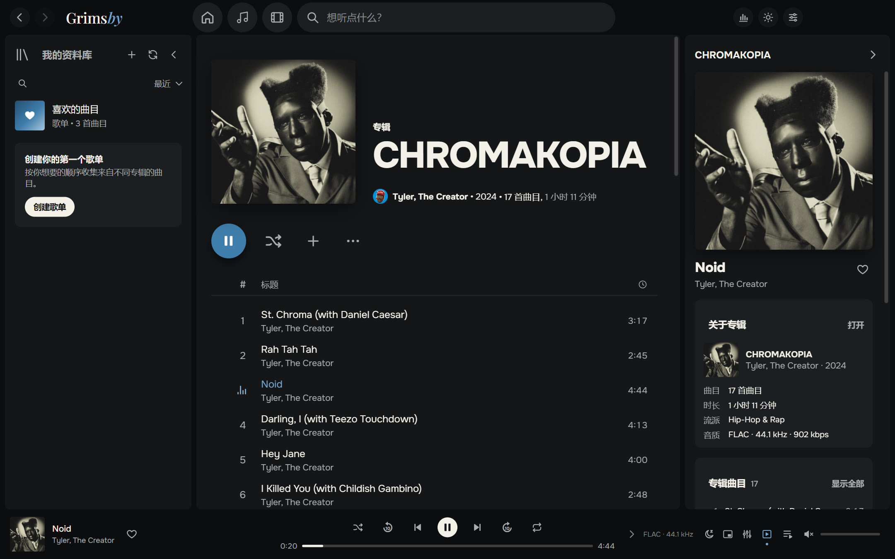

### 🎤 一个页面看尽艺人的一切

专辑、单曲、MV、电影、演唱会和合作曲目都在同一页面。Grimsby 只需从 Deezer 获取一次艺人照片，之后全部离线运行。
艺人电台和「观看全部视频」也在这里。

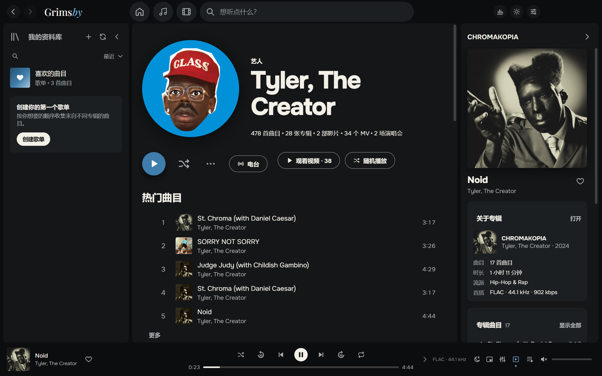

### 🎬 MV、演唱会和专辑电影

这是任何流媒体都没有的。Grimsby 会自动整理你的视频文件夹：

- 名为 `艺人 — 标题` 的视频按艺人和年份分组；
- 放在专辑文件夹里的视频会成为**该专辑**的 MV；
- 标有 `(Film)` 的文件会成为**专辑电影**，专辑与电影互相推荐；
- `concerts` 文件夹会变成带系列分类的演唱会板块（例如 *Tiny Desk Concert*）。

视频直接在应用内播放。可以把视频缩小到播放器角落，继续浏览音乐库。
如果文件使用了少见的编码（例如 4K 的 AV1），Grimsby 会自动准备一个兼容的副本。

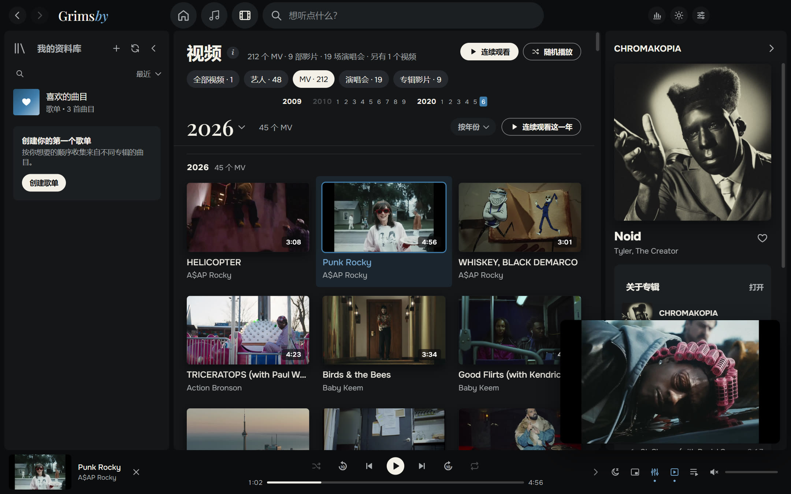

不看 MV？在设置里用一个开关就能隐藏整个视频板块。

### 🧰 让资料库井井有条

- **文件转换器**：MP3、AAC（M4A）、Opus、OGG、FLAC、ALAC 和 WAV。标签和封面会一并保留。可以把副本保存到单独的文件夹，或替换原文件：旧文件会移到回收站，喜欢和播放列表会自动转到新文件上。可以勾选需要转换的曲目。
- **查找重复**：不同文件中的同一首曲目，以及整个专辑文件夹的副本，每份副本都显示文件夹、格式和码率。不是重复？点「一切正常」，Grimsby 会记住。
- **资料库健康** 带心情表情 😊 😐 😟：缺少封面、年份或流派的专辑，没有编号的曲目，无法读取的文件——以及如何修复。
- **编辑详情**：一次编辑整张专辑的标签和封面，包括分碟。修改前 Grimsby 会备份文件。

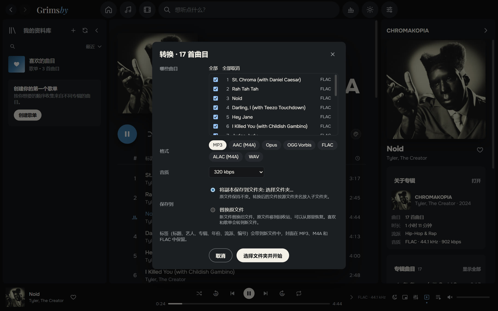

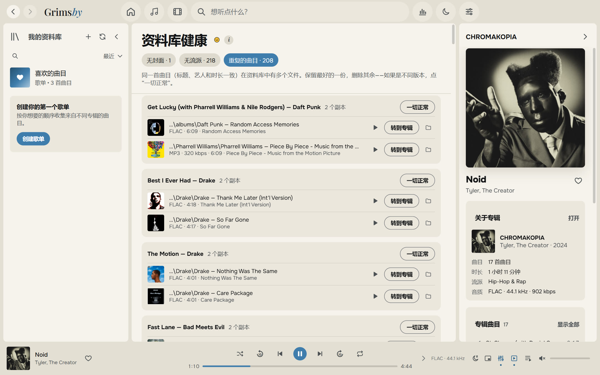

### 🔊 真正播放器的音质

- **无缝播放（gapless）**——概念专辑的曲目之间没有停顿。
- **2 到 12 秒的平滑交叉淡化**，在同一张专辑内会自动关闭。
- **音量均衡（ReplayGain / LUFS）**：智能、按曲目或按专辑。
- **10 段均衡器**，带预设：嘻哈、R&B、增强低音、人声、低音量等。
- **睡眠定时器、始终置顶的迷你播放器、「下一首播放」以及可拖放的播放队列。**
- **长曲目和混音** 会从你上次停下的位置继续。

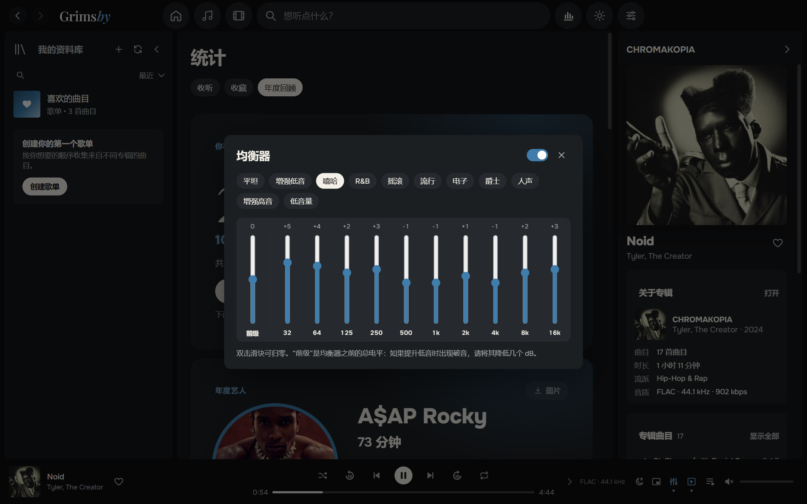

### 📻 自己会生成的播放列表

- **智能播放列表**，包括 **「电台：我的混合」**——你最常听的歌曲，混合流派和年代相近的音乐——以及 **艺人电台**，围绕某位艺人或某个流派的混合。
- **自定义顺序**：侧栏中的播放列表和文件夹可以随意拖动，即使切换排序方式再切回来也会保留。
- 「喜欢的曲目」和播放列表可按编号、艺人、标题、专辑或时长排序——通过菜单或点击列标题。
- 播放列表可自定义封面和描述。

### 📊 为数据爱好者准备的统计

**收听**：本周、本月、今年和全部时间——按分钟或播放次数统计的热门艺人、专辑和曲目，以及连续听歌天数。数字会在播放时实时更新。
**收藏**：你有多少曲目、专辑、流派、GB 和小时的音乐，无损占比多少——以及有多少专辑你**从未播放过**。

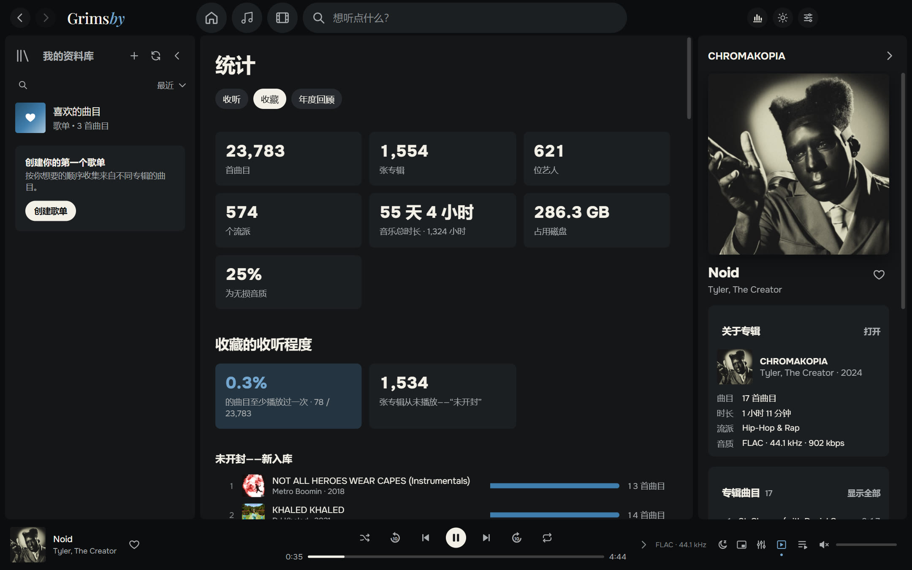

### 🎁 年度回顾

每年 12 月 1 日至 1 月 15 日，Grimsby 会送上年度回顾：年度艺人、年度专辑、最爱曲目、纪录、新发现以及你的听众类型
（「忠实粉丝」「探索者」「夜猫子」「马拉松听众」……）。每张卡片都可以保存为图片分享到动态，支持深色和浅色主题。

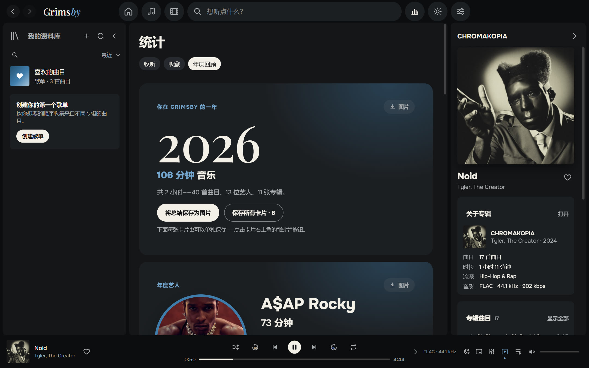

### 🌍 九种语言

中文、English、Русский、Español、Português、Deutsch、Français、日本語 和 한국어。Grimsby 默认使用你的 Windows 语言，也可以在「设置 → 外观」中切换。

### 🎨 深色和浅色主题，封面的颜色

Grimsby 标志性的蓝色、石墨色和「纸张」色。可选择主题或跟随 Windows。专辑或播放列表页面可以呈现封面的颜色——从柔和的光晕到完全填充——用页面上的调色板按钮即可切换。

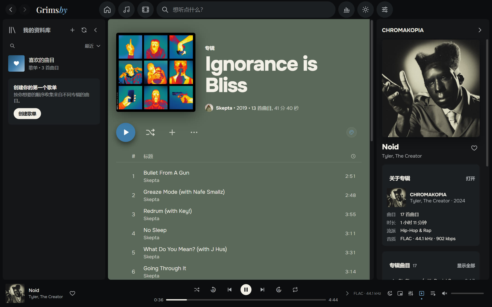

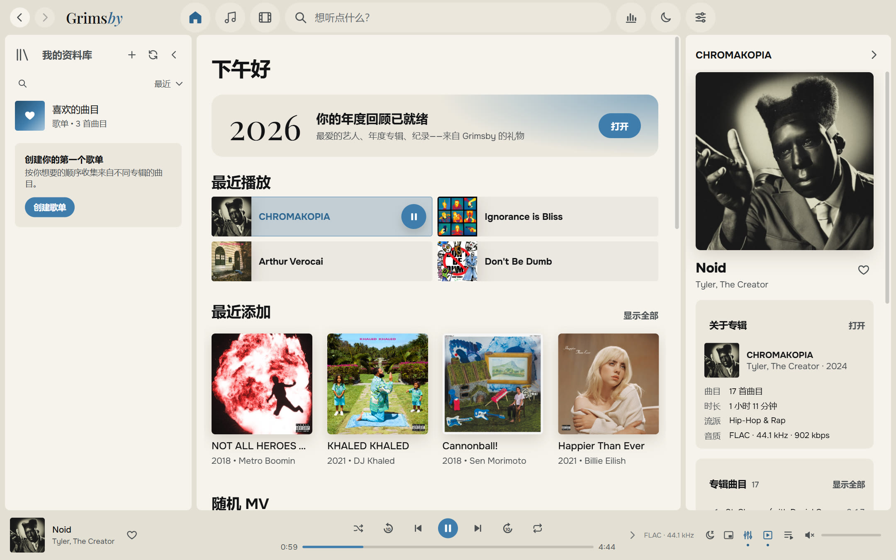

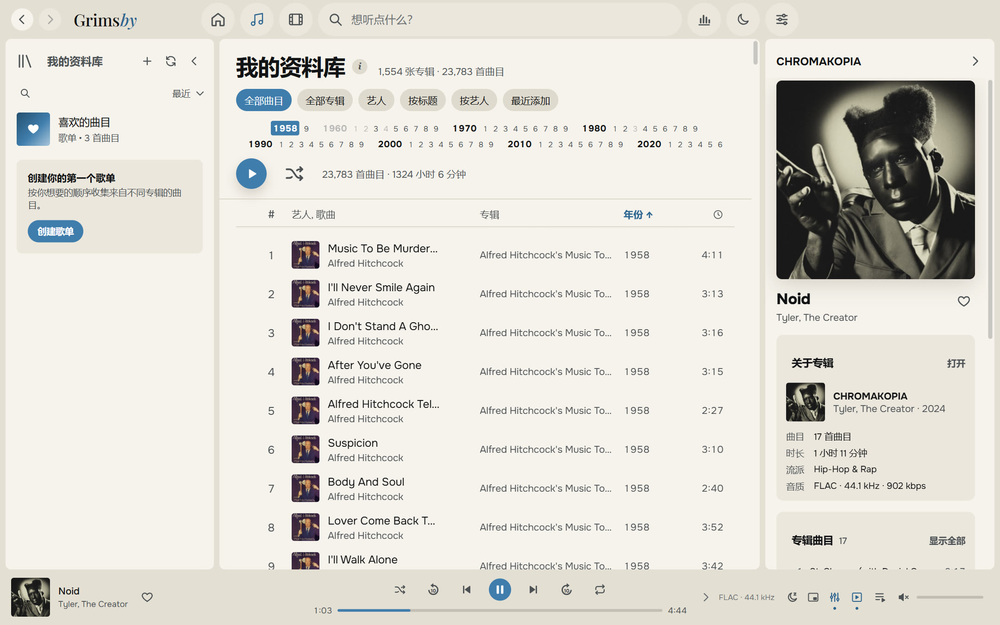

### 🪟 与 Windows 融为一体

- 带播放菜单的系统托盘图标；
- 任务栏缩略图上的上一首 / 暂停 / 下一首按钮，支持媒体键；
- 始终置顶的迷你播放器；
- 所有操作都有快捷键；
- 窗口会按你关闭时的样子重新打开。

### 🛠 还有更多

- **备份**：喜欢、播放列表和历史记录保存为一个文件。
- **内置指南「如何准备文件」**，语言通俗易懂。
- **更新方式由你决定**：「仅通知」「自动」或「不检查」。

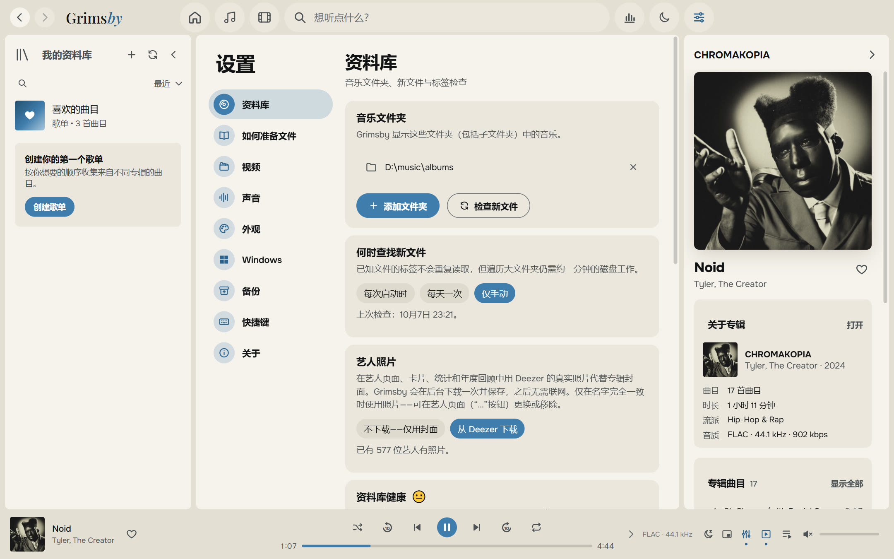

---

## 下载与安装

1. 打开**[最新版本](https://github.com/maksimkhatskevich/grimsby-releases/releases/latest)**页面，下载 `Grimsby-Player-Setup-X.Y.Z.exe`。
2. 运行安装程序。Windows 可能会弹出蓝色的「Windows 已保护你的电脑」窗口——这是没有付费代码签名的程序常见的提示。点击**更多信息 → 仍要运行**。
   安装程序已在 VirusTotal 上检测：[68 款杀毒引擎均未发现问题](https://www.virustotal.com/gui/file/5c565d77d2b34a541cc38c9464028a9a490483999d84340947974058d25d8179)（1.4.0 版）。
3. 首次启动时选择你的音乐文件夹（如果需要，也可以选择视频文件夹），其余交给 Grimsby。

**系统要求：** Windows 10 或 11（64 位）。只有更新和可选的艺人照片需要联网。

Grimsby 会自动检查新版本并显示更新内容。你的喜欢、播放列表、历史记录和设置都会保留。

---

## 如何整理文件

Grimsby 不要求你重新整理收藏：它读取标签，并能理解最常见的存放方式。不过它喜欢井井有条：

```
D:\Music\
├── albums\
│   └── Tyler, The Creator\
│       └── CHROMAKOPIA\
│           ├── 01 - St. Chroma.flac          ← 标签：艺人、专辑、年份、内嵌封面
│           └── (2024) Tyler, The Creator — Noid.mp4   ← 这张专辑的 MV
└── clips\
    ├── 2024\
    │   └── Kendrick Lamar — Not Like Us.mp4  ← MV；年份取自文件夹
    └── concerts\
        └── Tiny Desk Concert\
            └── Doechii — Tiny Desk.mp4       ← 系列中的演唱会
```

应用内有详细指南：「设置 → 如何准备文件」。

---

## 隐私

Grimsby **完全在你的电脑上运行**。没有账号、没有广告、没有统计分析。你的收听记录永远不会离开你的电脑。
应用只会为检查更新（GitHub）以及——除非你关闭——获取艺人照片（Deezer）而联网。

---

## 反馈

发现了问题、有想法，或者只是想说声谢谢？

- ✉️ 邮箱：**[grimsbyy@gmail.com](mailto:grimsbyy@gmail.com)**
- 🐞 问题与建议：[Issues](https://github.com/maksimkhatskevich/grimsby-releases/issues)
- 📣 Telegram：[@itsgrimsby](https://t.me/itsgrimsby)（俄语）

报告问题时，请注明 Grimsby 版本（「设置 → 关于」）、你当时在做什么，如果可以请附上截图。

---

## 许可

Grimsby 使用了开源组件，包括 Electron、React 和 FFmpeg（GPL v3）。完整列表、许可文本和源代码链接见应用内：「设置 → 关于」。
Deezer 是其所有者的商标。截图中的专辑封面归其版权方所有，仅作为个人音乐库的示例展示。

<p align="center"><sub>怀着对专辑的热爱制作 · © 2026 Grimsby</sub></p>
